# Terraform on AWS — from zero to intermediate

Learn Terraform on AWS from beginner to intermediate through hands-on examples, AWS infrastructure projects, reusable modules, state management, CI/CD, diagrams, and real-world Infrastructure as Code practices.

> **New here?** Read [What this course teaches](#what-this-course-teaches), follow [Quick start](#quick-start), then open the **[📚 Learning Path](docs/00-learning-roadmap/README.md)**. Every page has *Previous / Next* links, so you can simply keep clicking **Next →**.

---

## What this course teaches

Terraform lets you describe cloud infrastructure in text files and have a tool create, change and delete it for you. This repository teaches you to do that on AWS, one idea at a time. Every idea is taught the same way:

**WHY** it exists → **WHAT** it is → **HOW** to use it → a lab you run yourself → how to verify → how to clean up.

By the end you will be able to write, test, and deploy (through a CI/CD pipeline) Terraform code that builds VPCs, EC2, S3, IAM, KMS, Secrets Manager, Lambda, SNS/SQS, load balancers and more, and understand *why* the code works rather than copying it.

## Who it is for

| You are… | This course fits if… |
| --- | --- |
| New to Terraform | You have never written HCL (Terraform's language) — we start from zero. |
| An AWS console user | You have clicked through AWS and now want to automate it. |
| From a non-developer IT background | You are comfortable in a terminal but not a programmer. Jargon is explained as it appears. |
| A developer or DevOps engineer | You want a structured path to intermediate Terraform: modules, state, testing, CI/CD. |

## Prerequisites

- **Basic cloud concepts** — what a server, network and storage bucket are.
- **A terminal** — Linux, macOS, or Windows (PowerShell or WSL).
- **An AWS account you are allowed to experiment in.** A personal or sandbox account is ideal; *never* learn in a production account.
- **Budget awareness.** Most labs cost cents or nothing when destroyed promptly, but some resources (NAT gateways, load balancers, RDS) are billed by the hour. Each lab lists its costs and cleanup steps.

## Learning path

```mermaid
flowchart LR
    classDef foundation fill:#7B42BC,color:#fff,stroke:#5C2D91,stroke-width:2px
    classDef aws fill:#FF9900,color:#000,stroke:#C77800,stroke-width:2px
    classDef state fill:#3B82F6,color:#fff,stroke:#1D4ED8,stroke-width:2px
    classDef quality fill:#10B981,color:#fff,stroke:#047857,stroke-width:2px
    classDef platform fill:#64748B,color:#fff,stroke:#334155,stroke-width:2px
    classDef project fill:#EF4444,color:#fff,stroke:#B91C1C,stroke-width:2px

    A["1 · Foundations<br/>IaC, install, HCL, workflow"]:::foundation
    B["2 · Terraform + AWS<br/>provider, variables, data,<br/>meta-arguments, expressions"]:::aws
    C["3 · AWS service tracks<br/>S3, IAM, VPC, EC2, KMS,<br/>Lambda, SQS, SNS, ..."]:::aws
    D["4 · State and reuse<br/>state, remote state, modules,<br/>environments, import"]:::state
    E["5 · Quality and delivery<br/>testing, tooling,<br/>GitHub Actions + OIDC"]:::quality
    F["6 · Platforms<br/>HCP Terraform,<br/>Terraform Enterprise"]:::platform
    G["7 · Projects<br/>9 hands-on builds"]:::project

    A --> B --> C --> D --> E --> F --> G
```



The full, clickable sequence with checkpoints is in **[docs/00-learning-roadmap](docs/00-learning-roadmap/README.md)**.

### 🟢 Beginner topics

| # | Chapter | You will learn |
| --- | --- | --- |
| 01 | [Terraform introduction](docs/01-terraform-introduction/README.md) | Infrastructure as Code, declarative vs imperative, Terraform's architecture |
| 02 | [Installation and setup](docs/02-installation-and-setup/README.md) | Install Terraform and AWS CLI, configure credentials safely |
| 03 | [Terraform basics](docs/03-terraform-basics/README.md) | Providers, resources, files, `.terraform/`, lock file, first S3 bucket |
| 04 | [HCL fundamentals](docs/04-hcl-fundamentals/README.md) | Blocks, arguments, types, references, expressions (no AWS needed) |
| 05 | [Terraform workflow](docs/05-terraform-workflow/README.md) + [CLI reference](docs/05-terraform-workflow/cli-reference.md) | `init → fmt → validate → plan → apply → destroy` and what happens inside |
| 06 | [AWS provider](docs/06-aws-provider/README.md) | Version constraints, authentication, regions, default tags, first EC2 instance |
| 07 | [Variables and outputs](docs/07-variables-and-outputs/README.md) | Types, validation, sensitive values, tfvars, precedence, outputs |
| 08 | [Data sources and locals](docs/08-data-sources-and-locals/README.md) | Reading existing AWS information, reusable internal values |

### 🟡 Intermediate topics

| # | Chapter | You will learn |
| --- | --- | --- |
| 09 | [Meta-arguments](docs/09-meta-arguments/README.md) | `count`, `for_each`, `depends_on`, `provider(s)`, `lifecycle` |
| 10 | [Expressions and functions](docs/10-expressions-and-functions/README.md) | `for`, splat, conditionals, `dynamic` blocks, built-in functions |
| 11 | [Terraform state](docs/11-terraform-state/README.md) | What state is, addresses, inspection, refactoring, security |
| 12 | [Remote state](docs/12-remote-state/README.md) | S3 backend, native S3 locking, migration, recovery |
| 13 | [Modules](docs/13-terraform-modules/README.md) | Writing, versioning and composing modules |
| 14 | [Workspaces and environments](docs/14-workspaces-and-environments/README.md) | CLI workspaces vs directory-per-environment |
| 15 | [Import](docs/15-import-and-existing-resources/README.md) | Adopting resources created outside Terraform |
| 16 | [Testing and validation](docs/16-testing-and-validation/README.md) | `terraform test`, mocks, validation, pre/postconditions, checks |
| 17 | [Tooling](docs/17-terraform-tooling/README.md) | TFLint, terraform-docs, pre-commit, Checkov |
| 18 | [GitHub Actions](docs/18-github-actions/README.md) | PR plans, controlled applies, OIDC to AWS |
| 19 | [HCP Terraform](docs/19-hcp-terraform/README.md) | HashiCorp's managed platform |
| 20 | [Terraform Enterprise](docs/20-terraform-enterprise/README.md) | The self-hosted distribution of HCP Terraform |
| 21 | [Best practices](docs/21-best-practices/README.md) | Repository layout, naming, security, cost |
| 22 | [Troubleshooting](docs/22-troubleshooting/README.md) | Symptoms → causes → fixes |
| 23 | [Interview preparation](docs/23-interview-preparation/README.md) | Questions with explained answers |

### AWS services

Each service track explains the service, then builds it with Terraform: **[aws-services/](aws-services/README.md)**

| Networking | Compute | Storage and data | Security | Integration and ops |
| --- | --- | --- | --- | --- |
| [VPC](aws-services/vpc/README.md) | [EC2](aws-services/ec2/README.md) | [S3](aws-services/s3/README.md) | [IAM](aws-services/iam/README.md) | [SQS](aws-services/sqs/README.md) |
| [Security groups](aws-services/security-groups/README.md) | [Lambda](aws-services/lambda/README.md) | [EBS](aws-services/ebs/README.md) | [KMS](aws-services/kms/README.md) | [SNS](aws-services/sns/README.md) |
| [Load balancing](aws-services/load-balancer/README.md) | [Auto Scaling](aws-services/autoscaling/README.md) | [RDS](aws-services/rds/README.md) | [Secrets Manager](aws-services/secrets-manager/README.md) | [CloudWatch](aws-services/cloudwatch/README.md) |
| [Route 53](aws-services/route53/README.md) | | | | |

### Projects

| # | Project | Level | Main services |
| --- | --- | --- | --- |
| 01 | [Static website](projects/01-static-website/README.md) | 🟢 | S3, CloudFront |
| 02 | [Custom VPC](projects/02-custom-vpc/README.md) | 🟢 | VPC, subnets, routing, NAT |
| 03 | [Web server](projects/03-web-server/README.md) | 🟢 | EC2, security groups, user data |
| 04 | [VPC + EC2 stack](projects/04-vpc-ec2-stack/README.md) | 🟡 | VPC, EC2, tiered security groups |
| 05 | [Secure S3](projects/05-secure-s3/README.md) | 🟡 | S3, KMS, IAM, bucket policies |
| 06 | [Serverless application](projects/06-serverless-application/README.md) | 🟡 | API Gateway, Lambda, DynamoDB |
| 07 | [Event-driven architecture](projects/07-event-driven-architecture/README.md) | 🟡 | SNS, SQS, Lambda, DLQ |
| 08 | [Highly available web](projects/08-highly-available-web/README.md) | 🟡 | ALB, Auto Scaling, multi-AZ |
| 09 | [Production-style infrastructure](projects/09-production-style-infrastructure/README.md) | 🟡 | Modules, remote state, environments, OIDC CI/CD |

### Tooling

| Tool | Purpose | Where it is taught |
| --- | --- | --- |
| `terraform fmt` / `validate` | Formatting and configuration checks | [Chapter 05](docs/05-terraform-workflow/README.md) |
| `terraform test` | Unit and integration tests | [Chapter 16](docs/16-testing-and-validation/README.md) |
| [TFLint](https://github.com/terraform-linters/tflint) | Linting, AWS-specific rules | [Chapter 17](docs/17-terraform-tooling/README.md) · [.tflint.hcl](.tflint.hcl) |
| [terraform-docs](https://terraform-docs.io/) | Generates module documentation | [Chapter 17](docs/17-terraform-tooling/README.md) · [.terraform-docs.yml](.terraform-docs.yml) |
| [pre-commit](https://pre-commit.com/) | Runs checks before each commit | [Chapter 17](docs/17-terraform-tooling/README.md) · [.pre-commit-config.yaml](.pre-commit-config.yaml) |
| [Checkov](https://www.checkov.io/) | Security and misconfiguration scanning | [Chapter 17](docs/17-terraform-tooling/README.md) · [.checkov.yaml](.checkov.yaml) |
| GitHub Actions | CI/CD with OIDC to AWS | [Chapter 18](docs/18-github-actions/README.md) · [.github/workflows](.github/workflows) |

## Quick start

### 1. Install Terraform

Pick your platform (full details and alternatives in [Chapter 02](docs/02-installation-and-setup/README.md)):

```bash
# macOS (Homebrew)
brew tap hashicorp/tap
brew install hashicorp/tap/terraform

# Windows (winget)
winget install --id Hashicorp.Terraform

# Ubuntu / Debian: see Chapter 02 for HashiCorp's apt repository
```

```bash
terraform version   # this course needs 1.11 or newer
```

### 2. Configure AWS access

Install the [AWS CLI v2](https://docs.aws.amazon.com/cli/latest/userguide/getting-started-install.html), then sign in. If your organisation uses IAM Identity Center (SSO), use:

```bash
aws configure sso --profile learning
aws sso login --profile learning
export AWS_PROFILE=learning        # PowerShell: $Env:AWS_PROFILE = "learning"
aws sts get-caller-identity        # prints the account and identity you are using
```

Terraform uses the same credentials as the AWS CLI. **Never** write access keys into `.tf` files. Chapter 02 explains all the options.

### 3. Run the first lab

```bash
git clone https://github.com/cloud-prakhar/terraform-aws-learning.git
cd terraform-aws-learning/examples/beginner/01-first-s3-bucket

terraform init      # download the AWS provider
terraform plan      # preview: 1 to add
terraform apply     # type "yes" to create the bucket
terraform destroy   # type "yes" to delete it again
```

Then continue with the **[📚 Learning Path](docs/00-learning-roadmap/README.md)**.

## Repository layout

```text
terraform-aws-learning/
├── docs/            Chapters 00–23: the course itself
├── examples/        Small labs, one concept each, used by the chapters
├── aws-services/    Service tracks: concept + Terraform lab per AWS service
├── modules/         Reusable modules (s3, vpc, iam, ec2, application-stack) with tests
├── projects/        Nine progressive projects, ending with a production-style setup
├── cheatsheets/     One-page summaries of what the chapters teach
├── scripts/         validate-all.sh and check-links.py (used locally and in CI)
└── .github/         GitHub Actions workflows (checks, plan, apply, docs)
```

## Conventions used in every lab

| Convention | Why |
| --- | --- |
| `required_version = ">= 1.11.0"` | Remote-state locking and write-only arguments used later need 1.11+. |
| AWS provider `~> 6.0` | Any 6.x release; never jumps to 7.0 unexpectedly. Committed `.terraform.lock.hcl` files pin the exact version. |
| `region = var.aws_region`, default `us-east-1` | Change it with `-var aws_region=eu-west-1` or a `terraform.tfvars` file. |
| `default_tags` with `Project`, `Lab`, `ManagedBy` | Every resource can be found (and costed) by tag. |
| Names from `bucket_prefix` / `name_prefix` | Avoids clashes with other learners' globally unique names. |
| `COST` comments | Mark anything billed by the hour or month. |
| `LEARNING SHORTCUT` comments | Mark choices that are fine for a lab but not for production. |

## Staying safe while learning

- Use a sandbox AWS account, and set up an [AWS Budget alert](https://docs.aws.amazon.com/cost-management/latest/userguide/budgets-create.html) before you start.
- Always run `terraform destroy` when you finish a lab.
- Never commit `terraform.tfstate`, `*.tfvars` or credentials — the [.gitignore](.gitignore) already blocks them. See [SECURITY.md](SECURITY.md).

## Contributing

Found a mistake or an outdated command? See [CONTRIBUTING.md](CONTRIBUTING.md).

## License

[MIT](LICENSE)

---

[00 · Learning Roadmap →](docs/00-learning-roadmap/README.md)
