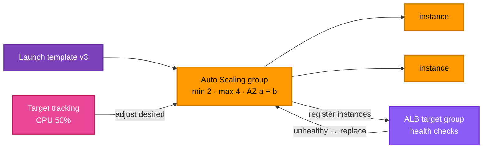

[← Elastic Load Balancing](../load-balancer/README.md) | [🏠 Home](../../README.md) | [📚 Learning Path](../../docs/00-learning-roadmap/README.md) | [⬆ AWS Service Tracks](../README.md) | [Route 53 →](../route53/README.md)

# EC2 Auto Scaling

🟡 Intermediate · Track 14 of 16 · Lab: [Project 08](../../projects/08-highly-available-web/README.md) · 💰 No charge for Auto Scaling itself; you pay for the instances it runs

## What is it?

An **Auto Scaling group (ASG)** keeps a fleet of EC2 instances at the size you want: it replaces unhealthy instances, spreads them across AZs, and adds or removes instances as load changes.

## Why do we need it?

- **Self-healing:** a failed instance is replaced automatically — no pager at 3 a.m.
- **High availability:** instances are balanced across AZs.
- **Elasticity:** pay for 2 instances at night and 10 at peak.
- **Immutable deployments:** new AMI or config → new launch template version → rolling instance refresh.

## How does it work?

| Piece | Terraform | What it defines |
| --- | --- | --- |
| **Launch template** | `aws_launch_template` | The recipe: AMI, instance type, security groups, user data, IMDSv2, disks |
| **Auto Scaling group** | `aws_autoscaling_group` | Where (subnets), how many (min/max/desired), health checks, target groups |
| **Scaling policy** | `aws_autoscaling_policy` | When to change the size (e.g. target 50% average CPU) |
| **Instance refresh** | `instance_refresh { }` in the ASG | How to roll out a new launch template version |



### Health checks

`health_check_type = "EC2"` only replaces instances whose hardware/OS status checks fail. `"ELB"` also replaces instances that fail the **load balancer's** health check (e.g. the web server crashed) — what you want behind an ALB.

### Terraform and `desired_capacity`

A scaling policy changes `desired_capacity` at runtime. If Terraform also sets it, every `apply` would reset the fleet size. Either don't set it, or add `lifecycle { ignore_changes = [desired_capacity] }` ([Chapter 09](../../docs/09-meta-arguments/README.md#6-lifecycle)).

```hcl
resource "aws_autoscaling_group" "web" {
  min_size            = 2
  max_size            = 4
  vpc_zone_identifier = module.vpc.private_subnet_ids
  target_group_arns   = [aws_lb_target_group.web.arn]
  health_check_type   = "ELB"

  launch_template {
    id      = aws_launch_template.web.id
    version = aws_launch_template.web.latest_version
  }

  instance_refresh {
    strategy = "Rolling"
    preferences {
      min_healthy_percentage = 50
    }
  }

  lifecycle {
    ignore_changes = [desired_capacity]
  }
}
```

Launch **configurations** (`aws_launch_configuration`) are the legacy predecessor of launch templates and should not be used for new work.

## Lab

Built in **[Project 08 · Highly available web](../../projects/08-highly-available-web/README.md)**: launch template, ASG across two private subnets, ALB health checks, CPU target tracking and rolling instance refresh.

## Key takeaways

- Launch template = recipe; ASG = fleet manager; scaling policy = when to resize.
- Use `health_check_type = "ELB"` behind a load balancer.
- Let the scaling policy own `desired_capacity`.

## Official references

- [What is Amazon EC2 Auto Scaling?](https://docs.aws.amazon.com/autoscaling/ec2/userguide/what-is-amazon-ec2-auto-scaling.html)
- [Launch templates](https://docs.aws.amazon.com/autoscaling/ec2/userguide/launch-templates.html)
- [Target tracking scaling policies](https://docs.aws.amazon.com/autoscaling/ec2/userguide/as-scaling-target-tracking.html)
- [Instance refresh](https://docs.aws.amazon.com/autoscaling/ec2/userguide/asg-instance-refresh.html)
- [aws_autoscaling_group (Terraform)](https://registry.terraform.io/providers/hashicorp/aws/latest/docs/resources/autoscaling_group)

---

[← Elastic Load Balancing](../load-balancer/README.md) | [🏠 Home](../../README.md) | [📚 Learning Path](../../docs/00-learning-roadmap/README.md) | [⬆ AWS Service Tracks](../README.md) | [Route 53 →](../route53/README.md)
