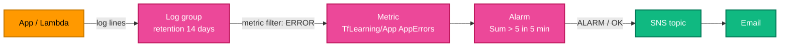

[← Secrets Manager](../secrets-manager/README.md) | [🏠 Home](../../README.md) | [📚 Learning Path](../../docs/00-learning-roadmap/README.md) | [⬆ AWS Service Tracks](../README.md) | [Lambda →](../lambda/README.md)

# CloudWatch

🟢 Beginner · Track 9 of 16 · Lab: [logs-and-alarms](logs-and-alarms/README.md) · 💰 Logs billed per GB ingested and stored; alarms billed per alarm per month

## What is it?

Amazon CloudWatch collects **logs**, **metrics** and **alarms** for AWS resources and your applications.

| Part | What it holds |
| --- | --- |
| **Log groups / streams** | Log lines, e.g. `/aws/lambda/my-function` |
| **Metrics** | Numbers over time: CPUUtilization, request counts, your custom metrics |
| **Metric filters** | Turn matching log lines into metric data points |
| **Alarms** | Watch a metric and act (e.g. notify SNS) when it crosses a threshold |

## Why do we need it?

You can't operate what you can't see. Terraform should create the log groups (with **retention**) and the alarms together with the resources they watch, so monitoring is never an afterthought.

## How does it work?



### Simple analogy

Logs are the **CCTV recordings**, metrics are the **visitor counter**, and alarms are the **security guard** who phones you when the counter goes above a threshold.

## How Terraform models CloudWatch

```hcl
resource "aws_cloudwatch_log_group" "app" {
  name              = "/tf-learning/app"
  retention_in_days = 14                  # default is "never expire" → growing bill
}

resource "aws_cloudwatch_metric_alarm" "errors" {
  alarm_name          = "tf-learning-app-errors"
  namespace           = "TfLearning/App"
  metric_name         = "AppErrors"
  statistic           = "Sum"
  period              = 300
  evaluation_periods  = 1
  threshold           = 5
  comparison_operator = "GreaterThanThreshold"
  treat_missing_data  = "notBreaching"
  alarm_actions       = [aws_sns_topic.alerts.arn]
}
```

### Log groups that services create for you

Lambda, API Gateway and others create log groups automatically **if they don't exist** — without retention, and not managed by Terraform. Create them in Terraform first (named exactly as the service expects, e.g. `/aws/lambda/<function-name>`), as the [Lambda track](../lambda/README.md) does.

## Lab

**[logs-and-alarms](logs-and-alarms/README.md)**: log group with retention, metric filter, alarm, SNS topic and optional email subscription. You will push fake error logs and watch the alarm fire.

## Key takeaways

- Always set `retention_in_days`.
- Metric filters turn logs into metrics; alarms turn metrics into notifications.
- Create service log groups in Terraform before the service does.

## Official references

- [Amazon CloudWatch Logs](https://docs.aws.amazon.com/AmazonCloudWatch/latest/logs/WhatIsCloudWatchLogs.html)
- [Metric filters](https://docs.aws.amazon.com/AmazonCloudWatch/latest/logs/MonitoringLogData.html)
- [CloudWatch alarms](https://docs.aws.amazon.com/AmazonCloudWatch/latest/monitoring/AlarmThatSendsEmail.html)
- [CloudWatch pricing](https://aws.amazon.com/cloudwatch/pricing/)

---

[← Secrets Manager](../secrets-manager/README.md) | [🏠 Home](../../README.md) | [📚 Learning Path](../../docs/00-learning-roadmap/README.md) | [⬆ AWS Service Tracks](../README.md) | [Lambda →](../lambda/README.md)
