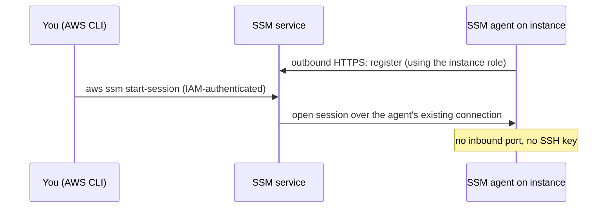

[⬆ EC2](../README.md) | [🏠 Home](../../../README.md) | [📚 Learning Path](../../../docs/00-learning-roadmap/README.md)

# EC2 lab 01 · Instance with SSM access

🟢 Beginner · [EC2 track](../README.md) · 💰 **Billed while running**: one `t3.micro`, its volume, and one public IPv4 address

## What will be created

| Resource | Purpose |
| --- | --- |
| `aws_iam_role.instance` + `aws_iam_role_policy_attachment.ssm` | Role with `AmazonSSMManagedInstanceCore` |
| `aws_iam_instance_profile.instance` | Lets the instance use the role |
| `aws_security_group.instance` + one egress rule | **No inbound rules**; outbound HTTPS only |
| `aws_instance.this` | Amazon Linux 2023, IMDSv2, encrypted gp3 root, boot script from [user_data.sh](user_data.sh) |



## Prerequisites

- Default VPC in the Region.
- The [Session Manager plugin](https://docs.aws.amazon.com/systems-manager/latest/userguide/session-manager-working-with-install-plugin.html) for the AWS CLI (only needed for the shell part).

## Commands

```bash
terraform init
terraform apply
terraform output ssm_command
```

## Verification

Wait 1–2 minutes for the agent to register, then:

```bash
aws ssm describe-instance-information --query "InstanceInformationList[].[InstanceId,PingStatus]" --output table
$(terraform output -raw ssm_command)          # opens a shell on the instance
# inside the instance:
cat /etc/motd                                  # written by user_data
curl -s -H "X-aws-ec2-metadata-token: $(curl -s -X PUT http://169.254.169.254/latest/api/token -H 'X-aws-ec2-metadata-token-ttl-seconds: 60')" \
  http://169.254.169.254/latest/meta-data/iam/info   # shows the instance profile
exit
```

Also try the IMDSv1 style request (no token): `curl -s http://169.254.169.254/latest/meta-data/` returns **401 Unauthorized**, because IMDSv2 is required.

## Cleanup

```bash
terraform destroy
```

---

[⬆ EC2](../README.md) | [🏠 Home](../../../README.md) | [📚 Learning Path](../../../docs/00-learning-roadmap/README.md)
