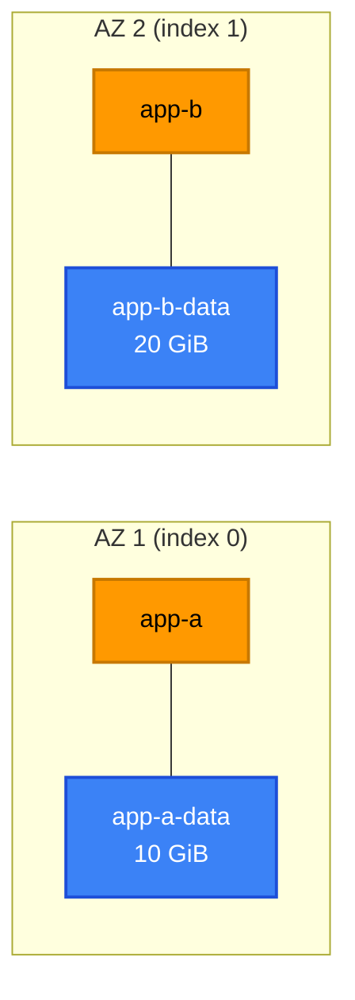

[⬆ EC2](../README.md) | [🏠 Home](../../../README.md) | [📚 Learning Path](../../../docs/00-learning-roadmap/README.md)

# EC2 lab 02 · Multiple instances with EBS volumes

🟡 Intermediate · [EC2 track](../README.md) · [EBS track](../../ebs/README.md) · 💰 **Billed while running**: 2 × `t3.micro` + 2 root volumes + 30 GiB of extra gp3 volumes

## What will be created

For each entry in `var.servers` (default `app-a` in AZ 0 and `app-b` in AZ 1):

| Resource | Purpose |
| --- | --- |
| `aws_instance.server["app-a"]` | Instance in the default subnet of its AZ |
| `aws_ebs_volume.data["app-a"]` | Encrypted gp3 data volume **in the same AZ** |
| `aws_volume_attachment.data["app-a"]` | Attaches the volume as `/dev/sdf` |



## Terraform concepts

- `for_each` over a **map of objects** with `optional()` attributes and defaults
- A `local` that enriches each object (adds the AZ name)
- Three resources sharing the same keys, so `aws_ebs_volume.data[each.key]` pairs with `aws_instance.server[each.key]`
- `data "aws_subnet"` with `for_each` to find the default subnet per AZ

## Commands

```bash
terraform init
terraform apply
terraform output servers
```

## Verification

```bash
aws ec2 describe-volumes --filters "Name=tag:Lab,Values=ec2-multiple-with-ebs" \
  --query "Volumes[].[Tags[?Key=='Name']|[0].Value,Size,AvailabilityZone,State,Attachments[0].InstanceId]" \
  --output table
```

## Experiments

1. Add `app-c = { az_index = 0, data_volume_gb = 5 }` to `servers` (in a `terraform.tfvars`) and plan: exactly three resources are added, nothing else changes.
2. Change `app-b`'s `data_volume_gb` to 30 and plan: the volume is **updated in place** (EBS supports growing volumes online; the file system must then be extended inside the OS).

## Cleanup

```bash
terraform destroy
```

---

[⬆ EC2](../README.md) | [🏠 Home](../../../README.md) | [📚 Learning Path](../../../docs/00-learning-roadmap/README.md)
