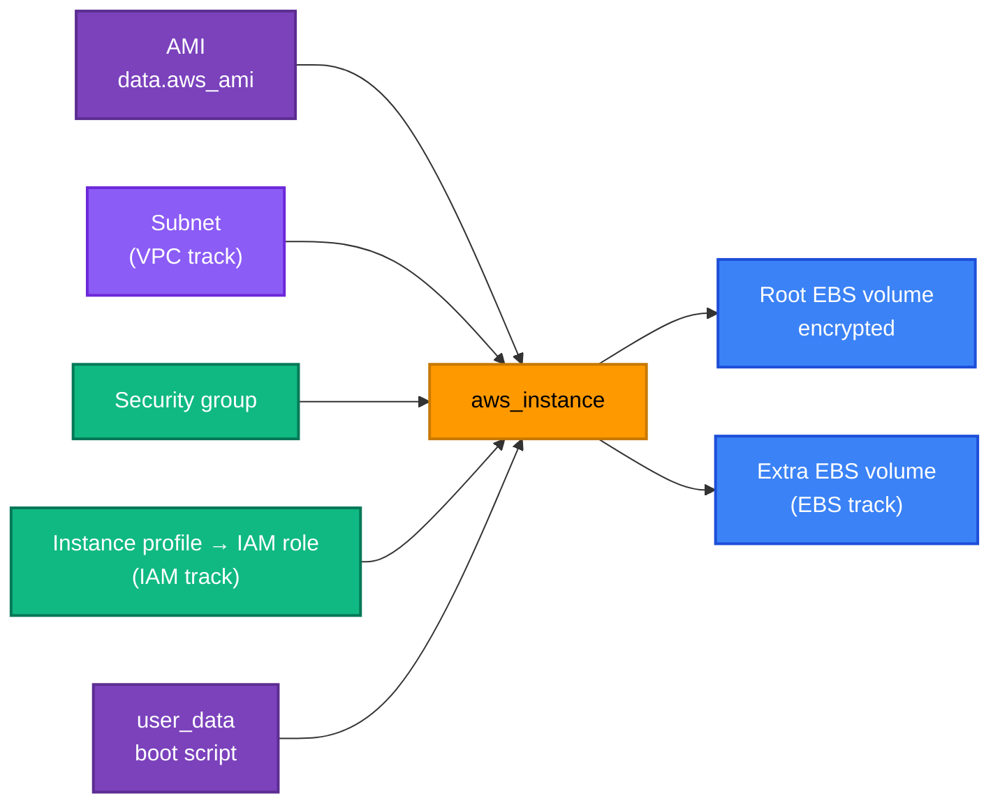

[← Security Groups](../security-groups/README.md) | [🏠 Home](../../README.md) | [📚 Learning Path](../../docs/00-learning-roadmap/README.md) | [⬆ AWS Service Tracks](../README.md) | [EBS →](../ebs/README.md)

# EC2 — Elastic Compute Cloud

🟢🟡 Track 5 of 16 · Labs: [01 · instance with SSM](01-instance-with-ssm/README.md), [02 · multiple instances with EBS](02-multiple-instances-with-ebs/README.md) · 💰 **Instances are billed while they run**

## What is it?

EC2 provides virtual servers ("instances"). You choose an **AMI** (the disk image: operating system + software), an **instance type** (CPU/memory size), a **subnet** (where in the network), **security groups** (firewall) and optionally an **IAM role** (what the server may do in AWS).

## Why do we need it?

Anything that needs a full operating system — legacy applications, custom software, self-managed databases, build agents — runs on EC2. Many higher-level services (ECS, EKS nodes, Auto Scaling groups) are also built on it.

## How does it work?



| Piece | What to know |
| --- | --- |
| **AMI** | Region-specific ID, replaced whenever a patched image is published → always look it up with `data "aws_ami"` and pin the `owners`. |
| **Instance type** | `t3.micro` = burstable, 2 vCPU, 1 GiB. `t4g.*` are ARM (Graviton) and need an ARM AMI. |
| **user_data** | A script run once by cloud-init at first boot. Changing it doesn't re-run it unless the instance is replaced (`user_data_replace_on_change = true`). |
| **Instance metadata service (IMDS)** | An internal endpoint where the instance reads its role credentials. Require **IMDSv2** (`http_tokens = "required"`) to block SSRF-style credential theft. |
| **Public IP** | Needed for direct internet access from a public subnet. AWS bills every public IPv4 address hourly. |
| **Access** | Prefer **SSM Session Manager** (an IAM-authenticated shell, no open ports, no keys) over SSH. |

### SSH key pairs (concept)

The traditional way in is SSH with a key pair (`aws_key_pair` + `key_name` on the instance + port 22 open in a security group). This course avoids it:

- the private key is a long-lived secret that must be distributed and rotated;
- port 22 must be reachable, usually from the internet;
- access isn't tied to IAM, so it isn't audited in CloudTrail.

SSM Session Manager solves all three. If you do need SSH, restrict port 22 to your own IP (`x.x.x.x/32`) and **never** generate private keys inside Terraform (`tls_private_key` stores the key in state).

### Simple analogy

The **AMI** is the factory image of a laptop, the **instance type** is the laptop model, **user_data** is the first-boot setup wizard, the **security group** is the laptop's firewall, and the **IAM role** is the corporate badge that lets it into internal systems.

## How Terraform models EC2

```hcl
resource "aws_instance" "this" {
  ami                    = data.aws_ami.al2023.id
  instance_type          = var.instance_type
  subnet_id              = var.subnet_id                     # omit → default VPC subnet
  vpc_security_group_ids = [aws_security_group.instance.id]  # NOT security_groups (EC2-Classic names)
  iam_instance_profile   = aws_iam_instance_profile.instance.name

  user_data                   = file("${path.module}/user_data.sh")
  user_data_replace_on_change = true

  metadata_options {
    http_tokens = "required"
  }

  root_block_device {
    volume_type = "gp3"
    encrypted   = true
  }
}
```

## Progression

| Step | Where | Adds |
| --- | --- | --- |
| Single instance | [examples/beginner/02](../../examples/beginner/02-first-ec2-instance/README.md) | AMI data source, IMDSv2, encryption |
| Variables and outputs | [examples/beginner/03](../../examples/beginner/03-variables-and-outputs/README.md) | Typed, validated inputs; tags via locals |
| `count` / `for_each` | [examples/meta-arguments](../../examples/meta-arguments/README.md) | Multiple instances |
| **IAM role + SSM + security group + user data** | [Lab 01](01-instance-with-ssm/README.md) | Shell access without SSH |
| **Several instances across AZs + EBS** | [Lab 02](02-multiple-instances-with-ebs/README.md) | `for_each` over a map of objects, data volumes |
| Web server | [Project 03](../../projects/03-web-server/README.md) | `templatefile`, HTTP |
| Inside a custom VPC | [Project 04](../../projects/04-vpc-ec2-stack/README.md) | Public + private subnets |
| As a module | [modules/ec2](../../modules/ec2/README.md) | Reusable interface |
| Auto Scaling | [Project 08](../../projects/08-highly-available-web/README.md) | Launch template + ASG |

## Key takeaways

- Look up AMIs; require IMDSv2; encrypt volumes; avoid public IPs unless needed.
- Use `vpc_security_group_ids` and an instance profile for AWS permissions.
- Prefer SSM Session Manager over SSH keys.

## Official references

- [Amazon EC2 User Guide](https://docs.aws.amazon.com/AWSEC2/latest/UserGuide/concepts.html)
- [Instance metadata service (IMDSv2)](https://docs.aws.amazon.com/AWSEC2/latest/UserGuide/configuring-instance-metadata-service.html)
- [Run commands at launch (user data)](https://docs.aws.amazon.com/AWSEC2/latest/UserGuide/user-data.html)
- [AWS Systems Manager Session Manager](https://docs.aws.amazon.com/systems-manager/latest/userguide/session-manager.html)
- [aws_instance (Terraform)](https://registry.terraform.io/providers/hashicorp/aws/latest/docs/resources/instance)

---

[← Security Groups](../security-groups/README.md) | [🏠 Home](../../README.md) | [📚 Learning Path](../../docs/00-learning-roadmap/README.md) | [⬆ AWS Service Tracks](../README.md) | [EBS →](../ebs/README.md)
