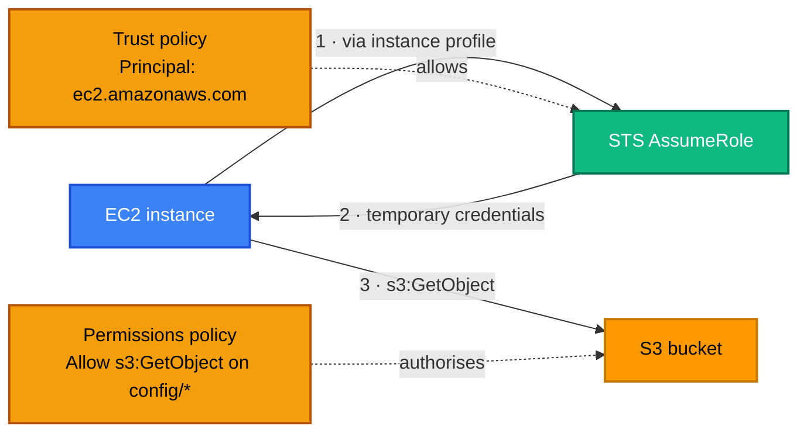

[← S3](../s3/README.md) | [🏠 Home](../../README.md) | [📚 Learning Path](../../docs/00-learning-roadmap/README.md) | [⬆ AWS Service Tracks](../README.md) | [VPC →](../vpc/README.md)

# IAM — Identity and Access Management

🟢 Beginner · Track 2 of 16 · Lab: [ec2-role](ec2-role/README.md) · 💰 Free

## What is it?

IAM decides **who** can do **what** to **which** AWS resources. Every AWS API call — including every call Terraform makes — is checked by IAM.

## Why do we need it?

Applications need AWS permissions too: an EC2 instance reading S3, a Lambda function writing to DynamoDB, a CI pipeline deploying infrastructure. IAM gives each of them **exactly the permissions they need, as temporary credentials**, instead of sharing long-lived keys.

## How does it work?

| Term | Plain meaning |
| --- | --- |
| **Principal** | Someone or something making a request: a user, a role, an AWS service |
| **IAM user** | A long-lived identity with a password and/or access keys. **Legacy for people** (use IAM Identity Center) and **discouraged for machines** (use roles). |
| **IAM role** | An identity with **no long-term credentials**. Principals *assume* it and get temporary credentials. |
| **Policy** | A JSON document of `Allow`/`Deny` statements: actions, resources, conditions |
| **Trust policy** | The policy **on a role** that says *who may assume it* |
| **Permissions policy** | A policy attached to a role/user that says *what it may do* |
| **Instance profile** | A container that lets **EC2** carry a role; the instance gets the role's temporary credentials through the metadata service |
| **AssumeRole** | The STS API call that exchanges "I am allowed to assume this role" for temporary credentials |

### Simple analogy

A **role** is a **hi-vis vest with a job title** hanging on a hook. The **trust policy** is the sign above the hook: "only EC2 instances may wear this vest". The **permissions policy** is the list printed on the vest: "may read the config bucket". The **instance profile** is the hanger that lets the vest go onto an EC2 instance.



### Least privilege

Grant the **minimum** actions on the **specific** resources needed, and nothing else:

| ❌ Too broad | ✅ Least privilege |
| --- | --- |
| `"Action": "s3:*"`, `"Resource": "*"` | `"Action": "s3:GetObject"`, `"Resource": "arn:aws:s3:::my-bucket/config/*"` |
| `AdministratorAccess` for an app | A custom policy listing the 3 actions the app uses |

## How Terraform models IAM

| Terraform | AWS concept |
| --- | --- |
| `data "aws_iam_policy_document"` | Builds policy JSON from HCL — validated, readable, composable |
| `aws_iam_role` + `assume_role_policy` | Role + **trust policy** |
| `aws_iam_policy` | Standalone **customer managed** permissions policy (own ARN, reusable) |
| `aws_iam_role_policy_attachment` | Attach a managed policy (AWS- or customer-managed) to a role |
| `aws_iam_role_policy` | **Inline** policy that lives inside one role |
| `aws_iam_instance_profile` | Instance profile for EC2 |

```hcl
data "aws_iam_policy_document" "ec2_trust" {
  statement {
    actions = ["sts:AssumeRole"]
    principals {
      type        = "Service"
      identifiers = ["ec2.amazonaws.com"]
    }
  }
}

resource "aws_iam_role" "app" {
  name               = "tf-learning-app-role"
  assume_role_policy = data.aws_iam_policy_document.ec2_trust.json
}

resource "aws_iam_instance_profile" "app" {
  name = "tf-learning-app-profile"
  role = aws_iam_role.app.name
}
```

### Other principals you will meet

| Who assumes the role | Trust policy principal | Where in this course |
| --- | --- | --- |
| EC2 | `Service: ec2.amazonaws.com` | this lab, [EC2 track](../ec2/README.md) |
| Lambda | `Service: lambda.amazonaws.com` | [Lambda track](../lambda/README.md) |
| GitHub Actions (OIDC) | `Federated: <OIDC provider ARN>` + conditions on `sub` | [Chapter 18](../../docs/18-github-actions/README.md) |
| People / other roles in the account | `AWS: arn:aws:iam::<account>:root` | [Project 05](../../projects/05-secure-s3/README.md) |

### Managed vs inline policies

- **AWS managed** (e.g. `AmazonSSMManagedInstanceCore`): maintained by AWS; convenient but often broader than needed.
- **Customer managed** (`aws_iam_policy`): yours, reusable across roles, versioned by IAM.
- **Inline** (`aws_iam_role_policy`): embedded in one role; deleted with it. Good for permissions that only make sense for that role.

## Lab

**[ec2-role](ec2-role/README.md)**: trust policy, least-privilege customer managed policy (read one prefix of one bucket), AWS managed SSM policy, instance profile. The [EC2 track](../ec2/README.md) then attaches a role like this to an instance.

## Key takeaways

- **Role** = identity without permanent keys; **trust policy** = who may assume it; **permissions policy** = what it may do; **instance profile** = how EC2 carries it.
- Build policies with `aws_iam_policy_document`, not hand-written JSON strings.
- Least privilege: specific actions on specific ARNs.
- Avoid IAM users with access keys for applications and pipelines.

## Official references

- [IAM roles](https://docs.aws.amazon.com/IAM/latest/UserGuide/id_roles.html)
- [Policies and permissions](https://docs.aws.amazon.com/IAM/latest/UserGuide/access_policies.html)
- [Using an IAM role to grant permissions to applications on EC2](https://docs.aws.amazon.com/IAM/latest/UserGuide/id_roles_use_switch-role-ec2.html)
- [Security best practices in IAM](https://docs.aws.amazon.com/IAM/latest/UserGuide/best-practices.html)
- [aws_iam_policy_document (Terraform)](https://registry.terraform.io/providers/hashicorp/aws/latest/docs/data-sources/iam_policy_document)

---

[← S3](../s3/README.md) | [🏠 Home](../../README.md) | [📚 Learning Path](../../docs/00-learning-roadmap/README.md) | [⬆ AWS Service Tracks](../README.md) | [VPC →](../vpc/README.md)
