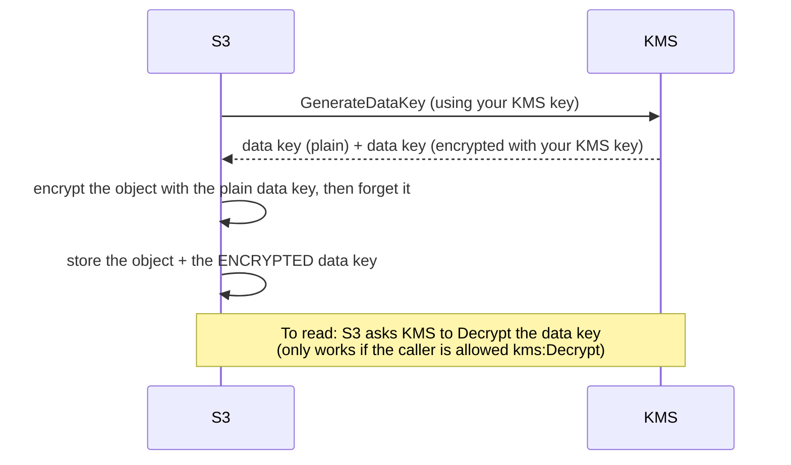

[← EBS](../ebs/README.md) | [🏠 Home](../../README.md) | [📚 Learning Path](../../docs/00-learning-roadmap/README.md) | [⬆ AWS Service Tracks](../README.md) | [Secrets Manager →](../secrets-manager/README.md)

# KMS — Key Management Service

🟡 Intermediate · Track 7 of 16 · Lab: [customer-managed-key](customer-managed-key/README.md) · 💰 Each customer managed key has a **monthly charge** (prorated) plus a per-request charge

## What is it?

KMS creates and protects **encryption keys**. AWS services (S3, EBS, RDS, Secrets Manager, …) call KMS to encrypt and decrypt your data; the key material itself never leaves KMS.

## Why do we need it?

- **Control:** with your own key, *reading* encrypted data requires permission on the **key** as well as on the data. A leaked S3 permission alone isn't enough.
- **Audit:** every use of the key is logged in CloudTrail.
- **Compliance:** many standards require customer-controlled keys, rotation and separation of duties.

## How does it work? (without the cryptography)

S3 doesn't send your 5 GB file to KMS. It uses **envelope encryption**:



| Key type | Who manages it | Cost | Use when |
| --- | --- | --- | --- |
| **AWS owned** | AWS, invisible to you | Free | Service defaults (e.g. SSE-S3, SQS SSE) |
| **AWS managed** (`aws/s3`, `aws/ebs`, `aws/secretsmanager`) | AWS, visible in your account | No monthly fee | Simple encryption with CloudTrail visibility |
| **Customer managed** | **You** — policy, rotation, deletion | Monthly + requests | You need control over who can decrypt |

### Key policies

Every KMS key has a **key policy** — the primary access control for that key. IAM policies can only grant access to a key if the key policy allows it (normally via the standard statement that delegates to IAM in the account). A key policy without that statement can lock *everyone* out of the key.

### Aliases

`alias/tf-learning-data` is a friendly name for a key. Code can refer to the alias, and the alias can later be pointed at a different key.

### Rotation and deletion

- `enable_key_rotation = true` rotates the key material yearly (configurable); old material is kept so older data still decrypts.
- Deleting a key makes everything encrypted with it **unreadable forever**, so AWS enforces a 7–30 day waiting period (`deletion_window_in_days`) during which you can cancel.

### Simple analogy

KMS is a **bank vault that holds master keys**. Services get a **one-time lockbox key** (data key) from the vault, lock your data with it, and store the lockbox key *locked with the master key* next to the data. To open the data, you must ask the vault — and the vault checks your ID every time.

## How Terraform models KMS

```hcl
resource "aws_kms_key" "data" {
  description             = "Encrypts objects in the lab bucket"
  policy                  = data.aws_iam_policy_document.key.json
  enable_key_rotation     = true
  deletion_window_in_days = 7
}

resource "aws_kms_alias" "data" {
  name          = "alias/tf-learning-data"
  target_key_id = aws_kms_key.data.key_id
}

# Use it for S3
resource "aws_s3_bucket_server_side_encryption_configuration" "encrypted" {
  bucket = aws_s3_bucket.encrypted.id
  rule {
    apply_server_side_encryption_by_default {
      sse_algorithm     = "aws:kms"
      kms_master_key_id = aws_kms_key.data.arn
    }
    bucket_key_enabled = true    # far fewer KMS requests → lower cost
  }
}
```

### KMS with Secrets Manager

`aws_secretsmanager_secret` accepts `kms_key_id`. Without it, the AWS managed key `aws/secretsmanager` is used. A customer managed key lets you restrict decryption to specific roles — see [Secrets Manager](../secrets-manager/README.md).

### KMS and Terraform state

The S3 backend accepts `kms_key_id` to encrypt state with your own key. Then reading state requires `kms:Decrypt` on that key — an extra lock on the most sensitive file Terraform produces ([Chapter 12](../../docs/12-remote-state/README.md)).

## Lab

**[customer-managed-key](customer-managed-key/README.md)**: key with explicit key policy, rotation and alias, plus a bucket using it for SSE-KMS with S3 Bucket Keys. [Project 05](../../projects/05-secure-s3/README.md) extends this with separate reader/writer roles.

## Key takeaways

- Envelope encryption: KMS protects small data keys; services encrypt your data with them.
- Customer managed keys add control, audit and cost; key policies are the root of access.
- Keep the "enable IAM policies" statement in key policies to avoid lock-out.
- Deletion is irreversible after the waiting period.

## Official references

- [AWS KMS concepts](https://docs.aws.amazon.com/kms/latest/developerguide/concepts.html)
- [Key policies](https://docs.aws.amazon.com/kms/latest/developerguide/key-policies.html)
- [Rotating keys](https://docs.aws.amazon.com/kms/latest/developerguide/rotate-keys.html)
- [S3 Bucket Keys](https://docs.aws.amazon.com/AmazonS3/latest/userguide/bucket-key.html)
- [AWS KMS pricing](https://aws.amazon.com/kms/pricing/)
- [aws_kms_key (Terraform)](https://registry.terraform.io/providers/hashicorp/aws/latest/docs/resources/kms_key)

---

[← EBS](../ebs/README.md) | [🏠 Home](../../README.md) | [📚 Learning Path](../../docs/00-learning-roadmap/README.md) | [⬆ AWS Service Tracks](../README.md) | [Secrets Manager →](../secrets-manager/README.md)
