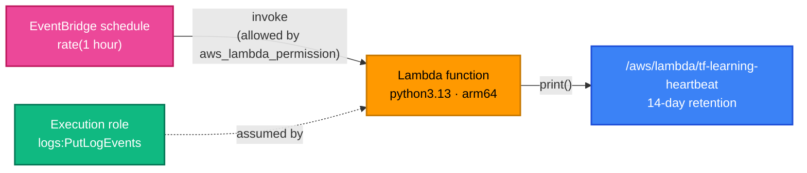

[← CloudWatch](../cloudwatch/README.md) | [🏠 Home](../../README.md) | [📚 Learning Path](../../docs/00-learning-roadmap/README.md) | [⬆ AWS Service Tracks](../README.md) | [SQS →](../sqs/README.md)

# Lambda

🟡 Intermediate · Track 10 of 16 · Lab: [scheduled-function](scheduled-function/README.md) · 💰 Billed per request and per GB-second of compute

## What is it?

AWS Lambda runs your code **without servers to manage**. You upload a function; AWS runs it when an **event** arrives (an HTTP request, a queue message, a schedule, a file upload) and bills only for the time it runs.

## Why do we need it?

For event-driven work — glue between services, APIs with spiky traffic, scheduled jobs — Lambda removes patching, scaling and idle cost.

## How does it work?

| Piece | Terraform | Direction |
| --- | --- | --- |
| **Deployment package** | `.zip` built by `data "archive_file"`, or an S3 object, or a container image | Code → Lambda |
| **Execution role** | `aws_iam_role` trusted by `lambda.amazonaws.com` | What the **function** may call |
| **Resource-based policy** | `aws_lambda_permission` | Who may **invoke** the function |
| **Log group** | `aws_cloudwatch_log_group` named `/aws/lambda/<name>` | Where `print()` output goes |
| **Configuration** | runtime, handler, memory, timeout, environment variables, architecture | |
| **Trigger** | EventBridge rule, API Gateway, SQS event source mapping, S3 notification, SNS subscription | Event → Lambda |



### Two kinds of permission — don't mix them up

- The **execution role** answers *"what can this function do?"* (write logs, read a table…).
- The **resource-based policy** (`aws_lambda_permission`) answers *"who can call this function?"* (EventBridge, API Gateway, S3…).

Queue-based triggers (SQS, Kinesis, DynamoDB streams) are different again: **Lambda polls the queue using the execution role**, so the role needs `sqs:ReceiveMessage` etc. and no `aws_lambda_permission` is needed ([Project 07](../../projects/07-event-driven-architecture/README.md)).

### Packaging

```hcl
data "archive_file" "function" {
  type        = "zip"
  source_dir  = "${path.module}/src"
  output_path = "${path.module}/build/function.zip"
}

resource "aws_lambda_function" "this" {
  filename         = data.archive_file.function.output_path
  source_code_hash = data.archive_file.function.output_base64sha256   # redeploy when code changes
  # ...
}
```

For larger packages or CI pipelines, upload the zip to **S3** (`s3_bucket`, `s3_key`, `s3_object_version`) — often by the application's own pipeline, with Terraform only managing the function configuration.

### Layers (concept)

A **layer** is a separately versioned zip (shared libraries, a runtime extension) that several functions can include via `layers = [aws_lambda_layer_version.deps.arn]`. Useful to share dependencies; not needed for small functions like the ones in this course.

### Environment variables

```hcl
environment {
  variables = {
    TABLE_NAME = aws_dynamodb_table.visits.name     # configuration: fine
    # DB_PASSWORD = "..."                           # secrets: NO — pass a Secrets Manager ARN
  }
}
```

## Lab

**[scheduled-function](scheduled-function/README.md)**: a tiny Python function, zipped by Terraform, with a least-privilege execution role, its own log group, environment variables, and an EventBridge schedule trigger.

More Lambda: HTTP API in [Project 06](../../projects/06-serverless-application/README.md), SQS consumer with partial batch failures in [Project 07](../../projects/07-event-driven-architecture/README.md).

## Key takeaways

- Execution role = what the function can do; `aws_lambda_permission` = who can invoke it.
- Create `/aws/lambda/<name>` log groups yourself, with retention.
- `source_code_hash` makes Terraform redeploy when the code changes.
- Never put secrets in environment variables.

## Official references

- [What is AWS Lambda?](https://docs.aws.amazon.com/lambda/latest/dg/welcome.html)
- [Lambda execution role](https://docs.aws.amazon.com/lambda/latest/dg/lambda-intro-execution-role.html)
- [Lambda resource-based policies](https://docs.aws.amazon.com/lambda/latest/dg/access-control-resource-based.html)
- [Lambda runtimes](https://docs.aws.amazon.com/lambda/latest/dg/lambda-runtimes.html)
- [aws_lambda_function (Terraform)](https://registry.terraform.io/providers/hashicorp/aws/latest/docs/resources/lambda_function)
- [archive_file data source](https://registry.terraform.io/providers/hashicorp/archive/latest/docs/data-sources/file)

---

[← CloudWatch](../cloudwatch/README.md) | [🏠 Home](../../README.md) | [📚 Learning Path](../../docs/00-learning-roadmap/README.md) | [⬆ AWS Service Tracks](../README.md) | [SQS →](../sqs/README.md)
