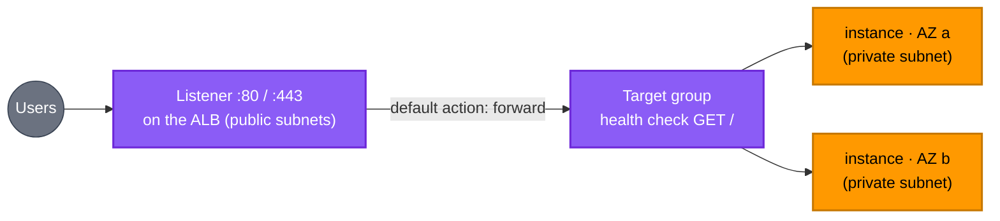

[← SNS](../sns/README.md) | [🏠 Home](../../README.md) | [📚 Learning Path](../../docs/00-learning-roadmap/README.md) | [⬆ AWS Service Tracks](../README.md) | [EC2 Auto Scaling →](../autoscaling/README.md)

# Elastic Load Balancing

🟡 Intermediate · Track 13 of 16 · Lab: [Project 08](../../projects/08-highly-available-web/README.md) · 💰 **Billed per hour** plus capacity units, and holds public IPv4 addresses

## What is it?

A load balancer receives traffic on one stable endpoint and **spreads it across several targets** (instances, IPs, Lambda functions) in multiple AZs, sending traffic only to targets that pass **health checks**.

| Type | Layer | Use for |
| --- | --- | --- |
| **Application Load Balancer (ALB)** | HTTP/HTTPS (layer 7) | Web apps and APIs; path/host-based routing |
| **Network Load Balancer (NLB)** | TCP/UDP/TLS (layer 4) | Very high throughput, static IPs, non-HTTP protocols |
| Gateway Load Balancer | layer 3 | Inserting network appliances (firewalls) — rarely needed |

## Why do we need it?

- **Availability:** if an instance or an AZ fails, traffic goes to the healthy ones.
- **Scalability:** add or remove instances without changing the endpoint.
- **Security:** only the load balancer is public; instances stay in private subnets.
- **TLS termination:** HTTPS certificates (from ACM) are managed on the load balancer.

## How does it work?



| Terraform resource | Concept |
| --- | --- |
| `aws_lb` | The load balancer itself: type, subnets (≥ 2 AZs), security groups |
| `aws_lb_target_group` | A set of targets plus the **health check** |
| `aws_lb_listener` | Port + protocol + what to do with requests (forward, redirect, fixed response) |
| `aws_lb_listener_rule` | Extra routing rules (path `/api/*` → another target group) |
| `aws_lb_target_group_attachment` | Register a single target manually (Auto Scaling does this automatically) |

```hcl
resource "aws_lb" "web" {
  load_balancer_type = "application"
  subnets            = module.vpc.public_subnet_ids
  security_groups    = [aws_security_group.alb.id]
}

resource "aws_lb_target_group" "web" {
  port     = 80
  protocol = "HTTP"
  vpc_id   = module.vpc.vpc_id
  health_check {
    path    = "/"
    matcher = "200"
  }
}

resource "aws_lb_listener" "http" {
  load_balancer_arn = aws_lb.web.arn
  port              = 80
  protocol          = "HTTP"
  default_action {
    type             = "forward"
    target_group_arn = aws_lb_target_group.web.arn
  }
}
```

### HTTPS in production

A production listener uses `protocol = "HTTPS"`, `certificate_arn` from an `aws_acm_certificate` (validated through Route 53), and a modern `ssl_policy`; the port-80 listener only redirects to HTTPS. The course's [Project 08](../../projects/08-highly-available-web/README.md) uses HTTP only because a certificate requires a domain you own — marked as a **learning shortcut** there.

## Lab

The load balancer is built in **[Project 08 · Highly available web](../../projects/08-highly-available-web/README.md)** together with Auto Scaling, because a load balancer without a fleet behind it teaches little.

## Key takeaways

- ALB for HTTP(S); NLB for TCP/UDP and static IPs.
- Load balancer → listener → target group → targets, with health checks deciding who gets traffic.
- Public load balancer, private instances, security groups chained by reference.

## Official references

- [What is an Application Load Balancer?](https://docs.aws.amazon.com/elasticloadbalancing/latest/application/introduction.html)
- [Target group health checks](https://docs.aws.amazon.com/elasticloadbalancing/latest/application/target-group-health-checks.html)
- [HTTPS listeners](https://docs.aws.amazon.com/elasticloadbalancing/latest/application/create-https-listener.html)
- [Elastic Load Balancing pricing](https://aws.amazon.com/elasticloadbalancing/pricing/)
- [aws_lb (Terraform)](https://registry.terraform.io/providers/hashicorp/aws/latest/docs/resources/lb)

---

[← SNS](../sns/README.md) | [🏠 Home](../../README.md) | [📚 Learning Path](../../docs/00-learning-roadmap/README.md) | [⬆ AWS Service Tracks](../README.md) | [EC2 Auto Scaling →](../autoscaling/README.md)
