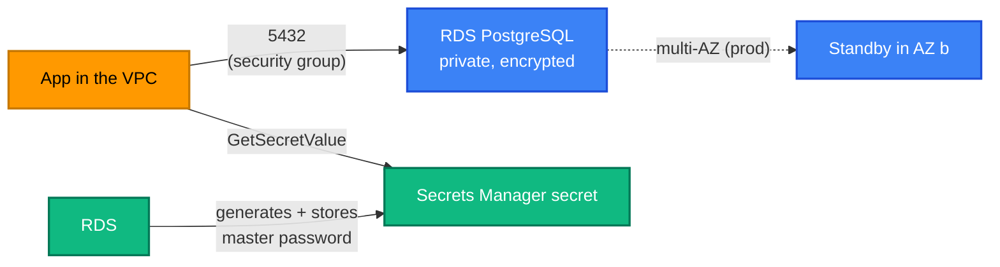

[← Route 53](../route53/README.md) | [🏠 Home](../../README.md) | [📚 Learning Path](../../docs/00-learning-roadmap/README.md) | [⬆ AWS Service Tracks](../README.md) | [11 · Terraform State →](../../docs/11-terraform-state/README.md)

# RDS — Relational Database Service

🟡 Intermediate · Track 16 of 16 · Lab: [postgres-basic](postgres-basic/README.md) · 💰 **Billed per hour** plus storage and backups; creation takes several minutes

## What is it?

Amazon RDS runs relational databases (PostgreSQL, MySQL, MariaDB, SQL Server, Oracle, Db2) for you: provisioning, patching, backups, failover. **Aurora** is AWS's cloud-native, MySQL/PostgreSQL-compatible engine within RDS.

## Why do we need it?

Running a database on EC2 means you own backups, replication, patching and failover. RDS automates them, and Terraform can describe the whole database setup — network, parameters, backups, encryption — as code.

## How does it work?

| Concept | Meaning |
| --- | --- |
| **DB instance** | The database server: engine, version, instance class, storage |
| **DB subnet group** | Subnets (in ≥ 2 AZs) RDS may place the instance in |
| **Security group** | Who may connect on the database port |
| **Multi-AZ** | A synchronous standby in another AZ with automatic failover |
| **Automated backups** | Daily snapshots + transaction logs for point-in-time restore |
| **Parameter group** | Engine settings (`aws_db_parameter_group`) |
| **Master password** | Either you provide it, or RDS generates it and stores it in **Secrets Manager** (`manage_master_user_password = true`) |



## How Terraform models RDS

```hcl
resource "aws_db_subnet_group" "this" {
  subnet_ids = data.aws_subnets.default.ids
}

resource "aws_db_instance" "this" {
  identifier_prefix = "tf-learning-"
  engine            = "postgres"
  engine_version    = "17"
  instance_class    = "db.t4g.micro"
  allocated_storage = 20
  storage_encrypted = true

  username                    = "app_admin"
  manage_master_user_password = true   # password never touches Terraform or its state

  db_subnet_group_name   = aws_db_subnet_group.this.name
  vpc_security_group_ids = [aws_security_group.db.id]
  publicly_accessible    = false

  backup_retention_period = 7
  deletion_protection     = true       # production
  skip_final_snapshot     = false      # production: take a snapshot before deletion
}
```

### Settings that can hurt you

| Setting | Why careful |
| --- | --- |
| `publicly_accessible = true` | Puts the database on the internet. Almost never needed. |
| `skip_final_snapshot = true` | `destroy` deletes the data with no backup. **Learning shortcut only.** |
| `deletion_protection = false` | Allows deletion by Terraform or the console. Set `true` for real data. |
| Changing `engine_version` major, `identifier`, `db_name`, some storage settings | May **replace** the database. Always read the plan; use `prevent_destroy`. |
| `apply_immediately = true` | Applies changes (and reboots) now instead of in the maintenance window |
| `password = var.x` | Stores the password in state; prefer `manage_master_user_password` or the write-only `password_wo` |

## Lab

**[postgres-basic](postgres-basic/README.md)**: a small, private, encrypted PostgreSQL instance in the default VPC with an AWS-managed master password.

## Key takeaways

- RDS = managed database; you still design network, backups and access.
- Keep databases private; reach them from inside the VPC.
- `manage_master_user_password = true` keeps the password out of Terraform.
- Protect real databases with `deletion_protection`, final snapshots and `prevent_destroy`.

## Official references

- [What is Amazon RDS?](https://docs.aws.amazon.com/AmazonRDS/latest/UserGuide/Welcome.html)
- [Password management with Secrets Manager](https://docs.aws.amazon.com/AmazonRDS/latest/UserGuide/rds-secrets-manager.html)
- [Multi-AZ deployments](https://docs.aws.amazon.com/AmazonRDS/latest/UserGuide/Concepts.MultiAZ.html)
- [Amazon RDS pricing](https://aws.amazon.com/rds/pricing/)
- [aws_db_instance (Terraform)](https://registry.terraform.io/providers/hashicorp/aws/latest/docs/resources/db_instance)

---

[← Route 53](../route53/README.md) | [🏠 Home](../../README.md) | [📚 Learning Path](../../docs/00-learning-roadmap/README.md) | [⬆ AWS Service Tracks](../README.md) | [11 · Terraform State →](../../docs/11-terraform-state/README.md)
