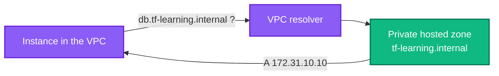

[← EC2 Auto Scaling](../autoscaling/README.md) | [🏠 Home](../../README.md) | [📚 Learning Path](../../docs/00-learning-roadmap/README.md) | [⬆ AWS Service Tracks](../README.md) | [RDS →](../rds/README.md)

# Route 53

🟢 Beginner · Track 15 of 16 · Lab: [private-hosted-zone](private-hosted-zone/README.md) · 💰 **Monthly charge per hosted zone** plus per-query charges

## What is it?

Amazon Route 53 is AWS's **DNS** service: it answers "what is the IP address of `app.example.com`?". It can also register domain names and health-check endpoints.

## Why do we need it?

People and services use names, not IP addresses. DNS records let you move an application to a new load balancer, Region or IP without changing any client.

## How does it work?

| Concept | Meaning |
| --- | --- |
| **Hosted zone** | The container of records for a domain (`example.com`) |
| **Public zone** | Answers queries from the internet; you must own the domain and point its name servers (NS) at the zone |
| **Private zone** | Answers only inside the VPCs you associate with it — no domain purchase needed |
| **A / AAAA record** | Name → IPv4 / IPv6 address |
| **CNAME** | Name → another name (not allowed at the zone apex, e.g. `example.com` itself) |
| **Alias record** | Route 53 extension: name → AWS resource (ALB, CloudFront, S3 website). Works at the apex, and alias queries to AWS resources are not charged. |
| **TTL** | How long resolvers may cache an answer |



### Simple analogy

DNS is the **phone book**; a hosted zone is **your company's page** in it; a private zone is the **internal phone list** only employees in the building (VPC) can read.

## How Terraform models Route 53

```hcl
resource "aws_route53_zone" "internal" {
  name = "tf-learning.internal"
  vpc {
    vpc_id = data.aws_vpc.default.id      # this makes it private
  }
}

resource "aws_route53_record" "db" {
  zone_id = aws_route53_zone.internal.zone_id
  name    = "db.tf-learning.internal"
  type    = "A"
  ttl     = 300
  records = ["172.31.10.10"]
}

# Alias to a load balancer (public zone example)
resource "aws_route53_record" "app" {
  zone_id = aws_route53_zone.public.zone_id
  name    = "app.example.com"
  type    = "A"
  alias {
    name                   = aws_lb.web.dns_name
    zone_id                = aws_lb.web.zone_id
    evaluate_target_health = true
  }
}
```

For a public zone of a domain registered elsewhere, you would copy `aws_route53_zone.public.name_servers` into your registrar's NS settings.

## Lab

**[private-hosted-zone](private-hosted-zone/README.md)**: a private zone on the default VPC with an A record and a CNAME. No domain needed.

## Key takeaways

- Hosted zone = container; records = answers.
- Private zones work only inside associated VPCs and need no domain.
- Prefer **alias** records for AWS endpoints.

## Official references

- [What is Amazon Route 53?](https://docs.aws.amazon.com/Route53/latest/DeveloperGuide/Welcome.html)
- [Working with private hosted zones](https://docs.aws.amazon.com/Route53/latest/DeveloperGuide/hosted-zones-private.html)
- [Choosing between alias and non-alias records](https://docs.aws.amazon.com/Route53/latest/DeveloperGuide/resource-record-sets-choosing-alias-non-alias.html)
- [Route 53 pricing](https://aws.amazon.com/route53/pricing/)

---

[← EC2 Auto Scaling](../autoscaling/README.md) | [🏠 Home](../../README.md) | [📚 Learning Path](../../docs/00-learning-roadmap/README.md) | [⬆ AWS Service Tracks](../README.md) | [RDS →](../rds/README.md)
