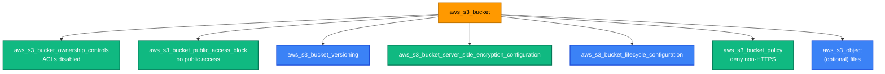

[← AWS Service Tracks](../README.md) | [🏠 Home](../../README.md) | [📚 Learning Path](../../docs/00-learning-roadmap/README.md) | [⬆ AWS Service Tracks](../README.md) | [IAM →](../iam/README.md)

# S3 — Simple Storage Service

🟢 Beginner · Track 1 of 16 · Lab: [secure-bucket](secure-bucket/README.md) · 💰 Free while empty

## What is it?

Amazon S3 stores **objects** (files of any size) in **buckets**. Each object has a **key** (its name, e.g. `logs/2026/app.log`) and is reached through the S3 API — not mounted like a disk.

## Why do we need it?

Almost every AWS architecture uses S3: website assets, backups, logs, data lakes, Lambda code packages — and **Terraform remote state** ([Chapter 12](../../docs/12-remote-state/README.md)).

## How does it work?

| Concept | Meaning |
| --- | --- |
| **Bucket name** | Globally unique across *all* AWS accounts, 3–63 lowercase characters. That is why labs use `bucket_prefix`. |
| **Region** | A bucket lives in one Region; data stays there unless you replicate it. |
| **Versioning** | Keeps every previous version of an object; deletes become "delete markers" that can be undone. |
| **Encryption at rest** | All new objects are encrypted. Default is SSE-S3 (keys managed by S3); SSE-KMS uses a KMS key you control ([KMS track](../kms/README.md)). |
| **Block Public Access** | Account- and bucket-level switches that override any policy or ACL that would make data public. On by default for new buckets. |
| **Object Ownership** | `BucketOwnerEnforced` disables ACLs; access is controlled only by policies. AWS's recommended setting. |
| **Bucket policy** | A resource-based IAM policy attached to the bucket (who may do what to it). |
| **Lifecycle rules** | Automatically move objects to cheaper storage classes or delete them after N days. |

### Simple analogy

A bucket is a **warehouse** with a unique street address. Objects are **labelled boxes**. Versioning keeps every earlier version of each box; lifecycle rules move old boxes to cheaper storage in the basement and eventually throw them away.

## How Terraform models S3

Since AWS provider v4, a bucket is configured by **one resource per aspect**, all pointing at the bucket:



The older style — `versioning { }`, `server_side_encryption_configuration { }` blocks *inside* `aws_s3_bucket` — is **deprecated**. Don't mix the two styles on one bucket; they fight each other.

### Minimal secure bucket

```hcl
resource "aws_s3_bucket" "this" {
  bucket_prefix = "tf-learning-s3-lab-"
}

resource "aws_s3_bucket_public_access_block" "this" {
  bucket                  = aws_s3_bucket.this.id
  block_public_acls       = true
  block_public_policy     = true
  ignore_public_acls      = true
  restrict_public_buckets = true
}

resource "aws_s3_bucket_versioning" "this" {
  bucket = aws_s3_bucket.this.id
  versioning_configuration {
    status = "Enabled"
  }
}
```

### Lifecycle rules

```hcl
rule {
  id     = "logs"
  status = "Enabled"
  filter { prefix = "logs/" }

  transition {                 # after 30 days → cheaper infrequent-access class
    days          = 30
    storage_class = "STANDARD_IA"
  }
  expiration {                 # after 365 days → delete
    days = 365
  }
}
```

### Bucket policy: HTTPS only

```hcl
data "aws_iam_policy_document" "bucket" {
  statement {
    effect    = "Deny"
    actions   = ["s3:*"]
    resources = [aws_s3_bucket.this.arn, "${aws_s3_bucket.this.arn}/*"]
    principals {
      type        = "*"
      identifiers = ["*"]
    }
    condition {
      test     = "Bool"
      variable = "aws:SecureTransport"
      values   = ["false"]
    }
  }
}
```

### About public buckets

This course never makes a bucket public. To serve a website from S3, keep the bucket **private** and put **CloudFront** in front of it with Origin Access Control — see [Project 01](../../projects/01-static-website/README.md). S3's "static website hosting" feature requires public read access and HTTP only; it is a legacy pattern for most use cases.

### `force_destroy`

`force_destroy = true` lets `terraform destroy` delete a bucket that still contains objects. Labs set it for convenience. **Learning shortcut** — for real data, keep it `false` so a mistaken destroy fails instead of wiping data.

## Lab

**[secure-bucket](secure-bucket/README.md)**: bucket + ownership controls + public access block + versioning + encryption + lifecycle rules + HTTPS-only policy + one object.

The same settings are packaged as a reusable module in [modules/s3](../../modules/s3/README.md) ([Chapter 13](../../docs/13-terraform-modules/README.md)).

## Key takeaways

- Bucket names are global — use `bucket_prefix` in labs.
- One Terraform resource per bucket aspect (versioning, encryption, policy, …).
- Secure defaults: ACLs disabled, public access blocked, versioning on, HTTPS only.
- Serve websites through CloudFront, never from a public bucket.

## Official references

- [Amazon S3 User Guide](https://docs.aws.amazon.com/AmazonS3/latest/userguide/Welcome.html)
- [Blocking public access](https://docs.aws.amazon.com/AmazonS3/latest/userguide/access-control-block-public-access.html)
- [Controlling object ownership](https://docs.aws.amazon.com/AmazonS3/latest/userguide/about-object-ownership.html)
- [Security best practices for S3](https://docs.aws.amazon.com/AmazonS3/latest/userguide/security-best-practices.html)
- [aws_s3_bucket (Terraform)](https://registry.terraform.io/providers/hashicorp/aws/latest/docs/resources/s3_bucket)

---

[← AWS Service Tracks](../README.md) | [🏠 Home](../../README.md) | [📚 Learning Path](../../docs/00-learning-roadmap/README.md) | [⬆ AWS Service Tracks](../README.md) | [IAM →](../iam/README.md)
