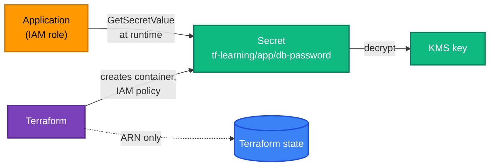

[← KMS](../kms/README.md) | [🏠 Home](../../README.md) | [📚 Learning Path](../../docs/00-learning-roadmap/README.md) | [⬆ AWS Service Tracks](../README.md) | [CloudWatch →](../cloudwatch/README.md)

# Secrets Manager

🟡 Intermediate · Track 8 of 16 · Lab: [secret-without-state](secret-without-state/README.md) · 💰 Monthly charge per secret (prorated) plus API calls

## What is it?

AWS Secrets Manager stores secrets — database passwords, API keys, tokens — encrypted with KMS, with fine-grained IAM access, audit logging and optional automatic rotation.

## Why do we need it?

Secrets must not live in code, in environment files on servers, or in Git. Applications fetch them at runtime with their IAM role, and rotation can change them without redeploying.

## How does it work?

- A **secret** is a container: name, description, KMS key, resource policy, rotation settings.
- The **value** is stored in **versions**. Each version has labels such as `AWSCURRENT` and `AWSPREVIOUS`.
- An application calls `secretsmanager:GetSecretValue` with its role and receives the current value.



## ⚠️ The Terraform state problem

**Any value Terraform handles is normally written to the state file in plain text.** That includes:

- a password passed in `secret_string` of `aws_secretsmanager_secret_version`;
- a value read with `data "aws_secretsmanager_secret_version"`;
- a `random_password` resource's result;
- a `password` argument on `aws_db_instance`.

`sensitive = true` **only hides values in CLI output**. It does not remove them from state or plan files.

So there are three safe patterns, from best to acceptable:

| Pattern | How | Value in state? |
| --- | --- | --- |
| **1. Terraform never sees the value** | Create the secret container with Terraform; set the value outside Terraform (console, CLI, rotation Lambda). Or let AWS manage it, e.g. RDS `manage_master_user_password = true` ([RDS track](../rds/README.md)). | No |
| **2. Ephemeral + write-only** (Terraform 1.11+) | Generate the value with an **ephemeral** resource and send it through a **write-only** argument (`secret_string_wo`). | **No** |
| **3. Classic** | `secret_string = var.password` or `random_password` | **Yes** → state must be encrypted and tightly access-controlled ([Chapter 12](../../docs/12-remote-state/README.md)) |

### Ephemeral resources and write-only arguments

```hcl
# Generated during the run, never stored in plan or state.
ephemeral "aws_secretsmanager_random_password" "db" {
  password_length     = 32
  exclude_punctuation = true
}

resource "aws_secretsmanager_secret_version" "db" {
  secret_id                = aws_secretsmanager_secret.db.id
  secret_string_wo         = ephemeral.aws_secretsmanager_random_password.db.random_password
  secret_string_wo_version = var.password_version   # bump to write a new value
}
```

- **Ephemeral resources** (Terraform 1.10+) produce values that exist only during a run.
- **Write-only arguments** (Terraform 1.11+, names ending in `_wo`) are sent to the provider but never persisted. Because Terraform can't compare a value it never stored, a companion `*_wo_version` argument tells it when to write again.

### Referencing a secret from other resources

Pass the **ARN**, not the value:

```hcl
resource "aws_lambda_function" "app" {
  environment {
    variables = {
      DB_SECRET_ARN = aws_secretsmanager_secret.db.arn   # app fetches the value itself
    }
  }
}
```

and grant the app's role `secretsmanager:GetSecretValue` on that ARN (plus `kms:Decrypt` if the secret uses a customer managed key).

### Deletion and recovery

By default a deleted secret can be recovered for 30 days (`recovery_window_in_days`). During that time the **name cannot be reused**. Labs set `recovery_window_in_days = 0` so you can re-run them — a **learning shortcut**.

## Lab

**[secret-without-state](secret-without-state/README.md)**: a secret whose value is generated and stored without ever touching Terraform state, plus a least-privilege IAM policy for reading it. You will inspect the state file to prove the password isn't there.

## Key takeaways

- Terraform should manage the **secret container and access**, not see the **value** — or use ephemeral + write-only.
- `sensitive = true` hides output; it does not protect state.
- Pass ARNs to applications; they fetch values at runtime with IAM.

## Official references

- [What is AWS Secrets Manager?](https://docs.aws.amazon.com/secretsmanager/latest/userguide/intro.html)
- [Ephemeral resources (Terraform)](https://developer.hashicorp.com/terraform/language/resources/ephemeral)
- [Write-only arguments (Terraform)](https://developer.hashicorp.com/terraform/language/resources/ephemeral/write-only)
- [Manage sensitive data in state](https://developer.hashicorp.com/terraform/language/manage-sensitive-data)
- [aws_secretsmanager_secret_version (Terraform)](https://registry.terraform.io/providers/hashicorp/aws/latest/docs/resources/secretsmanager_secret_version)

---

[← KMS](../kms/README.md) | [🏠 Home](../../README.md) | [📚 Learning Path](../../docs/00-learning-roadmap/README.md) | [⬆ AWS Service Tracks](../README.md) | [CloudWatch →](../cloudwatch/README.md)
