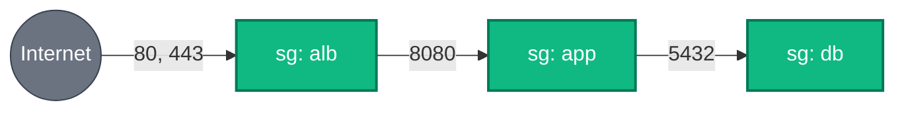

[← VPC](../vpc/README.md) | [🏠 Home](../../README.md) | [📚 Learning Path](../../docs/00-learning-roadmap/README.md) | [⬆ AWS Service Tracks](../README.md) | [EC2 →](../ec2/README.md)

# Security Groups

🟢 Beginner · Track 4 of 16 · Lab: [tiered-security-groups](tiered-security-groups/README.md) · 💰 Free

## What is it?

A security group is a **stateful virtual firewall** attached to network interfaces — EC2 instances, load balancers, RDS databases, VPC Lambda functions. It contains **allow** rules only; anything not allowed is denied.

## Why do we need it?

It is the main tool for "only the load balancer may talk to the app servers, and only the app servers may talk to the database". Getting it right is most of network security on AWS.

## How does it work?

- **Inbound (ingress)** rules: who may connect *to* the resource, on which ports.
- **Outbound (egress)** rules: where the resource may connect *to*.
- **Stateful:** if a connection is allowed in one direction, its replies are allowed automatically. A database needs no egress rule to answer queries.
- **Sources** can be CIDR ranges (`203.0.113.10/32`) **or other security groups**. Referencing a group means "any resource that has that group attached" — it keeps working as instances are added and removed.

### Simple analogy

A security group is a **guest list at an office door**. Referencing another security group is like writing "anyone wearing a *Sales* badge" instead of listing names: new salespeople get in without updating the list.



## How Terraform models security groups

The **current recommendation** is one resource per rule:

```hcl
resource "aws_security_group" "app" {
  name        = "tf-learning-app"
  description = "Application servers"
  vpc_id      = data.aws_vpc.default.id
}

resource "aws_vpc_security_group_ingress_rule" "app_from_alb" {
  security_group_id            = aws_security_group.app.id
  ip_protocol                  = "tcp"
  from_port                    = 8080
  to_port                      = 8080
  referenced_security_group_id = aws_security_group.alb.id   # source = another SG
}

resource "aws_vpc_security_group_egress_rule" "app_all" {
  security_group_id = aws_security_group.app.id
  ip_protocol       = "-1"                                    # all protocols
  cidr_ipv4         = "0.0.0.0/0"
}
```

| Style | Status |
| --- | --- |
| `aws_vpc_security_group_ingress_rule` / `_egress_rule` (one resource per rule) | ✅ Recommended: each rule has its own ID, tags and description |
| Inline `ingress { }` / `egress { }` blocks inside `aws_security_group` | Works, but all rules are managed as one unit |
| `aws_security_group_rule` | Older standalone rule resource; still works, superseded by the resources above |

**Never mix** inline rules and separate rule resources on the same group — they overwrite each other.

### Gotchas

- **Terraform removes the default egress rule.** AWS adds "allow all outbound" to new groups; the `aws_security_group` resource deletes it. Add the egress rules you need explicitly.
- **Changing `name` or `description` replaces the group.** Use `name_prefix` + `lifecycle { create_before_destroy = true }` for groups attached to running resources ([Chapter 09](../../docs/09-meta-arguments/README.md#6-lifecycle)).
- **`0.0.0.0/0` on SSH (22) or RDP (3389)** is one of the most common security findings. Prefer SSM Session Manager ([EC2 track](../ec2/README.md)), which needs **no** inbound rules at all.

## Lab

**[tiered-security-groups](tiered-security-groups/README.md)** builds the ALB → app → DB chain above in your default VPC.

## Key takeaways

- Stateful, allow-only firewalls on network interfaces.
- Reference security groups, not IP addresses, between tiers.
- One `aws_vpc_security_group_*_rule` resource per rule.
- Terraform-created groups have **no** egress until you add it.

## Official references

- [Security groups (Amazon VPC)](https://docs.aws.amazon.com/vpc/latest/userguide/vpc-security-groups.html)
- [Security group rules](https://docs.aws.amazon.com/vpc/latest/userguide/security-group-rules.html)
- [aws_vpc_security_group_ingress_rule (Terraform)](https://registry.terraform.io/providers/hashicorp/aws/latest/docs/resources/vpc_security_group_ingress_rule)
- [aws_security_group (Terraform)](https://registry.terraform.io/providers/hashicorp/aws/latest/docs/resources/security_group)

---

[← VPC](../vpc/README.md) | [🏠 Home](../../README.md) | [📚 Learning Path](../../docs/00-learning-roadmap/README.md) | [⬆ AWS Service Tracks](../README.md) | [EC2 →](../ec2/README.md)
