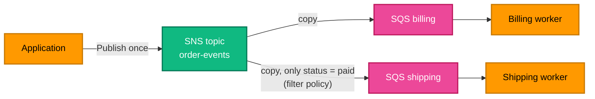

[← SQS](../sqs/README.md) | [🏠 Home](../../README.md) | [📚 Learning Path](../../docs/00-learning-roadmap/README.md) | [⬆ AWS Service Tracks](../README.md) | [Elastic Load Balancing →](../load-balancer/README.md)

# SNS — Simple Notification Service

🟡 Intermediate · Track 12 of 16 · Lab: [fan-out](fan-out/README.md) · 💰 Billed per publish and per delivery

## What is it?

Amazon SNS is a **publish/subscribe** service. A publisher sends a message to a **topic**; SNS delivers a copy to **every subscription** of that topic — SQS queues, Lambda functions, HTTPS endpoints, email, SMS.

## Why do we need it?

When one event matters to several independent systems ("order placed" → billing, shipping, analytics), the publisher shouldn't know about each of them. It publishes once; each consumer subscribes.

## How does it work? Fan-out



**SNS + SQS** is the classic pattern: SNS fans out, and each queue buffers its consumer, so a slow or broken consumer doesn't affect the others.

| Concept | Meaning |
| --- | --- |
| **Topic** | The channel publishers send to |
| **Subscription** | Protocol + endpoint (e.g. `sqs` + queue ARN) |
| **Raw message delivery** | Deliver the original body instead of an SNS JSON envelope (for SQS/HTTP) |
| **Filter policy** | Per-subscription rules on message attributes/body; non-matching messages are not delivered |
| **Topic policy** | Resource policy: who may publish/subscribe |
| **Queue policy** | For SQS subscribers: the **queue** must allow `sns.amazonaws.com` to `SendMessage`, restricted to this topic |

### Simple analogy

A topic is a **mailing list**. Publishing is sending one email to the list address; every subscriber gets a copy. A filter policy is a mail rule that only lets certain messages through.

## How Terraform models SNS

```hcl
resource "aws_sns_topic" "orders" {
  name              = "tf-learning-order-events"
  kms_master_key_id = "alias/aws/sns"
}

resource "aws_sns_topic_subscription" "billing" {
  topic_arn            = aws_sns_topic.orders.arn
  protocol             = "sqs"
  endpoint             = aws_sqs_queue.billing.arn
  raw_message_delivery = true
}

# And the queue must allow the topic to write to it:
data "aws_iam_policy_document" "allow_topic" {
  statement {
    actions   = ["sqs:SendMessage"]
    resources = [aws_sqs_queue.billing.arn]
    principals {
      type        = "Service"
      identifiers = ["sns.amazonaws.com"]
    }
    condition {
      test     = "ArnEquals"
      variable = "aws:SourceArn"
      values   = [aws_sns_topic.orders.arn]
    }
  }
}
```

### Lambda subscriptions

`protocol = "lambda"` with `endpoint = aws_lambda_function.x.arn`, plus an `aws_lambda_permission` with `principal = "sns.amazonaws.com"` and `source_arn = aws_sns_topic.orders.arn`. For reliability, most designs put an SQS queue between SNS and Lambda instead ([Project 07](../../projects/07-event-driven-architecture/README.md)).

### Email subscriptions

`protocol = "email"` subscriptions stay **pending** until the recipient clicks the confirmation link, and Terraform can't confirm them for you ([CloudWatch lab](../cloudwatch/logs-and-alarms/README.md)).

## Lab

**[fan-out](fan-out/README.md)**: one topic, two queues (billing gets everything, shipping only `paid` orders), with correctly scoped queue policies.

## Key takeaways

- SNS = push to many; SQS = buffer for one consumer. Together they form fan-out.
- SQS subscribers need a queue policy allowing the topic (scoped with `aws:SourceArn`).
- Filter policies route subsets of messages per subscriber.

## Official references

- [What is Amazon SNS?](https://docs.aws.amazon.com/sns/latest/dg/welcome.html)
- [Fanout to SQS queues](https://docs.aws.amazon.com/sns/latest/dg/sns-sqs-as-subscriber.html)
- [Message filtering](https://docs.aws.amazon.com/sns/latest/dg/sns-message-filtering.html)
- [Raw message delivery](https://docs.aws.amazon.com/sns/latest/dg/sns-large-payload-raw-message-delivery.html)
- [aws_sns_topic_subscription (Terraform)](https://registry.terraform.io/providers/hashicorp/aws/latest/docs/resources/sns_topic_subscription)

---

[← SQS](../sqs/README.md) | [🏠 Home](../../README.md) | [📚 Learning Path](../../docs/00-learning-roadmap/README.md) | [⬆ AWS Service Tracks](../README.md) | [Elastic Load Balancing →](../load-balancer/README.md)
