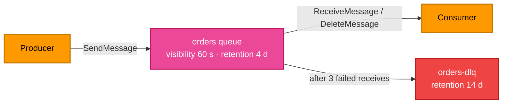

[← Lambda](../lambda/README.md) | [🏠 Home](../../README.md) | [📚 Learning Path](../../docs/00-learning-roadmap/README.md) | [⬆ AWS Service Tracks](../README.md) | [SNS →](../sns/README.md)

# SQS — Simple Queue Service

🟢 Beginner · Track 11 of 16 · Lab: [queue-with-dlq](queue-with-dlq/README.md) · 💰 Billed per request (a free monthly allowance exists — check current pricing)

## What is it?

Amazon SQS is a managed **message queue**. Producers send messages; consumers receive, process and delete them. The queue sits in between and absorbs bursts.

## Why do we need it?

It **decouples** systems: the website accepting orders doesn't need the warehouse system to be up at the same moment. If consumers are slow or down, messages wait in the queue instead of being lost.

## How does it work?

| Concept | Meaning |
| --- | --- |
| **Queue URL** | How SDKs/CLI address the queue (`https://sqs.<region>.amazonaws.com/<account>/<name>`) |
| **Queue ARN** | How IAM policies and event sources refer to it |
| **Visibility timeout** | After a consumer receives a message, it is hidden from others for this long. If the consumer doesn't delete it in time, it reappears and is processed again. |
| **Message retention** | How long an unprocessed message is kept (1 minute – 14 days) |
| **Receive count** | How many times a message has been received |
| **Dead-letter queue (DLQ)** | After `maxReceiveCount` failed receives, the message moves here for inspection |
| **Redrive policy** | The setting on the source queue that points to the DLQ |
| **Redrive allow policy** | The setting on the DLQ that says which queues may use it |
| **Encryption** | SSE-SQS (SQS-owned keys, no KMS cost) or SSE-KMS |
| **Standard vs FIFO** | Standard: at-least-once, best-effort order, very high throughput. FIFO: exactly-once processing, strict order, name ends in `.fifo`. |



### Simple analogy

A queue is a **ticket rail in a restaurant kitchen**. Waiters (producers) clip orders to the rail; cooks (consumers) take one, and if they don't finish in time (visibility timeout) the ticket goes back on the rail. A ticket that fails three times goes to the manager's desk (DLQ).

## How Terraform models SQS

```hcl
resource "aws_sqs_queue" "orders_dlq" {
  name                      = "tf-learning-orders-dlq"
  message_retention_seconds = 1209600         # 14 days
  sqs_managed_sse_enabled   = true
}

resource "aws_sqs_queue" "orders" {
  name                       = "tf-learning-orders"
  visibility_timeout_seconds = 60
  message_retention_seconds  = 345600         # 4 days
  receive_wait_time_seconds  = 20             # long polling
  sqs_managed_sse_enabled    = true

  redrive_policy = jsonencode({
    deadLetterTargetArn = aws_sqs_queue.orders_dlq.arn
    maxReceiveCount     = 3
  })
}
```

`aws_sqs_queue.orders.url` (also exposed as `.id`) is the URL; `.arn` is the ARN.

### Lambda integration

Lambda can poll a queue for you with an **event source mapping** (`aws_lambda_event_source_mapping`). Set the queue's visibility timeout to at least 6× the function timeout, as AWS recommends. See [Project 07](../../projects/07-event-driven-architecture/README.md).

## Lab

**[queue-with-dlq](queue-with-dlq/README.md)**: queue + DLQ + redrive + encryption + long polling. You'll push a message through failures until it lands in the DLQ.

## Key takeaways

- Queues decouple producers and consumers.
- Tune visibility timeout to processing time; use a DLQ for poison messages.
- URL for SDKs, ARN for IAM and event sources.

## Official references

- [Amazon SQS Developer Guide](https://docs.aws.amazon.com/AWSSimpleQueueService/latest/SQSDeveloperGuide/welcome.html)
- [Visibility timeout](https://docs.aws.amazon.com/AWSSimpleQueueService/latest/SQSDeveloperGuide/sqs-visibility-timeout.html)
- [Dead-letter queues](https://docs.aws.amazon.com/AWSSimpleQueueService/latest/SQSDeveloperGuide/sqs-dead-letter-queues.html)
- [Using Lambda with SQS](https://docs.aws.amazon.com/lambda/latest/dg/with-sqs.html)
- [aws_sqs_queue (Terraform)](https://registry.terraform.io/providers/hashicorp/aws/latest/docs/resources/sqs_queue)

---

[← Lambda](../lambda/README.md) | [🏠 Home](../../README.md) | [📚 Learning Path](../../docs/00-learning-roadmap/README.md) | [⬆ AWS Service Tracks](../README.md) | [SNS →](../sns/README.md)
