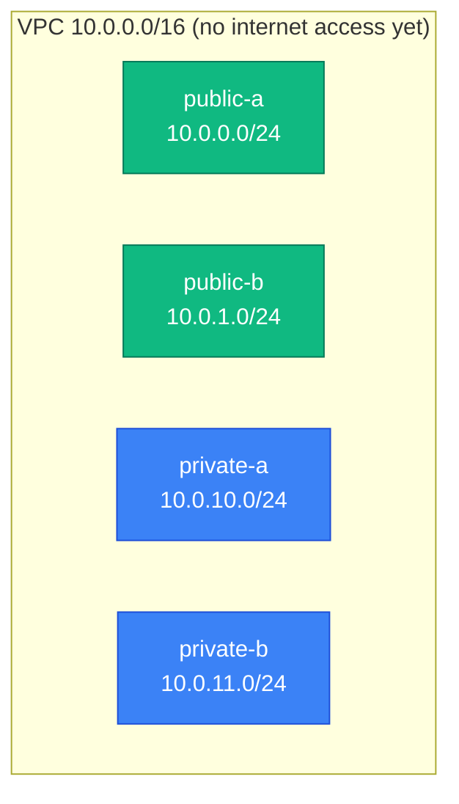

[⬆ VPC](../README.md) | [🏠 Home](../../../README.md) | [📚 Learning Path](../../../docs/00-learning-roadmap/README.md)

# VPC lab 01 · VPC and subnets

🟢 Beginner · [VPC track](../README.md) · 💰 Free (VPCs and subnets have no charge)

## What will be created

| Resource | Details |
| --- | --- |
| `aws_vpc.main` | `10.0.0.0/16`, DNS support and hostnames enabled |
| `aws_subnet.public["<az-a>"]`, `["<az-b>"]` | `10.0.0.0/24`, `10.0.1.0/24` |
| `aws_subnet.private["<az-a>"]`, `["<az-b>"]` | `10.0.10.0/24`, `10.0.11.0/24` |



## Terraform concepts

- `data "aws_availability_zones"` + `slice()` to pick 2 AZs
- A `for` expression building `{ az => cidr }` maps with `cidrsubnet()`
- `for_each` over those maps, so each subnet is addressed by its AZ

## Commands

```bash
terraform init
terraform plan        # 5 to add
terraform apply
terraform output
```

## Verification

```bash
aws ec2 describe-subnets --filters "Name=vpc-id,Values=$(terraform output -raw vpc_id)" \
  --query "Subnets[].[Tags[?Key=='Name']|[0].Value,CidrBlock,AvailabilityZone]" --output table
```

At this point **both** "public" and "private" subnets are isolated: nothing routes to the internet. The names are only labels until lab 02.

## Cleanup

```bash
terraform destroy
```

Next: [lab 02 · Internet access](../02-internet-access/README.md)

---

[⬆ VPC](../README.md) | [🏠 Home](../../../README.md) | [📚 Learning Path](../../../docs/00-learning-roadmap/README.md)
