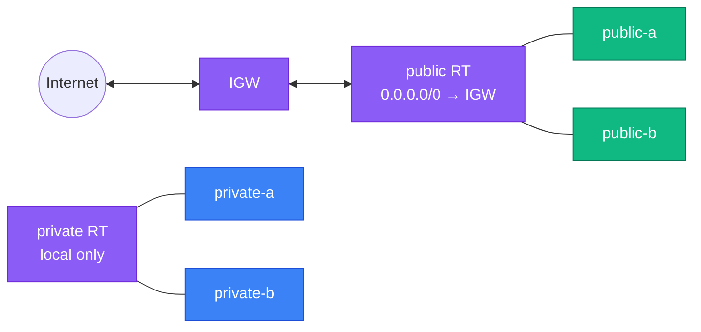

[⬆ VPC](../README.md) | [🏠 Home](../../../README.md) | [📚 Learning Path](../../../docs/00-learning-roadmap/README.md)

# VPC lab 02 · Internet access

🟢 Beginner · [VPC track](../README.md) · 💰 Free (internet gateways and route tables have no charge)

## What is new

Everything from lab 01, plus:

| Resource | Why |
| --- | --- |
| `aws_internet_gateway.main` | The VPC's door to the internet |
| `aws_route_table.public` + `aws_route.public_internet` | Route `0.0.0.0/0 → IGW` — **this makes a subnet public** |
| `aws_route_table_association.public[...]` | Attach the public table to the public subnets |
| `aws_route_table.private` + associations | A separate table with only the local route |

```bash
diff ../01-vpc-and-subnets/main.tf main.tf     # see exactly what changed
```



## Commands

```bash
terraform init
terraform apply
```

## Verification

```bash
aws ec2 describe-route-tables --route-table-ids "$(terraform output -raw public_route_table_id)" \
  --query "RouteTables[0].Routes[].[DestinationCidrBlock,GatewayId]" --output table
```

Expect two routes: `10.0.0.0/16 → local` and `0.0.0.0/0 → igw-...`.

## Why `aws_route` instead of an inline `route { }` block?

`aws_route_table` can also take inline `route` blocks. Using separate `aws_route` resources lets other configurations or modules add routes to the same table later. **Never mix** inline routes and `aws_route` resources on one table — they overwrite each other.

## Cleanup

```bash
terraform destroy
```

Next: [lab 03 · Private subnets with NAT](../03-private-subnets-nat/README.md)

---

[⬆ VPC](../README.md) | [🏠 Home](../../../README.md) | [📚 Learning Path](../../../docs/00-learning-roadmap/README.md)
