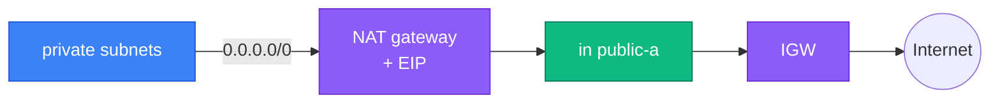

[⬆ VPC](../README.md) | [🏠 Home](../../../README.md) | [📚 Learning Path](../../../docs/00-learning-roadmap/README.md)

# VPC lab 03 · Private subnets with NAT

🟡 Intermediate · [VPC track](../README.md) · 💰 **Billed per hour**: NAT gateway + its public IPv4 address. Destroy as soon as you have verified it.

## What is new

Everything from lab 02, plus:

| Resource | Why |
| --- | --- |
| `aws_eip.nat` | Static public IPv4 address for the NAT gateway |
| `aws_nat_gateway.main` | In public subnet A; gives private subnets outbound-only internet |
| `aws_route.private_nat` | Route `0.0.0.0/0 → NAT` in the private route table |
| `aws_default_security_group.main` | Adopts the VPC's default security group and removes its allow rules |



Traffic can only be *started* from the private subnets. Replies come back through the NAT gateway, but nothing on the internet can open a new connection to a private instance.

**Learning shortcut:** one NAT gateway serves both AZs. If AZ *a* fails, private subnet *b* loses internet access too. Production runs one NAT gateway per AZ — see [Project 02](../../../projects/02-custom-vpc/README.md).

## Commands

```bash
terraform init
terraform apply        # the NAT gateway takes a minute or two
terraform output nat_gateway_public_ip
```

## Verification

```bash
aws ec2 describe-nat-gateways --filter "Name=vpc-id,Values=$(terraform output -raw vpc_id)" \
  --query "NatGateways[].[NatGatewayId,State,SubnetId]" --output table
```

State should be `available`. To prove outbound traffic works you need an instance in a private subnet — that is exactly what [Project 04](../../../projects/04-vpc-ec2-stack/README.md) and [Project 08](../../../projects/08-highly-available-web/README.md) build.

## Cleanup

```bash
terraform destroy      # do not skip this: the NAT gateway bills every hour
```

---

[⬆ VPC](../README.md) | [🏠 Home](../../../README.md) | [📚 Learning Path](../../../docs/00-learning-roadmap/README.md)
