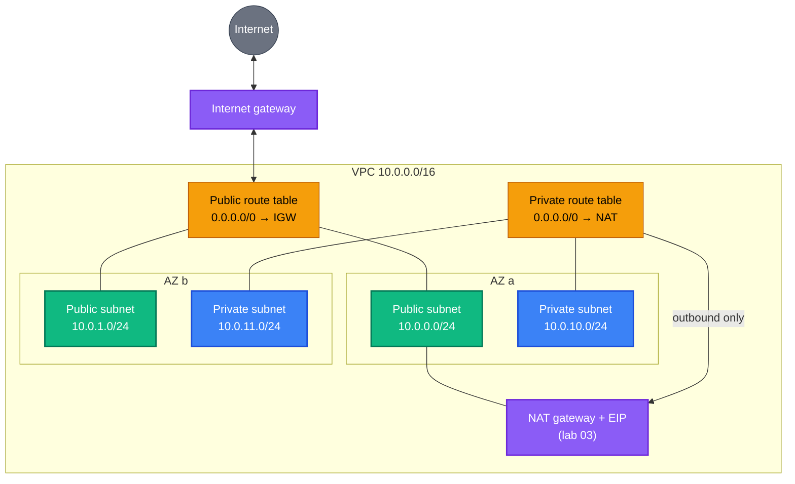

[← IAM](../iam/README.md) | [🏠 Home](../../README.md) | [📚 Learning Path](../../docs/00-learning-roadmap/README.md) | [⬆ AWS Service Tracks](../README.md) | [Security Groups →](../security-groups/README.md)

# VPC — Virtual Private Cloud

🟢🟡 Track 3 of 16 · Labs: [01](01-vpc-and-subnets/README.md) → [02](02-internet-access/README.md) → [03](03-private-subnets-nat/README.md) · 💰 Labs 01–02 free; lab 03 has an **hourly NAT gateway charge**

Networking is where most beginners get stuck, so this track builds a VPC **one layer at a time**. Each lab adds exactly one idea to the previous one.

---

## What is it?

A **VPC** is your own private, isolated network inside an AWS Region. You choose its IP address range, divide it into subnets, and decide what can reach the internet.

## Why do we need it?

Every EC2 instance, load balancer, RDS database and VPC-connected Lambda function lives in a VPC. The VPC design decides what is reachable from the internet, what is not, and how resilient the system is to a data-centre failure.

## Concepts, one at a time

### CIDR blocks — address ranges

A CIDR block like `10.0.0.0/16` describes a range of IP addresses. The number after `/` says how many leading bits are **fixed**; the rest are free:

| CIDR | Fixed bits | Addresses | Typical use |
| --- | --- | --- | --- |
| `10.0.0.0/16` | 16 | 65,536 | a whole VPC |
| `10.0.1.0/24` | 24 | 256 (AWS reserves 5 per subnet → 251 usable) | a subnet |
| `10.0.1.10/32` | 32 | 1 | one host (e.g. "allow my IP") |

Use private ranges (`10.0.0.0/8`, `172.16.0.0/12`, `192.168.0.0/16`) and **don't overlap** with networks you may connect to later (office VPN, other VPCs). Terraform's `cidrsubnet()` carves subnets out of the VPC range:

```hcl
cidrsubnet("10.0.0.0/16", 8, 0)    # "10.0.0.0/24"
cidrsubnet("10.0.0.0/16", 8, 10)   # "10.0.10.0/24"
```

### Availability Zones (AZs)

A Region contains several AZs — separate data centres with independent power and networking. A **subnet lives in exactly one AZ**. Spreading subnets (and servers) across **at least two AZs** means one AZ failing doesn't take the system down.

### Subnets: public vs private

A subnet is a slice of the VPC's range in one AZ. **Public** and **private** are not settings — they are the result of **routing**:

| | Public subnet | Private subnet |
| --- | --- | --- |
| Route for `0.0.0.0/0` | → **internet gateway** | → **NAT gateway** (outbound only) or none |
| Reachable from the internet? | Yes, if the resource has a public IP and security groups allow it | **No** |
| Typical contents | load balancers, NAT gateways, bastion hosts | application servers, databases |

### Route tables

A route table is a list of "destination → target" rules attached to subnets. Every table automatically contains the **local route** (`10.0.0.0/16 → local`), which lets all subnets in the VPC talk to each other. Each subnet uses exactly one route table (the VPC's *main* table unless you associate another).

### Internet gateway (IGW)

The VPC's connection to the internet. It is attached to the VPC, needs no AZ, and has **no hourly charge**. A route `0.0.0.0/0 → igw` makes a subnet public.

### NAT gateway + Elastic IP

Lets instances in private subnets **start** connections to the internet (package updates, AWS APIs) while nothing on the internet can start a connection **to** them. It sits in a **public** subnet and uses an **Elastic IP** (a static public IPv4 address).

> 💰 **Cost:** NAT gateways are billed **per hour** plus **per GB processed**, and their public IPv4 address is billed per hour. This is usually the most expensive part of a small lab. Alternatives for labs: public subnets with public IPs, or **VPC endpoints** (gateway endpoints for S3 and DynamoDB have no hourly charge).

### Security groups vs network ACLs

| | Security group | Network ACL |
| --- | --- | --- |
| Attached to | network interfaces (instances, load balancers, …) | subnets |
| Rules | **allow** only | allow **and** deny, evaluated in number order |
| State | **stateful** — replies are automatically allowed | **stateless** — replies need their own rule (ephemeral ports 1024–65535) |
| Typical use | the main firewall, one per tier | coarse subnet-level guard rails; often left at the default (allow all) |

Security groups get their own track: [Security groups](../security-groups/README.md).

### Simple analogy

The **VPC** is an office building. **Subnets** are floors, each in one wing (**AZ**). The **route table** is the signage on each floor. The **internet gateway** is the front door; floors with signs pointing to it are "public". The **NAT gateway** is the mail room: private floors can send letters out and receive replies, but visitors can't walk in. **Security groups** are the locks on each office door.

## The architecture we build



## Build it step by step

| Lab | Adds | New Terraform resources | 💰 |
| --- | --- | --- | --- |
| [01 · VPC and subnets](01-vpc-and-subnets/README.md) | Address plan, 2 AZs, 4 subnets | `aws_vpc`, `aws_subnet` (with `for_each`) | Free |
| [02 · Internet access](02-internet-access/README.md) | Public routing | `aws_internet_gateway`, `aws_route_table`, `aws_route`, `aws_route_table_association` | Free |
| [03 · Private subnets with NAT](03-private-subnets-nat/README.md) | Outbound-only internet for private subnets; lock down the default SG | `aws_eip`, `aws_nat_gateway`, `aws_default_security_group` | **Hourly** |

Each lab directory is a complete configuration: lab 02 contains lab 01's code plus the new part (marked `NEW IN STEP 02`). You can `diff` them to see exactly what changed:

```bash
diff 01-vpc-and-subnets/main.tf 02-internet-access/main.tf
```

Then:

- Put EC2 instances into this network: [Project 04 · VPC + EC2 stack](../../projects/04-vpc-ec2-stack/README.md).
- Design a three-tier, multi-AZ network yourself: [Project 02 · Custom VPC](../../projects/02-custom-vpc/README.md).
- Package it as a reusable module: [modules/vpc](../../modules/vpc/README.md).

## Network ACL basics (reference)

Labs keep the default network ACL (allow all), and rely on security groups. If you need a subnet-level rule — for example, blocking a known bad CIDR — this is what a NACL looks like. Remember it is **stateless**: return traffic needs the ephemeral-port rule.

```hcl
resource "aws_network_acl" "public" {
  vpc_id     = aws_vpc.main.id
  subnet_ids = [for s in aws_subnet.public : s.id]

  ingress {
    rule_no    = 100
    action     = "allow"
    protocol   = "tcp"
    from_port  = 443
    to_port    = 443
    cidr_block = "0.0.0.0/0"
  }

  ingress {                        # replies to connections started from inside
    rule_no    = 200
    action     = "allow"
    protocol   = "tcp"
    from_port  = 1024
    to_port    = 65535
    cidr_block = "0.0.0.0/0"
  }

  egress {
    rule_no    = 100
    action     = "allow"
    protocol   = "-1"
    from_port  = 0
    to_port    = 0
    cidr_block = "0.0.0.0/0"
  }
}
```

## Production considerations

- **One NAT gateway per AZ** so an AZ outage only affects that AZ ([Project 02](../../projects/02-custom-vpc/README.md) implements a `per_az` mode).
- **VPC Flow Logs** record accepted/rejected traffic for troubleshooting and security (costs ingestion/storage).
- **VPC endpoints** keep traffic to AWS services private and reduce NAT data charges.
- **Plan CIDRs** across all VPCs and on-premises networks up front; changing a VPC range later is painful.

## Key takeaways

- A VPC is a private network; subnets live in one AZ each.
- "Public" means *routed to an internet gateway*; "private" means *not*.
- NAT gateways give private subnets outbound-only internet — and cost money every hour.
- Security groups are stateful allow-lists on resources; NACLs are stateless allow/deny lists on subnets.

## Official references

- [What is Amazon VPC?](https://docs.aws.amazon.com/vpc/latest/userguide/what-is-amazon-vpc.html)
- [Subnets for your VPC](https://docs.aws.amazon.com/vpc/latest/userguide/configure-subnets.html)
- [Route tables](https://docs.aws.amazon.com/vpc/latest/userguide/VPC_Route_Tables.html)
- [NAT gateways](https://docs.aws.amazon.com/vpc/latest/userguide/vpc-nat-gateway.html)
- [Network ACLs](https://docs.aws.amazon.com/vpc/latest/userguide/vpc-network-acls.html)
- [Amazon VPC pricing](https://aws.amazon.com/vpc/pricing/)

---

[← IAM](../iam/README.md) | [🏠 Home](../../README.md) | [📚 Learning Path](../../docs/00-learning-roadmap/README.md) | [⬆ AWS Service Tracks](../README.md) | [Security Groups →](../security-groups/README.md)
