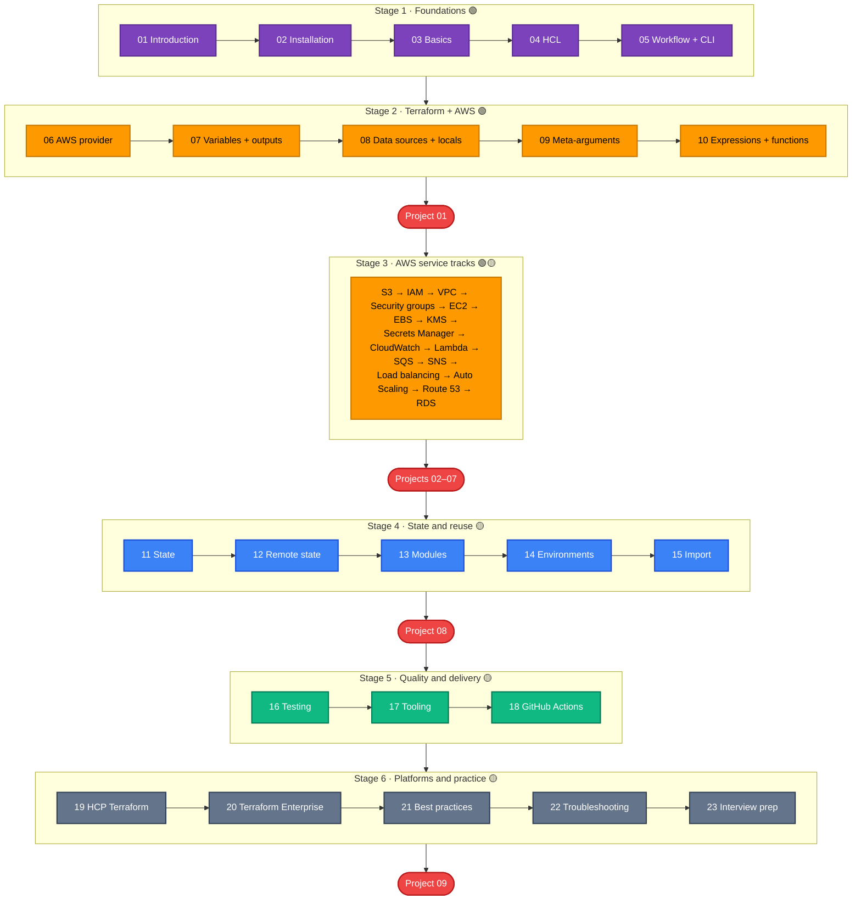

[← Terraform on AWS](../../README.md) | [🏠 Home](../../README.md) | [01 · Terraform Introduction →](../01-terraform-introduction/README.md)

# 00 · Learning Roadmap

This page is the map of the whole course. If you ever feel lost, come back here: every page has a **📚 Learning Path** link that brings you to this page.

## How to use this course

1. Follow the stages **in order**. Each chapter assumes you finished the previous one.
2. In each chapter, read the explanation, then **run the lab**. Reading Terraform is not the same as running it.
3. After each lab, **verify** what was created (Terraform output, AWS CLI, AWS console), then **destroy** it.
4. Do the **checkpoint project** at the end of each stage before moving on.

Difficulty labels: 🟢 Beginner · 🟡 Intermediate

## The route at a glance

## Stage 1 · Foundations 🟢

Goal: understand what Terraform is and run the core workflow without fear.

| Step | Page | Lab |
| --- | --- | --- |
| 01 | [Terraform introduction](../01-terraform-introduction/README.md) | — (concepts) |
| 02 | [Installation and setup](../02-installation-and-setup/README.md) | Install tools, verify AWS identity |
| 03 | [Terraform basics](../03-terraform-basics/README.md) | [examples/beginner/01-first-s3-bucket](../../examples/beginner/01-first-s3-bucket/README.md) |
| 04 | [HCL fundamentals](../04-hcl-fundamentals/README.md) | [examples/beginner/00-hcl-playground](../../examples/beginner/00-hcl-playground/README.md) (no AWS needed) |
| 05 | [Terraform workflow](../05-terraform-workflow/README.md) and [CLI reference](../05-terraform-workflow/cli-reference.md) | Re-run the S3 lab and watch each stage |

✅ **You are ready for Stage 2 when** you can explain what `init`, `plan`, `apply` and `destroy` do, and you know where the state file is.

## Stage 2 · Terraform + AWS 🟢

Goal: write realistic, parameterised configurations.

| Step | Page | Lab |
| --- | --- | --- |
| 06 | [AWS provider](../06-aws-provider/README.md) | [examples/beginner/02-first-ec2-instance](../../examples/beginner/02-first-ec2-instance/README.md) |
| 07 | [Variables and outputs](../07-variables-and-outputs/README.md) | [examples/beginner/03-variables-and-outputs](../../examples/beginner/03-variables-and-outputs/README.md) |
| 08 | [Data sources and locals](../08-data-sources-and-locals/README.md) | [examples/data-sources](../../examples/data-sources/README.md) |
| 09 | [Meta-arguments](../09-meta-arguments/README.md) | [examples/meta-arguments](../../examples/meta-arguments/README.md) (5 labs) |
| 10 | [Expressions and functions](../10-expressions-and-functions/README.md) | HCL playground, part 2 |

🏗️ **Checkpoint:** [Project 01 · Static website](../../projects/01-static-website/README.md)

## Stage 3 · AWS service tracks 🟢🟡

Goal: learn how the most important AWS services are modelled in Terraform. Start at the **[track index](../../aws-services/README.md)** and follow the order below; each service page ends with a link to the next.

| Order | Service | Why at this point |
| --- | --- | --- |
| 1 | [S3](../../aws-services/s3/README.md) | Simplest service; shows the "one resource per setting" pattern |
| 2 | [IAM](../../aws-services/iam/README.md) | Every later service needs roles and policies |
| 3 | [VPC](../../aws-services/vpc/README.md) | The network everything else runs in (3 progressive labs) |
| 4 | [Security groups](../../aws-services/security-groups/README.md) | Firewalls between tiers |
| 5 | [EC2](../../aws-services/ec2/README.md) | Servers, combining VPC + IAM + security groups |
| 6 | [EBS](../../aws-services/ebs/README.md) | Disks for EC2 |
| 7 | [KMS](../../aws-services/kms/README.md) | Encryption keys |
| 8 | [Secrets Manager](../../aws-services/secrets-manager/README.md) | Secrets, and why state needs protecting |
| 9 | [CloudWatch](../../aws-services/cloudwatch/README.md) | Logs, metrics, alarms |
| 10 | [Lambda](../../aws-services/lambda/README.md) | Serverless functions |
| 11 | [SQS](../../aws-services/sqs/README.md) | Queues |
| 12 | [SNS](../../aws-services/sns/README.md) | Pub/sub and fan-out |
| 13 | [Load balancing](../../aws-services/load-balancer/README.md) | Spreading traffic |
| 14 | [Auto Scaling](../../aws-services/autoscaling/README.md) | Self-healing server fleets |
| 15 | [Route 53](../../aws-services/route53/README.md) | DNS |
| 16 | [RDS](../../aws-services/rds/README.md) | Managed databases |

🏗️ **Checkpoints** (do them as you finish the related services):

| Project | Do it after |
| --- | --- |
| [02 · Custom VPC](../../projects/02-custom-vpc/README.md) | VPC |
| [03 · Web server](../../projects/03-web-server/README.md) | EC2 |
| [04 · VPC + EC2 stack](../../projects/04-vpc-ec2-stack/README.md) | EC2 |
| [05 · Secure S3](../../projects/05-secure-s3/README.md) | KMS |
| [06 · Serverless application](../../projects/06-serverless-application/README.md) | Lambda |
| [07 · Event-driven architecture](../../projects/07-event-driven-architecture/README.md) | SNS |

## Stage 4 · State and reuse 🟡

Goal: work like a team — shared state, reusable modules, multiple environments.

| Step | Page | Lab |
| --- | --- | --- |
| 11 | [Terraform state](../11-terraform-state/README.md) | [examples/state/state-basics](../../examples/state/state-basics/README.md) |
| 12 | [Remote state](../12-remote-state/README.md) | [remote-state-bootstrap](../../examples/state/remote-state-bootstrap/README.md) → [remote-state-backend](../../examples/state/remote-state-backend/README.md) |
| 13 | [Modules](../13-terraform-modules/README.md) | [examples/modules](../../examples/modules/README.md), [modules/](../../modules/README.md) |
| 14 | [Workspaces and environments](../14-workspaces-and-environments/README.md) | [examples/multi-environment/workspaces](../../examples/multi-environment/workspaces/README.md) |
| 15 | [Import](../15-import-and-existing-resources/README.md) | [examples/state/import-existing-bucket](../../examples/state/import-existing-bucket/README.md) |

🏗️ **Checkpoint:** [Project 08 · Highly available web](../../projects/08-highly-available-web/README.md)

## Stage 5 · Quality and delivery 🟡

Goal: make changes safe — tests, linters, scanners and a CI/CD pipeline.

| Step | Page | Lab |
| --- | --- | --- |
| 16 | [Testing and validation](../16-testing-and-validation/README.md) | Module tests in [modules/*/tests](../../modules/README.md) |
| 17 | [Terraform tooling](../17-terraform-tooling/README.md) | TFLint, terraform-docs, pre-commit, Checkov on this repo |
| 18 | [GitHub Actions](../18-github-actions/README.md) | Workflows in [.github/workflows](../../.github/workflows) |

## Stage 6 · Platforms and practice 🟡

| Step | Page |
| --- | --- |
| 19 | [HCP Terraform](../19-hcp-terraform/README.md) |
| 20 | [Terraform Enterprise](../20-terraform-enterprise/README.md) |
| 21 | [Best practices](../21-best-practices/README.md) |
| 22 | [Troubleshooting](../22-troubleshooting/README.md) |
| 23 | [Interview preparation](../23-interview-preparation/README.md) |

🏁 **Final project:** [Project 09 · Production-style infrastructure](../../projects/09-production-style-infrastructure/README.md) — modules, remote state, dev/prod, tests, linting and GitHub Actions with OIDC.

## Reference material (use any time)

| Resource | What it is |
| --- | --- |
| [Cheatsheets](../../cheatsheets/README.md) | One-page summaries: CLI, HCL, variables, meta-arguments, state, modules, AWS provider, troubleshooting |
| [CLI reference](../05-terraform-workflow/cli-reference.md) | Every command used in the course, with options and common mistakes |
| [Examples index](../../examples/README.md) | All small labs in one list |
| [Modules index](../../modules/README.md) | The reusable modules and their tests |
| [Troubleshooting](../22-troubleshooting/README.md) | When something goes wrong |

---

[← Terraform on AWS](../../README.md) | [🏠 Home](../../README.md) | [01 · Terraform Introduction →](../01-terraform-introduction/README.md)
