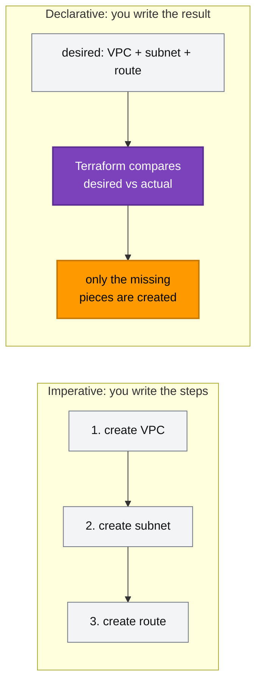
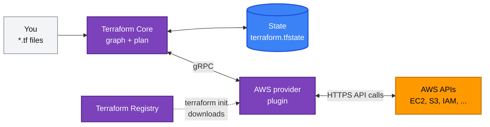
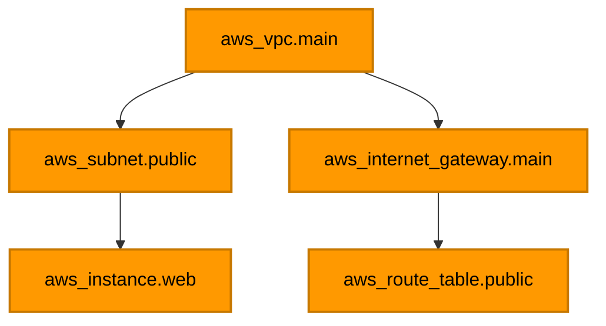
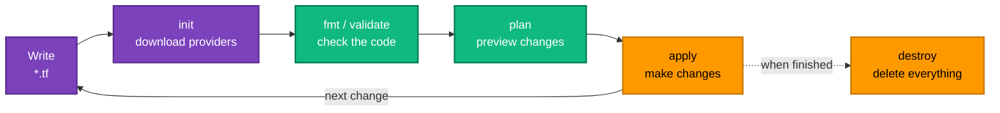

[← 00 · Learning Roadmap](../00-learning-roadmap/README.md) | [🏠 Home](../../README.md) | [📚 Learning Path](../00-learning-roadmap/README.md) | [02 · Installation and Setup →](../02-installation-and-setup/README.md)

# 01 · Terraform Introduction

🟢 Beginner · ⏱️ 30 minutes · 💰 No AWS cost

By the end of this chapter you can explain what Infrastructure as Code is, why Terraform exists, and how its pieces (Core, providers, state) fit together.

---

## 1. Infrastructure as Code (IaC)

### What is it?

Infrastructure as Code means **describing your servers, networks, databases and permissions in text files**, and letting a tool create them for you. Instead of clicking "Create bucket" in the AWS console, you write:

```hcl
resource "aws_s3_bucket" "reports" {
  bucket = "acme-monthly-reports"
}
```

…and a tool (Terraform) makes it real.

### Why do we need it?

Clicking in a console works for one server. It breaks down quickly:

| Problem with manual changes | How IaC solves it |
| --- | --- |
| "Who changed the security group last week?" | Every change is a commit in Git, with an author and a review. |
| Dev and prod slowly become different | The same code builds both, with a few different input values. |
| Rebuilding after a disaster takes days | Re-run the code; the infrastructure is recreated. |
| A new engineer must learn by clicking around | The code *is* the documentation of what exists. |
| Mistakes are only found after they happen | You preview every change (`terraform plan`) before applying it. |

### Simple analogy

A console is like cooking from memory. IaC is a **written recipe**: anyone can follow it, get the same dish, and suggest improvements to the recipe itself.

---

## 2. Declarative vs imperative

### What is it?

- **Imperative** = you list the *steps*: "create a VPC, then create a subnet, then attach…". A shell script with AWS CLI commands is imperative.
- **Declarative** = you describe the *end result*: "there should be a VPC with two subnets". The tool works out the steps.

Terraform is **declarative**.

### Why it matters

Run an imperative script twice and you may get two VPCs. Run a declarative configuration twice and the second run does **nothing**, because the real world already matches the description. This property — running again is safe — is called **idempotency**.



---

## 3. Why Terraform?

There are other IaC tools. AWS's own is **CloudFormation** (and the **AWS CDK**, which generates CloudFormation). Terraform's main strengths:

- **One language for many platforms.** The same workflow manages AWS, GitHub, Datadog, Kubernetes and hundreds of other systems through *providers*.
- **Plan before apply.** You always see exactly what will change.
- **Huge ecosystem.** Thousands of providers and modules in the public [Terraform Registry](https://registry.terraform.io/).
- **State-based.** Terraform keeps a record of what it manages, so it can detect changes and delete what you remove from the code.

> **License note.** Since version 1.6 (2023), HashiCorp Terraform is released under the Business Source License (BUSL 1.1). [OpenTofu](https://opentofu.org/) is a community fork under the Linux Foundation that is largely compatible. This course uses HashiCorp Terraform, and what you learn applies to both.

---

## 4. Terraform architecture

### How does it work?

Terraform is made of a few pieces that talk to each other:

| Piece | What it does | Analogy |
| --- | --- | --- |
| **Configuration** (`*.tf` files) | Your description of the desired infrastructure | The recipe |
| **Terraform Core** (the `terraform` binary) | Reads configuration and state, builds a dependency graph, decides what must change | The head chef |
| **Providers** (plugins) | Know how to talk to one API, e.g. AWS; translate "create bucket" into real API calls | Specialist cooks |
| **State** (`terraform.tfstate`) | Terraform's record of which real object belongs to which block of code | The chef's notebook |
| **Registry** ([registry.terraform.io](https://registry.terraform.io/)) | Where providers and shared modules are published | The supplier |



Key point: **Terraform Core knows nothing about AWS.** Everything AWS-specific lives in the AWS provider. That is why the same Terraform can manage any platform that has a provider.

---

## 5. Resources and data sources

The two building blocks you will write most:

| | `resource` | `data` |
| --- | --- | --- |
| Purpose | **Create and manage** something | **Read** something that already exists |
| Terraform owns it? | Yes — can change or delete it | No — only looks it up |
| Example | `resource "aws_s3_bucket" "logs" {}` | `data "aws_caller_identity" "me" {}` |

Both are covered in depth later ([Chapter 03](../03-terraform-basics/README.md), [Chapter 08](../08-data-sources-and-locals/README.md)).

---

## 6. The dependency graph

Terraform reads all your `.tf` files at once — **the order of blocks in files does not matter.** It works out the correct order from the **references** between blocks:

```hcl
resource "aws_vpc" "main" {
  cidr_block = "10.0.0.0/16"
}

resource "aws_subnet" "public" {
  vpc_id     = aws_vpc.main.id   # ← this reference creates a dependency
  cidr_block = "10.0.1.0/24"
}
```

The subnet refers to `aws_vpc.main.id`, so Terraform knows the VPC must be created first — and destroyed last. Resources with no dependency between them are created **in parallel** (10 at a time by default).



*Arrows read "must exist before". The subnet and the internet gateway don't depend on each other, so Terraform creates them at the same time.*

---

## 7. The Terraform lifecycle

Every change follows the same loop:



Each stage is explained in detail — including what happens internally — in [Chapter 05](../05-terraform-workflow/README.md).

---

## Key takeaways

- **IaC** = infrastructure described in version-controlled text files.
- Terraform is **declarative**: you describe the result, Terraform works out the steps, and running it again is safe.
- **Core** plans, **providers** talk to APIs, **state** remembers what Terraform manages.
- Order in files doesn't matter; **references** define the dependency graph.

## Official references

- [What is Terraform?](https://developer.hashicorp.com/terraform/intro)
- [How Terraform works with plugins](https://developer.hashicorp.com/terraform/plugin/how-terraform-works)
- [Terraform language overview](https://developer.hashicorp.com/terraform/language)
- [Terraform Registry](https://registry.terraform.io/)

---

[← 00 · Learning Roadmap](../00-learning-roadmap/README.md) | [🏠 Home](../../README.md) | [📚 Learning Path](../00-learning-roadmap/README.md) | [02 · Installation and Setup →](../02-installation-and-setup/README.md)
