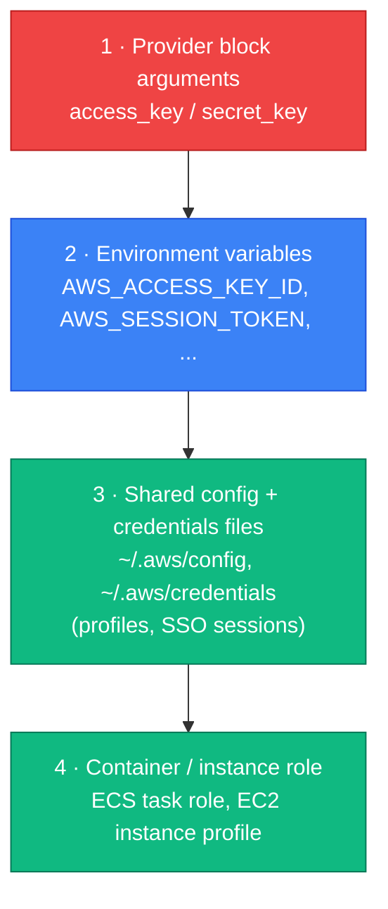

[← 01 · Terraform Introduction](../01-terraform-introduction/README.md) | [🏠 Home](../../README.md) | [📚 Learning Path](../00-learning-roadmap/README.md) | [03 · Terraform Basics →](../03-terraform-basics/README.md)

# 02 · Installation and Setup

🟢 Beginner · ⏱️ 30–45 minutes · 💰 No AWS cost

By the end of this chapter you will have Terraform and the AWS CLI installed, AWS credentials configured **safely**, and you will have proved that Terraform can see your AWS account.

---

## 1. Install Terraform

This course needs **Terraform 1.11 or newer** (later chapters use features added in 1.10 and 1.11). Install the latest release.

### macOS

```bash
brew tap hashicorp/tap
brew install hashicorp/tap/terraform
```

### Windows

```powershell
winget install --id Hashicorp.Terraform
```

Or download the zip from the [official install page](https://developer.hashicorp.com/terraform/install), extract `terraform.exe`, and add its folder to your `PATH`. On Windows you can also do the whole course inside **WSL** (Ubuntu) and follow the Linux instructions.

### Ubuntu / Debian

These commands add HashiCorp's signed package repository, so `apt upgrade` keeps Terraform up to date:

```bash
sudo apt-get update && sudo apt-get install -y gnupg software-properties-common wget
wget -O- https://apt.releases.hashicorp.com/gpg | \
  sudo gpg --dearmor -o /usr/share/keyrings/hashicorp-archive-keyring.gpg
echo "deb [arch=$(dpkg --print-architecture) signed-by=/usr/share/keyrings/hashicorp-archive-keyring.gpg] \
https://apt.releases.hashicorp.com $(grep -oP '(?<=UBUNTU_CODENAME=).*' /etc/os-release || lsb_release -cs) main" | \
  sudo tee /etc/apt/sources.list.d/hashicorp.list
sudo apt-get update && sudo apt-get install terraform
```

For RHEL/Fedora/Amazon Linux, see the [official install page](https://developer.hashicorp.com/terraform/install).

### Verify

```bash
terraform version
terraform -help
```

`terraform version` prints the installed version and your platform; if a newer release exists it tells you so.

> **Managing several versions?** Tools such as [tenv](https://github.com/tofuutils/tenv) or [tfenv](https://github.com/tfutils/tfenv) switch Terraform versions per project. Optional — a single up-to-date install is enough for this course.

### Editor support (recommended)

Install the official **HashiCorp Terraform** extension for VS Code (syntax highlighting, completion, formatting on save), or the equivalent for your editor.

---

## 2. Install the AWS CLI v2

Terraform does not need the AWS CLI, but you will use the CLI to **log in** and to **verify** what Terraform created.

Follow the official guide for your OS: [Installing the AWS CLI](https://docs.aws.amazon.com/cli/latest/userguide/getting-started-install.html).

```bash
aws --version    # should print aws-cli/2.x
```

---

## 3. Configure AWS credentials safely

### What is it?

Terraform needs **credentials** (proof of identity) to call AWS APIs on your behalf. The AWS provider uses the **same credential chain as the AWS CLI and SDKs**, so if `aws sts get-caller-identity` works, Terraform will work too.

### Why "safely"?

Leaked AWS keys are one of the most common causes of cloud security incidents: bots scan public GitHub repositories for keys within minutes. Two rules:

1. **Prefer short-lived credentials** (IAM Identity Center / SSO, or roles) over long-lived access keys.
2. **Never put credentials in `.tf` files, `tfvars` files, or Git.**

### How the credential chain works

The provider looks for credentials in this order and uses the first it finds:



*Option 1 exists but is exactly what this course tells you **not** to use.* The full list, with details, is in the [AWS provider authentication docs](https://registry.terraform.io/providers/hashicorp/aws/latest/docs#authentication-and-configuration).

### Option A — IAM Identity Center / SSO (recommended)

If your account uses IAM Identity Center (common in companies and in AWS Organizations):

```bash
aws configure sso --profile learning     # answer the prompts once
aws sso login --profile learning         # repeat when the session expires
```

Credentials are temporary and refreshed by `aws sso login`. Nothing long-lived is stored on disk.

### Option B — Access keys for a personal sandbox (learning shortcut)

For a personal account without Identity Center, you can create an IAM user with access keys:

```bash
aws configure --profile learning
# AWS Access Key ID:     AKIA...
# AWS Secret Access Key: ...
# Default region name:   us-east-1
# Default output format: json
```

This stores the keys in `~/.aws/credentials` — outside any Git repository. **Learning shortcut:** long-lived keys are acceptable for a personal sandbox if you protect them, never share them, and delete them when you are done. **Production recommendation:** Identity Center for people, IAM roles for machines, and OIDC for CI/CD ([Chapter 18](../18-github-actions/README.md)).

> Never use the AWS account **root user** for daily work. Create an administrator identity in Identity Center or IAM, enable MFA, and use that.

### Select the profile

Tell the CLI and Terraform which profile to use for this terminal session:

```bash
# Linux / macOS / WSL
export AWS_PROFILE=learning
# PowerShell
$Env:AWS_PROFILE = "learning"
```

Every lab in this course also accepts `-var aws_profile=learning` as an alternative.

---

## 4. Verify: can Terraform see AWS?

First with the CLI:

```bash
aws sts get-caller-identity
```

You should see JSON with your `Account`, `UserId` and `Arn`. If you get an error, fix it now — see [Troubleshooting](../22-troubleshooting/README.md#provider-authentication-failure).

Then with Terraform. The [data-sources example](../../examples/data-sources/README.md) reads (but does not create) account information. You will study it in Chapter 08; for now, just prove the connection works:

```bash
cd examples/data-sources
terraform init
terraform plan
```

The plan should show your account ID in the `account_id` output and propose to create one S3 bucket. **Do not apply yet** — you only needed to see that authentication works.

---

## 5. Protect your wallet

Before creating anything:

1. Create a **budget alert** in AWS Billing → Budgets (for example, alert at 5 USD). See [Creating a budget](https://docs.aws.amazon.com/cost-management/latest/userguide/budgets-create.html).
2. Pick one Region for all labs (the course default is `us-east-1`) so nothing is forgotten in another Region.
3. Make `terraform destroy` part of finishing every lab.

---

## Key takeaways

- Install **Terraform ≥ 1.11** and the **AWS CLI v2**.
- Terraform uses the **standard AWS credential chain** — configure the CLI and Terraform follows.
- Prefer **SSO / temporary credentials**; never place keys in Terraform files or Git.
- `aws sts get-caller-identity` is your first debugging command, always.

## Official references

- [Install Terraform](https://developer.hashicorp.com/terraform/install)
- [Installing the AWS CLI](https://docs.aws.amazon.com/cli/latest/userguide/getting-started-install.html)
- [Configuring IAM Identity Center authentication with the AWS CLI](https://docs.aws.amazon.com/cli/latest/userguide/cli-configure-sso.html)
- [AWS provider: authentication and configuration](https://registry.terraform.io/providers/hashicorp/aws/latest/docs#authentication-and-configuration)
- [Security best practices in IAM](https://docs.aws.amazon.com/IAM/latest/UserGuide/best-practices.html)

---

[← 01 · Terraform Introduction](../01-terraform-introduction/README.md) | [🏠 Home](../../README.md) | [📚 Learning Path](../00-learning-roadmap/README.md) | [03 · Terraform Basics →](../03-terraform-basics/README.md)
