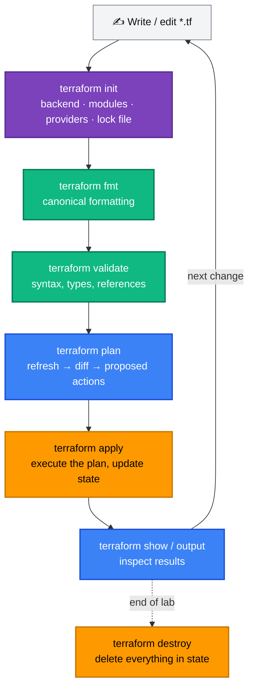
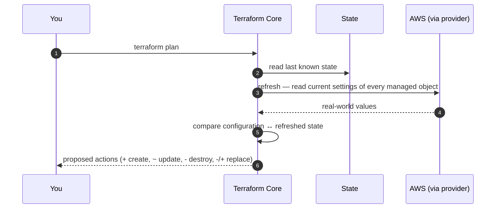

[← 04 · HCL Fundamentals](../04-hcl-fundamentals/README.md) | [🏠 Home](../../README.md) | [📚 Learning Path](../00-learning-roadmap/README.md) | [05b · Terraform CLI Reference →](cli-reference.md)

# 05 · Terraform Workflow

🟢 Beginner · ⏱️ 45 minutes · 💰 Free when destroyed (re-uses the first S3 bucket lab)

Every Terraform change — from a one-line tag edit to a new data centre — goes through the same steps. By the end of this chapter you will know what each step does **internally**, so plan output and error messages make sense.

Every command is also documented in the **[CLI reference](cli-reference.md)** (options, examples, common mistakes).

---

## The workflow



You only need `init` again when providers, modules or the backend change. The everyday loop is **edit → fmt → validate → plan → apply**.

---

## 1. `terraform init`

**What it does:** prepares the working directory. Nothing in AWS is touched.

Internally, in order:

1. **Backend** — reads the `backend` block (if any) and connects to where state is stored ([Chapter 12](../12-remote-state/README.md)). Without a backend, state is a local file.
2. **Modules** — downloads any `module` sources into `.terraform/modules/` ([Chapter 13](../13-terraform-modules/README.md)).
3. **Providers** — reads `required_providers`, picks versions that satisfy the constraints **and** the lock file, downloads them into `.terraform/providers/`, and verifies checksums.
4. **Lock file** — creates or updates `.terraform.lock.hcl` with the selected versions and hashes.

Running `init` again is always safe. Use `terraform init -upgrade` to deliberately move to newer provider versions allowed by your constraints.

---

## 2. `terraform fmt`

**What it does:** rewrites `.tf` files into the canonical style (indentation, aligned `=` signs). It never changes meaning.

```bash
terraform fmt              # format files in this directory
terraform fmt -recursive   # include subdirectories
terraform fmt -check       # CI: exit non-zero if anything needs formatting
```

Consistent formatting keeps diffs in code review about *real* changes.

---

## 3. `terraform validate`

**What it does:** checks the configuration **without contacting AWS**:

- syntax is valid HCL;
- every reference points at something that exists (`var.x` is declared, `aws_vpc.main` exists);
- argument names and types match the provider's schema (so it needs `init` first);
- `validation` rules on variables with known values.

It cannot detect problems that only AWS knows about — an invalid AMI ID, a bucket name that is already taken, missing IAM permissions. Those surface during `plan` or `apply`.

---

## 4. `terraform plan`

**What it does:** works out what would change, without changing anything.



Step 3 (**refresh**) is how Terraform notices **drift**: someone changed a resource by hand in the console. The plan then reports *"Objects have changed outside of Terraform"* and proposes to put the resource back the way the code describes it.

### Reading plan symbols

| Symbol | Meaning | Risk |
| --- | --- | --- |
| `+` | create | Low |
| `~` | update in place | Low–medium: read which attributes change |
| `-` | destroy | **High**: data may be lost |
| `-/+` | destroy, then create a replacement | **High**: new ID, possible downtime/data loss |
| `+/-` | create replacement first, then destroy (`create_before_destroy`) | Medium |
| `<=` | read a data source during apply | None |

The line `# forces replacement` next to an attribute tells you *which* change causes a replacement. The summary line — `Plan: 1 to add, 2 to change, 0 to destroy.` — is the first thing to check.

### Save the plan

```bash
terraform plan -out=tfplan
terraform apply tfplan
```

Applying a **saved plan** guarantees Terraform does exactly what you reviewed — CI/CD pipelines always work this way ([Chapter 18](../18-github-actions/README.md)). Plan files can contain sensitive values; never commit them.

---

## 5. `terraform apply`

**What it does:** executes the plan.

1. Without a plan file, it runs a fresh plan and **asks for confirmation** (type `yes`).
2. It walks the dependency graph, calling the provider to create/update/delete each object — independent objects in parallel.
3. After **each** object finishes, it records the result in state.

Because state is updated as it goes, a failed apply (for example, a permissions error on resource 7 of 10) leaves the first 6 recorded correctly. Fix the cause and run `apply` again; Terraform continues from where reality is.

`-auto-approve` skips the prompt. Use it only in automation that applies a reviewed, saved plan.

---

## 6. `terraform show` and `terraform output`

```bash
terraform show                 # human-readable view of the current state
terraform show tfplan          # human-readable view of a saved plan
terraform output               # all root-module outputs
terraform output -raw bucket_name   # one output, no quotes (for scripts)
terraform output -json         # machine-readable
```

---

## 7. `terraform destroy`

**What it does:** plans the deletion of **everything recorded in the state** of this configuration, in reverse dependency order, and asks for confirmation. It is equivalent to `terraform apply -destroy`.

It only deletes what *this* configuration manages — never other resources in your account. Preview it safely with `terraform plan -destroy`.

---

## Lab: watch every stage

Use the first-bucket lab again: [examples/beginner/01-first-s3-bucket](../../examples/beginner/01-first-s3-bucket/README.md).

```bash
cd examples/beginner/01-first-s3-bucket

# 1. init: look at what it created
terraform init
ls -a                        # .terraform/  .terraform.lock.hcl
terraform providers          # which providers the configuration needs

# 2. fmt: break the formatting, then fix it
sed -i.bak 's/^  bucket_prefix/        bucket_prefix/' main.tf   # add bad indentation
terraform fmt -check ; echo "exit code: $?"                      # non-zero: needs formatting
terraform fmt                                                    # fixes it
rm -f main.tf.bak

# 3. validate: introduce a typo, then fix it
#    edit main.tf: change  aws_s3_bucket.first.bucket  to  aws_s3_bucket.frist.bucket
terraform validate           # "Reference to undeclared resource"
#    undo the typo
terraform validate           # Success!

# 4. plan with a saved plan file
terraform plan -out=tfplan
terraform show tfplan

# 5. apply exactly that plan (no prompt: you already reviewed it)
terraform apply tfplan

# 6. inspect
terraform show
terraform output
terraform state list

# 7. drift: change the bucket outside Terraform, then plan
aws s3api put-bucket-tagging --bucket "$(terraform output -raw bucket_name)" \
  --tagging 'TagSet=[{Key=Name,Value=changed-by-hand}]'
terraform plan               # Terraform detects the drift and proposes to fix the tags
terraform apply              # puts the tags back to what the code says
```

(`sed -i.bak` is used because it works the same on Linux and macOS.)

### Cleanup

```bash
terraform destroy
rm -f tfplan
```

---

## Key takeaways

- `init` prepares the directory; `fmt` and `validate` check code locally; `plan` compares code with reality; `apply` changes reality and records it in state.
- `plan` refreshes first, which is how **drift** is detected.
- Read the plan **symbols** and the **summary line** before every apply; `-/+` means replacement.
- Save plans (`-out`) when the reviewer and the applier must see the same thing.

## Official references

- [The core Terraform workflow](https://developer.hashicorp.com/terraform/intro/core-workflow)
- [terraform init](https://developer.hashicorp.com/terraform/cli/commands/init) · [plan](https://developer.hashicorp.com/terraform/cli/commands/plan) · [apply](https://developer.hashicorp.com/terraform/cli/commands/apply) · [destroy](https://developer.hashicorp.com/terraform/cli/commands/destroy)
- [terraform fmt](https://developer.hashicorp.com/terraform/cli/commands/fmt) · [validate](https://developer.hashicorp.com/terraform/cli/commands/validate)

---

[← 04 · HCL Fundamentals](../04-hcl-fundamentals/README.md) | [🏠 Home](../../README.md) | [📚 Learning Path](../00-learning-roadmap/README.md) | [05b · Terraform CLI Reference →](cli-reference.md)
