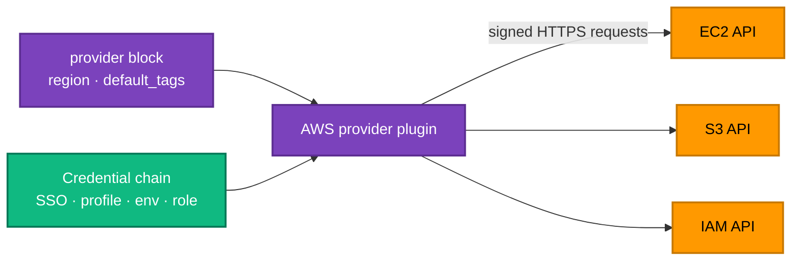

[← 05b · Terraform CLI Reference](../05-terraform-workflow/cli-reference.md) | [🏠 Home](../../README.md) | [📚 Learning Path](../00-learning-roadmap/README.md) | [07 · Variables and Outputs →](../07-variables-and-outputs/README.md)

# 06 · The AWS Provider

🟢 Beginner · ⏱️ 45 minutes · 💰 Lab creates one `t3.micro` instance — destroy it afterwards

By the end of this chapter you can declare the AWS provider with sensible version constraints, authenticate without hard-coded keys, and launch your first EC2 instance.

---

## 1. What is the AWS provider?

The [AWS provider](https://registry.terraform.io/providers/hashicorp/aws/latest/docs) (`hashicorp/aws`) is the plugin that translates Terraform resources such as `aws_instance` into AWS API calls. It is maintained by HashiCorp and AWS, released frequently (usually weekly), and each major version (5.x → 6.x) may contain breaking changes described in an [upgrade guide](https://registry.terraform.io/providers/hashicorp/aws/latest/docs/guides/version-6-upgrade).



---

## 2. Declaring requirements: `required_version` and `required_providers`

Every configuration in this course starts with a `versions.tf` like this:

```hcl
terraform {
  required_version = ">= 1.11.0"

  required_providers {
    aws = {
      source  = "hashicorp/aws"
      version = "~> 6.0"
    }
  }
}
```

| Setting | Meaning | Why this value |
| --- | --- | --- |
| `required_version` | Which **Terraform CLI** versions may run this code | Later chapters use S3 native locking and write-only arguments (Terraform 1.11). |
| `source` | Where to download the provider: `<namespace>/<name>` on the public registry | `hashicorp/aws` is the official provider. |
| `version` | Which **provider** versions are acceptable | `~> 6.0` allows 6.0, 6.1, … 6.99 but never 7.0. |

### Version constraint operators

| Constraint | Allows | Typical use |
| --- | --- | --- |
| `= 6.10.0` | exactly 6.10.0 | Rarely; the lock file already pins exact versions |
| `>= 6.0` | 6.0 and anything newer, including 7.x | **Reusable modules**: declare a minimum, let the caller choose |
| `~> 6.0` | ≥ 6.0 and < 7.0 | **Root modules**: accept minor/patch updates, block the next major |
| `~> 6.10.0` | ≥ 6.10.0 and < 6.11.0 | Only patch updates |
| `>= 6.0, < 6.50` | a range | Working around a known bad release |

### Constraints vs the lock file

The constraint says what is *acceptable*; the [lock file](../03-terraform-basics/README.md#why-commit-the-lock-file) records what was *chosen*. With a committed lock file, everyone keeps using the same exact version until someone runs `terraform init -upgrade`, reviews the result, and commits the new lock file.

> **Why not always pin exact versions?** Pinning in *code* makes every upgrade a code change in every directory. Constraint in code + exact version in the lock file gives reproducibility **and** easy, deliberate upgrades.

---

## 3. Configuring the provider

```hcl
provider "aws" {
  region  = var.aws_region   # e.g. "us-east-1"
  profile = var.aws_profile  # null → standard credential chain

  default_tags {
    tags = {
      Project   = "terraform-aws-learning"
      ManagedBy = "Terraform"
    }
  }
}
```

### `region`

Most AWS resources are **regional**: a bucket, VPC or instance lives in exactly one Region. The provider's `region` is the default for every resource. Keep it in a variable so the same code can target another Region.

> **New in AWS provider 6.x:** most resources accept their own `region` argument, overriding the provider's Region for that resource. Before 6.0, managing several Regions required one aliased provider per Region ([Chapter 09](../09-meta-arguments/README.md#5-provider-and-providers)); aliases remain the common pattern and are still needed for, e.g., different accounts.

### `default_tags`

Tags added to **every** resource the provider creates. Tags are how you find, filter and cost resources, so setting them centrally means none are forgotten. Resource-level `tags` are merged on top (resource tags win on conflicts).

### Authentication — never in code

```hcl
# ❌ NEVER do this
provider "aws" {
  access_key = "AKIA..."
  secret_key = "..."
}
```

Keys in `.tf` files end up in Git history, in CI logs and on every laptop that clones the repository. Instead, let the provider use the **standard credential chain** you configured in [Chapter 02](../02-installation-and-setup/README.md#3-configure-aws-credentials-safely):

| Method | How | Good for |
| --- | --- | --- |
| Named profile | `profile = var.aws_profile`, or `export AWS_PROFILE=learning` | Laptops (SSO or a sandbox profile) |
| Environment variables | `AWS_ACCESS_KEY_ID`, `AWS_SECRET_ACCESS_KEY`, `AWS_SESSION_TOKEN` set by a tool | Short-lived credentials from SSO tooling or CI |
| Instance / task role | Nothing to configure | Terraform running on EC2, ECS, CodeBuild |
| Web identity (OIDC) | Set by `aws-actions/configure-aws-credentials` | GitHub Actions ([Chapter 18](../18-github-actions/README.md)) |
| `assume_role` block | See below | Deploying into another account/role |

```hcl
provider "aws" {
  region = "us-east-1"

  # Start with whatever credentials the chain finds, then switch role.
  assume_role {
    role_arn     = "arn:aws:iam::111122223333:role/terraform-deployer"
    session_name = "terraform"
  }
}
```

### A safety net: `allowed_account_ids`

```hcl
provider "aws" {
  region              = "us-east-1"
  allowed_account_ids = ["111122223333"]  # refuse to run anywhere else
}
```

If your credentials point at the wrong account (for example, production instead of a sandbox), Terraform stops before doing anything. Highly recommended for real environments.

---

## 4. Lab: your first EC2 instance

**Folder:** [examples/beginner/02-first-ec2-instance](../../examples/beginner/02-first-ec2-instance/README.md)

```hcl
data "aws_ami" "al2023" {
  most_recent = true
  owners      = ["amazon"]

  filter {
    name   = "name"
    values = ["al2023-ami-2023.*-x86_64"]
  }
}

resource "aws_instance" "first" {
  ami                         = data.aws_ami.al2023.id
  instance_type               = "t3.micro"
  associate_public_ip_address = false

  metadata_options {
    http_tokens = "required"   # IMDSv2 only
  }

  root_block_device {
    encrypted = true
  }
}
```

Three things worth noticing:

1. The AMI is **looked up**, not hard-coded. AMI IDs differ per Region and change with every patched image ([Chapter 08](../08-data-sources-and-locals/README.md)).
2. **No public IP.** The lab doesn't need internet access, and AWS charges for every public IPv4 address.
3. Two security defaults: **IMDSv2** protects the instance's temporary credentials from a common class of attacks, and the root disk is **encrypted**.

### Run it

```bash
cd examples/beginner/02-first-ec2-instance
terraform init
terraform plan      # note: 1 to add; the AMI is resolved during plan
terraform apply
```

### Verify

```bash
terraform output
aws ec2 describe-instances --instance-ids "$(terraform output -raw instance_id)" \
  --query "Reservations[0].Instances[0].State.Name" --region us-east-1
```

In the EC2 console, find the instance and check its **Tags**, **Security → IAM role** (none), and **Storage → Encrypted**.

### Experiment

Change `instance_type` to `t3.small` and run `terraform plan`. The plan shows `~ update in-place`: AWS can resize a stopped instance, and the provider handles stopping and starting it. Compare with changing the AMI, which forces a replacement. Revert before applying if you want to avoid extra cost.

### Cleanup

```bash
terraform destroy
```

---

## Key takeaways

- Declare `required_version` and `required_providers` in every root module.
- Root modules: `~> MAJOR.0` constraint + committed lock file. Reusable modules: `>= minimum`.
- The provider uses the standard AWS credential chain — **never** put keys in code.
- `default_tags` and `allowed_account_ids` are cheap, powerful safety features.

## Official references

- [AWS provider documentation](https://registry.terraform.io/providers/hashicorp/aws/latest/docs)
- [AWS provider: authentication and configuration](https://registry.terraform.io/providers/hashicorp/aws/latest/docs#authentication-and-configuration)
- [AWS provider version 6 upgrade guide](https://registry.terraform.io/providers/hashicorp/aws/latest/docs/guides/version-6-upgrade)
- [Version constraints](https://developer.hashicorp.com/terraform/language/expressions/version-constraints)
- [Provider configuration](https://developer.hashicorp.com/terraform/language/providers/configuration)
- [Use IMDSv2 (AWS)](https://docs.aws.amazon.com/AWSEC2/latest/UserGuide/configuring-instance-metadata-service.html)

---

[← 05b · Terraform CLI Reference](../05-terraform-workflow/cli-reference.md) | [🏠 Home](../../README.md) | [📚 Learning Path](../00-learning-roadmap/README.md) | [07 · Variables and Outputs →](../07-variables-and-outputs/README.md)
