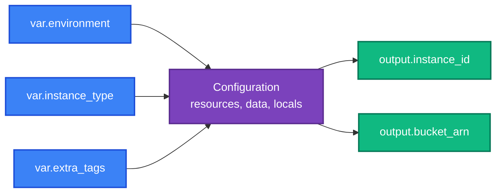
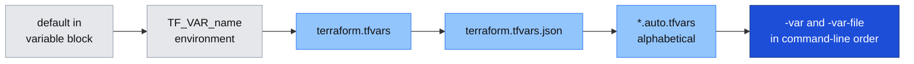

[← 06 · The AWS Provider](../06-aws-provider/README.md) | [🏠 Home](../../README.md) | [📚 Learning Path](../00-learning-roadmap/README.md) | [08 · Data Sources and Locals →](../08-data-sources-and-locals/README.md)

# 07 · Variables and Outputs

🟢 Beginner · ⏱️ 60 minutes · 💰 Lab creates one `t3.micro` instance and one empty bucket — destroy afterwards

Variables are a configuration's **inputs**; outputs are its **results**. By the end of this chapter you can make any configuration reusable across environments and expose the values other people and tools need.

**Lab:** [examples/beginner/03-variables-and-outputs](../../examples/beginner/03-variables-and-outputs/README.md)



---

## Part A · Input variables

### What is it?

A `variable` block declares a named input. Code reads it as `var.<name>`.

### Why do we need it?

Without variables, the "dev" and "prod" versions of a configuration would be two copies of the same code with different hard-coded values — which drift apart over time. With variables, one piece of code serves every environment.

### Simple analogy

A variable is a **parameter of a function**: the configuration is the function, and `terraform apply` calls it with specific arguments.

### Terraform syntax

```hcl
variable "instance_type" {
  description = "EC2 instance type."          # shown in docs and prompts: always write one
  type        = string                        # what kind of value is allowed
  default     = "t3.micro"                    # makes the variable optional

  validation {                                # your own rules
    condition     = contains(["t3.micro", "t3.small"], var.instance_type)
    error_message = "Use one of the small instance types allowed in this lab."
  }
}

resource "aws_instance" "web" {
  instance_type = var.instance_type
  # ...
}
```

A variable **without a default is required**: Terraform asks for it interactively, or fails in automation with `-input=false`.

### Types

```hcl
variable "name"         { type = string }
variable "disk_gb"      { type = number }
variable "monitoring"   { type = bool }
variable "subnet_ids"   { type = list(string) }
variable "ports"        { type = set(number) }
variable "extra_tags"   { type = map(string) }

variable "server" {
  type = object({
    name          = string
    instance_type = string
    disk_gb       = optional(number, 8)   # optional attribute with a default
  })
}
```

Always declare a `type`. It catches mistakes early ("expected number, got string") and documents what the variable expects. `optional()` lets callers omit object attributes.

### Validation

`validation` blocks run during `plan` (and during `validate` when the value is known) and stop Terraform with **your** error message:

```hcl
variable "environment" {
  type = string

  validation {
    condition     = contains(["dev", "staging", "prod"], var.environment)
    error_message = "environment must be dev, staging or prod."
  }
}

variable "project_name" {
  type = string

  validation {
    condition     = can(regex("^[a-z0-9-]{3,20}$", var.project_name))
    error_message = "project_name: 3-20 lowercase letters, numbers or hyphens."
  }
}
```

`can(expr)` returns `false` instead of an error when `expr` fails, which makes it ideal for regex checks. Since Terraform 1.9, a condition may also refer to *other* variables.

### Sensitive variables

```hcl
variable "db_password" {
  description = "Database master password."
  type        = string
  sensitive   = true
}
```

`sensitive = true` **hides the value in plan and apply output** (`(sensitive value)`), and propagates to anything derived from it.

> ⚠️ **It does not encrypt or remove the value.** If a sensitive value is used in a resource argument, it is stored **in plain text in the state file** (and in saved plan files). Protect state accordingly ([Chapter 12](../12-remote-state/README.md)), and prefer designs where Terraform never handles the secret at all — see [Secrets Manager](../../aws-services/secrets-manager/README.md) for write-only arguments and AWS-managed passwords.

Never put real secret values in `default`, in committed `.tfvars` files, or in examples.

### Nullable

By default a caller can pass `null` explicitly, which means "no value". With `nullable = false`, passing `null` makes Terraform use the `default` instead:

```hcl
variable "instance_name" {
  type     = string
  default  = null     # optional; the code falls back to a generated name
}

locals {
  instance_name = coalesce(var.instance_name, "${var.project_name}-web")
}
```

The pattern above (`default = null` + `coalesce`) is the common way to express "optional, computed if not given".

---

## Part B · Setting variable values

There are five ways to give a variable a value:

```bash
# 1. terraform.tfvars — loaded automatically
instance_type = "t3.small"

# 2. *.auto.tfvars — also loaded automatically (alphabetical order)
#    e.g. network.auto.tfvars

# 3. -var-file on the command line
terraform plan -var-file=prod.tfvars

# 4. -var on the command line
terraform plan -var 'instance_type=t3.small' -var 'extra_tags={Owner="alice"}'

# 5. Environment variables named TF_VAR_<name>
export TF_VAR_instance_type=t3.small
```

### Precedence

When the same variable is set in several places, **the later source in this list wins**:



*Lowest priority on the left, highest on the right.* Example: `terraform.tfvars` says `t3.small`, and you run `-var instance_type=t3.medium` → Terraform uses `t3.medium`.

### What to commit

| File | Commit? |
| --- | --- |
| `variables.tf` (declarations) | ✅ Always |
| `terraform.tfvars.example` | ✅ A template with **fake** values, so people know what to set |
| `terraform.tfvars`, `*.auto.tfvars` | Usually ❌ (ignored by this repo's `.gitignore`). Teams sometimes commit non-sensitive environment files such as `prod.tfvars`; keep secrets out of them. |

---

## Part C · Outputs

### What is it?

An `output` block exposes a value after Terraform evaluates the configuration.

### Why do we need it?

- **People** need results: the URL of a website, the ID of an instance.
- **Scripts** need values: `terraform output -raw bucket_name`.
- **Other configurations** need values: a module's outputs are its "return values" ([Chapter 13](../13-terraform-modules/README.md)); CI pipelines pass them on.

### Terraform syntax

```hcl
output "instance_id" {
  description = "ID of the EC2 instance."
  value       = aws_instance.web.id
}

output "bucket_arn" {
  description = "ARN of the artifacts bucket, e.g. for IAM policies."
  value       = aws_s3_bucket.artifacts.arn
}

# Outputs can combine values
output "connection_hint" {
  description = "Human-friendly summary."
  value       = "Instance ${aws_instance.web.id} runs in ${aws_instance.web.availability_zone}."
}

# Outputs can be structured
output "network" {
  description = "VPC and subnet IDs."
  value = {
    vpc_id     = aws_vpc.main.id
    subnet_ids = aws_subnet.public[*].id
  }
}
```

### Sensitive outputs

If an output's value is derived from a sensitive value, Terraform requires `sensitive = true` on the output:

```hcl
output "db_password" {
  value     = var.db_password
  sensitive = true
}
```

It is then shown as `<sensitive>` in `terraform output`, but printed in clear text by `terraform output -raw db_password` and `terraform output -json` — and it is stored in state. Better: don't output secrets at all; output the **ARN of the secret** instead.

### Using outputs

```bash
terraform output                       # all outputs
terraform output bucket_arn            # one output, HCL-formatted (strings quoted)
terraform output -raw bucket_name      # plain string for shell scripts
terraform output -json | jq .          # everything, machine-readable
```

---

## Variable vs local vs output

| | Variable | Local | Output |
| --- | --- | --- | --- |
| Direction | **Input** from the caller | **Internal** helper value | **Result** exposed to the caller |
| Set by | tfvars, `-var`, `TF_VAR_`, module arguments | The configuration itself | The configuration itself |
| Read as | `var.name` | `local.name` | `terraform output name`, `module.x.name` |
| Chapter | this one | [08](../08-data-sources-and-locals/README.md) | this one |

---

## Lab

**Folder:** [examples/beginner/03-variables-and-outputs](../../examples/beginner/03-variables-and-outputs/README.md)

This lab turns the first EC2 instance into a parameterised configuration with validated inputs, an S3 bucket, and several outputs.

```bash
cd examples/beginner/03-variables-and-outputs
cp terraform.tfvars.example terraform.tfvars      # edit Owner in extra_tags
terraform init
terraform plan

# precedence experiments (plan only, nothing is created)
terraform plan -var instance_type=t3.small
TF_VAR_instance_type=t3a.micro terraform plan     # environment variable is used (see note)
terraform plan -var environment=qa                # validation error
terraform plan -var root_volume_size_gb=100       # validation error

terraform apply
terraform output
terraform output -raw bucket_name
terraform output -json
```

> Note on the `TF_VAR_` experiment: `terraform.tfvars` does not set `instance_type`, so the environment variable is used. Add `instance_type = "t3.small"` to `terraform.tfvars` and run it again: the file now wins, because environment variables have **lower** precedence than tfvars files.

### Verify

```bash
aws ec2 describe-instances --instance-ids "$(terraform output -raw instance_id)" \
  --query "Reservations[0].Instances[0].[InstanceType,Tags]" --region us-east-1
aws s3api get-bucket-tagging --bucket "$(terraform output -raw bucket_name)"
```

### Cleanup

```bash
terraform destroy
```

---

## Key takeaways

- **Variables** are typed, documented, validated inputs. No default = required.
- Precedence: default < `TF_VAR_` < `terraform.tfvars` < `*.auto.tfvars` < `-var`/`-var-file`.
- `sensitive = true` only **hides** values in output; they are still in state.
- **Outputs** expose results for people, scripts and other configurations.

## Official references

- [Input variables](https://developer.hashicorp.com/terraform/language/values/variables)
- [Variable definition precedence](https://developer.hashicorp.com/terraform/language/values/variables#variable-definition-precedence)
- [Custom validation rules](https://developer.hashicorp.com/terraform/language/values/variables#custom-validation-rules)
- [Output values](https://developer.hashicorp.com/terraform/language/values/outputs)
- [terraform output](https://developer.hashicorp.com/terraform/cli/commands/output)

---

[← 06 · The AWS Provider](../06-aws-provider/README.md) | [🏠 Home](../../README.md) | [📚 Learning Path](../00-learning-roadmap/README.md) | [08 · Data Sources and Locals →](../08-data-sources-and-locals/README.md)
