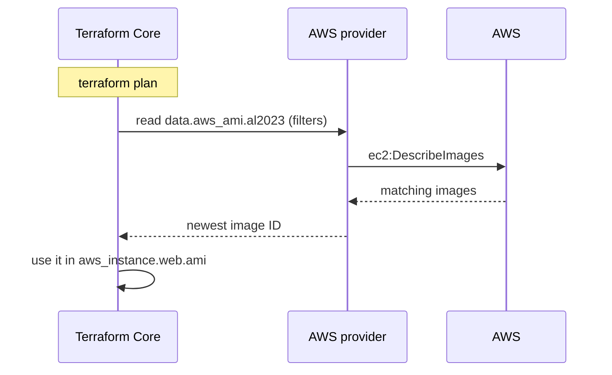

[← 07 · Variables and Outputs](../07-variables-and-outputs/README.md) | [🏠 Home](../../README.md) | [📚 Learning Path](../00-learning-roadmap/README.md) | [09 · Meta-Arguments →](../09-meta-arguments/README.md)

# 08 · Data Sources and Locals

🟢 Beginner · ⏱️ 45 minutes · 💰 Lab creates one empty S3 bucket (free) — destroy afterwards

By the end of this chapter you can **read** information from AWS without managing it (data sources), and remove repetition from your code with named internal values (locals).

**Lab:** [examples/data-sources](../../examples/data-sources/README.md)

---

## Part A · Data sources

### What is it?

A `data` block asks a provider to **look something up** and makes the result available to your code. Terraform never creates, changes or deletes what a data source reads.

### Why do we need it?

Real configurations constantly need facts they should not hard-code:

- the **latest AMI** (changes every few weeks, differs per Region);
- the **account ID** (to build ARNs and unique names);
- the **Availability Zones** available in this Region;
- an **existing VPC or subnet** created by another team;
- an **existing secret's ARN** to grant an application access.

### Resource vs data source

| | `resource "aws_vpc" "main"` | `data "aws_vpc" "default"` |
| --- | --- | --- |
| Terraform's role | **Owner**: creates, updates, destroys | **Reader**: looks up |
| On `terraform destroy` | Deleted | Untouched |
| Arguments are… | the desired settings | **filters** to find the object |
| Referenced as | `aws_vpc.main.id` | `data.aws_vpc.default.id` |

### Simple analogy

A resource is a house you **build**. A data source is looking up an address in the **phone book**: you get the information, but you don't own the house.

### How does it work?



Data sources are normally read during **plan**, so the plan already shows the concrete value. If a data source depends on something that doesn't exist yet (e.g. a resource created in the same run), it is read during **apply** instead and the plan shows `(known after apply)`.

### AWS examples

All of these are in the lab's [data.tf](../../examples/data-sources/data.tf):

```hcl
# Who am I?
data "aws_caller_identity" "current" {}
#   .account_id  .arn  .user_id

# Which Region is the provider using?
data "aws_region" "current" {}
#   .region   (provider 6.x; the older .name attribute is deprecated)

# Which AZs can I use?
data "aws_availability_zones" "available" {
  state = "available"
}
#   .names = ["us-east-1a", "us-east-1b", ...]

# Latest Ubuntu 24.04 LTS AMI from Canonical
data "aws_ami" "ubuntu" {
  most_recent = true
  owners      = ["099720109477"] # Canonical's AWS account: ALWAYS pin the owner

  filter {
    name   = "name"
    values = ["ubuntu/images/hvm-ssd-gp3/ubuntu-noble-24.04-amd64-server-*"]
  }
}

# The default VPC and its subnets
data "aws_vpc" "default" {
  default = true
}

data "aws_subnets" "default" {
  filter {
    name   = "vpc-id"
    values = [data.aws_vpc.default.id]
  }
}
```

> **Why pin `owners` on AMI lookups?** Anyone can publish a public AMI with a name like `ubuntu-noble-24.04`. Filtering by the publisher's account ID makes sure you get the real image.

### Looking up existing resources created elsewhere

A common real-world use: the network team manages the VPC; your configuration only needs its ID.

```hcl
data "aws_vpc" "shared" {
  tags = {
    Name = "shared-services"
  }
}

resource "aws_security_group" "app" {
  vpc_id = data.aws_vpc.shared.id
  # ...
}
```

If the filter matches **zero or several** objects, the plan fails with an error — make filters specific.

### Data sources and secrets

```hcl
data "aws_secretsmanager_secret" "db" {
  name = "prod/app/db-password"
}
# .arn → safe to use in IAM policies
```

There is also a `aws_secretsmanager_secret_version` data source that returns the **secret value**. Anything a data source returns is written to the **state file**, so reading secret values this way puts them in state. Prefer to pass the secret's **ARN** to the application and let it read the value at runtime ([Secrets Manager](../../aws-services/secrets-manager/README.md)).

---

## Part B · Locals

### What is it?

A `locals` block defines **named values computed inside the configuration**. Read them as `local.<name>` (note: `locals` to define, `local.` to read).

### Why do we need it?

- **Avoid repetition.** Write `"${var.project_name}-${var.environment}"` once, use it everywhere.
- **Give complex expressions a name.** `local.azs` is easier to read than `slice(data.aws_availability_zones.available.names, 0, 2)`.
- **Change in one place.** When the naming convention changes, you edit one line.

### Terraform syntax

```hcl
locals {
  account_id  = data.aws_caller_identity.current.account_id
  region      = data.aws_region.current.region
  name_prefix = "${var.project_name}-${var.environment}"
  azs         = slice(data.aws_availability_zones.available.names, 0, 2)

  common_tags = {
    Environment = var.environment
    Project     = var.project_name
    ManagedBy   = "Terraform"
  }
}

resource "aws_s3_bucket" "reports" {
  bucket = "${local.name_prefix}-reports-${local.account_id}-${local.region}"
  tags   = merge(local.common_tags, { Purpose = "reports" })
}
```

### `common_tags` vs `default_tags`

Both solve "every resource needs the same tags":

| | `local.common_tags` + `merge()` | provider `default_tags` |
| --- | --- | --- |
| Applies to | resources where you add `tags = local.common_tags` | every resource the provider creates |
| Can be forgotten? | Yes | No |
| Works for… | also non-AWS resources, module inputs | AWS resources only |

This course uses `default_tags` for the tags every resource needs, and locals for tags that vary (`Purpose`, `Tier`, …).

### Locals are not variables

Locals **cannot** be set from outside (no `-var`, no tfvars). That is the point: they are implementation details of the configuration.

| | Variable | Local | Output |
| --- | --- | --- | --- |
| Is | **input** | **internal reusable value** | **information exposed** after evaluation |
| Analogy | function parameter | variable inside the function | return value |

Don't overuse locals: wrapping every single value in a local makes code *harder* to follow. Use them for values that are **reused** or **non-obvious**.

---

## Lab

**Folder:** [examples/data-sources](../../examples/data-sources/README.md)

```bash
cd examples/data-sources
terraform init
terraform plan        # all data sources are read here; see the outputs section
terraform apply
terraform output
```

### Verify

Compare Terraform's answers with the AWS CLI:

```bash
terraform output account_id
aws sts get-caller-identity --query Account --output text

terraform output availability_zones
aws ec2 describe-availability-zones --query "AvailabilityZones[].ZoneName"

terraform output bucket_name   # built from account ID and Region
```

Optional: create a secret (it costs a small monthly fee, prorated), then look it up by name:

```bash
aws secretsmanager create-secret --name tf-learning/demo --secret-string '{"demo":"value"}'
terraform plan -var existing_secret_name=tf-learning/demo     # existing_secret_arn output is filled
aws secretsmanager delete-secret --secret-id tf-learning/demo --force-delete-without-recovery
```

### Cleanup

```bash
terraform destroy     # deletes only the bucket; data sources own nothing
```

---

## Key takeaways

- `resource` = Terraform **manages** it. `data` = Terraform **reads** it.
- Data sources replace hard-coded AMIs, account IDs, AZs and cross-team IDs.
- Values read by data sources are stored in state — don't read secret values with them.
- **Locals** name internal values; they are not inputs.

## Official references

- [Data sources](https://developer.hashicorp.com/terraform/language/data-sources)
- [Local values](https://developer.hashicorp.com/terraform/language/values/locals)
- [aws_ami data source](https://registry.terraform.io/providers/hashicorp/aws/latest/docs/data-sources/ami)
- [aws_caller_identity data source](https://registry.terraform.io/providers/hashicorp/aws/latest/docs/data-sources/caller_identity)
- [Find an Ubuntu AMI (Canonical)](https://documentation.ubuntu.com/aws/aws-how-to/instances/find-ubuntu-images/)

---

[← 07 · Variables and Outputs](../07-variables-and-outputs/README.md) | [🏠 Home](../../README.md) | [📚 Learning Path](../00-learning-roadmap/README.md) | [09 · Meta-Arguments →](../09-meta-arguments/README.md)
