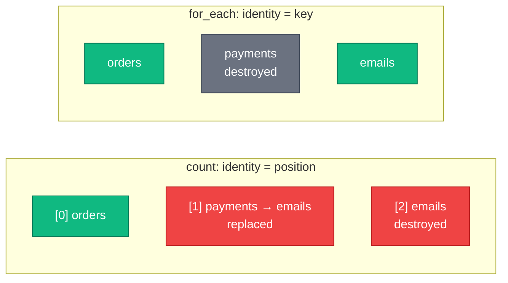
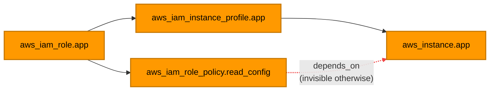
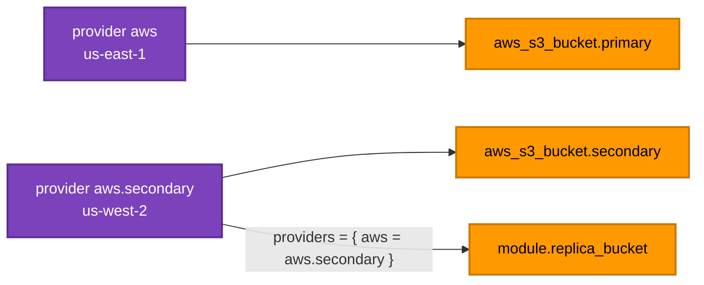

[← 08 · Data Sources and Locals](../08-data-sources-and-locals/README.md) | [🏠 Home](../../README.md) | [📚 Learning Path](../00-learning-roadmap/README.md) | [10 · Expressions and Functions →](../10-expressions-and-functions/README.md)

# 09 · Meta-Arguments

🟡 Intermediate · ⏱️ 90 minutes · 💰 Several labs create `t3.micro` instances — destroy each lab when done

**Meta-arguments** are arguments that Terraform itself understands, on *any* resource type (and most also on modules). They control **how many** copies exist, **in what order** things happen, **which provider** is used, and **how** changes are applied.

| Meta-argument | Question it answers | Lab |
| --- | --- | --- |
| [`count`](#1-count) | How many identical copies? | [count-and-for-each](../../examples/meta-arguments/count-and-for-each/README.md) |
| [`for_each`](#2-for_each) | One copy per key — which keys? | [count-and-for-each](../../examples/meta-arguments/count-and-for-each/README.md) |
| [count vs for_each](#3-count-vs-for_each) | Which one should I use? | [count-vs-for-each](../../examples/meta-arguments/count-vs-for-each/README.md) |
| [`depends_on`](#4-depends_on) | Is there a dependency Terraform can't see? | [depends-on](../../examples/meta-arguments/depends-on/README.md) |
| [`provider` / `providers`](#5-provider-and-providers) | Which provider configuration (Region/account)? | [multi-region-providers](../../examples/meta-arguments/multi-region-providers/README.md) |
| [`lifecycle`](#6-lifecycle) | How should changes and deletes be handled? | [lifecycle](../../examples/meta-arguments/lifecycle/README.md) |

All labs: [examples/meta-arguments](../../examples/meta-arguments/README.md)

---

## 1. `count`

### What is it?

`count = N` creates **N copies** of a resource. Inside the block, `count.index` is the copy number (0, 1, 2, …).

### Why do we need it?

To avoid copy-pasting a block several times, and to make a resource **optional** (`count = 0` or `1`).

### Terraform syntax

```hcl
resource "aws_instance" "worker" {
  count = var.instance_count          # e.g. 2

  ami           = data.aws_ami.al2023.id
  instance_type = "t3.micro"

  tags = {
    Name = "worker-${count.index + 1}" # worker-1, worker-2
  }
}
```

| Address | Refers to |
| --- | --- |
| `aws_instance.worker` | the whole **list** of instances |
| `aws_instance.worker[0]` | the first instance |
| `aws_instance.worker[*].id` | list of all IDs (splat) |

### The optional-resource pattern

```hcl
resource "aws_nat_gateway" "this" {
  count = var.enable_nat_gateway ? 1 : 0
  # ...
}

output "nat_gateway_id" {
  value = one(aws_nat_gateway.this[*].id)   # the ID, or null when count = 0
}
```

`one()` returns the single element of a list, or `null` if the list is empty.

---

## 2. `for_each`

### What is it?

`for_each` creates **one copy per element of a map or a set of strings**. Inside the block, `each.key` and `each.value` describe the current element.

### Why do we need it?

When each copy has an **identity** ("the logs bucket", "the billing queue") and possibly **different settings**.

### Terraform syntax

```hcl
variable "buckets" {
  type = map(object({ versioning = bool }))
  default = {
    logs      = { versioning = false }
    artifacts = { versioning = true }
  }
}

resource "aws_s3_bucket" "this" {
  for_each = var.buckets

  bucket_prefix = "tf-learning-${each.key}-"   # each.key   = "logs", "artifacts"
  tags          = { Purpose = each.key }       # each.value = { versioning = ... }
}
```

| Address | Refers to |
| --- | --- |
| `aws_s3_bucket.this` | a **map** of buckets |
| `aws_s3_bucket.this["logs"]` | the logs bucket |
| `{ for k, b in aws_s3_bucket.this : k => b.arn }` | map of key → ARN |

With a **set** of strings, `each.key` and `each.value` are the same string:

```hcl
resource "aws_sqs_queue" "this" {
  for_each = toset(["orders", "payments"])
  name     = "tf-learning-${each.value}"
}
```

### Chaining `for_each`

A resource can iterate over **another resource that uses `for_each`**, so both share the same keys:

```hcl
resource "aws_s3_bucket_versioning" "this" {
  for_each = aws_s3_bucket.this          # same keys as the buckets

  bucket = each.value.id                 # each.value = the bucket object
  versioning_configuration {
    status = var.buckets[each.key].versioning ? "Enabled" : "Suspended"
  }
}
```

### Limitation: keys must be known at plan time

`for_each` keys (and `count` values) must be known **before** apply. You cannot use, for example, the ID of a resource created in the same run as a key. Use static names as keys; unknown values are fine as **values**. (You will see a real example of this rule in [modules/iam](../../modules/iam/README.md).)

---

## 3. count vs for_each

### The ordering problem

With `count`, Terraform identifies copies by **position**. With `for_each`, by **key**. The difference shows up when you remove an element from the middle.

Start with `queue_names = ["orders", "payments", "emails"]`:

| count address | Queue | for_each address | Queue |
| --- | --- | --- | --- |
| `by_count[0]` | orders | `by_key["orders"]` | orders |
| `by_count[1]` | payments | `by_key["payments"]` | payments |
| `by_count[2]` | emails | `by_key["emails"]` | emails |

Now remove `"payments"` → `["orders", "emails"]`:

| count address | Before → after | What Terraform plans |
| --- | --- | --- |
| `by_count[0]` | orders → orders | nothing |
| `by_count[1]` | payments → **emails** | **replace** the payments queue with an emails queue (the name forces a new queue) |
| `by_count[2]` | emails → *(gone)* | **destroy** the old emails queue |

| for_each address | What Terraform plans |
| --- | --- |
| `by_key["payments"]` | **destroy** — and nothing else |

With `count`, removing one element **destroyed and recreated an unrelated queue**. For queues that is annoying (messages are lost); for databases or instances it can be an outage.



Try it yourself in the [count-vs-for-each lab](../../examples/meta-arguments/count-vs-for-each/README.md).

### Comparison

| | `count` | `for_each` |
| --- | --- | --- |
| Input | a number | a map or a set of strings |
| Identity of each copy | index `[0]`, `[1]` | key `["name"]` |
| Removing a middle element | shifts all later elements → replacements | affects only that element |
| Per-copy settings | awkward (look up by `count.index`) | natural (`each.value`) |
| Best for | N **identical** things; **optional** resources (`0`/`1`) | things with **names or different settings** |

**Rule of thumb:** if you are tempted to write `var.list[count.index]`, use `for_each` instead.

---

## 4. `depends_on`

### What is it?

An explicit dependency: "create this only after those exist".

### Why do we need it?

Terraform finds almost all dependencies from **references**. `depends_on` is for the rare **hidden** dependency — one that exists at runtime but is not visible in any argument.

### AWS example

An EC2 instance's boot script reads from S3 using the instance's IAM role. The instance references the **instance profile**, but not the **policy** that grants S3 access. Without `depends_on`, Terraform may start the instance before the policy is attached, and the boot script fails.

```hcl
resource "aws_instance" "app" {
  iam_instance_profile = aws_iam_instance_profile.app.name   # implicit dependency
  user_data            = "aws s3 ls s3://${aws_s3_bucket.config.bucket}/"

  depends_on = [aws_iam_role_policy.read_config]             # explicit, hidden dependency
}
```



**Use sparingly.** `depends_on` makes Terraform more conservative (it may defer reading data sources to apply time), and it hides *why* the dependency exists unless you comment it. If you can express the dependency with a reference, do that instead.

---

## 5. `provider` and `providers`

### What is it?

- `provider = aws.<alias>` on a **resource** picks a non-default provider configuration.
- `providers = { aws = aws.<alias> }` on a **module call** hands a provider configuration to a module.

### Why do we need it?

One provider block has one Region and one set of credentials. Multi-Region setups (e.g. a backup bucket in another Region, or an ACM certificate that must live in `us-east-1` for CloudFront) and multi-account setups need several configurations of the same provider.

### Terraform syntax

```hcl
provider "aws" {            # default configuration
  region = "us-east-1"
}

provider "aws" {            # second configuration, named by its alias
  alias  = "secondary"
  region = "us-west-2"
}

resource "aws_s3_bucket" "primary" {
  bucket_prefix = "tf-learning-primary-"          # uses the default provider
}

resource "aws_s3_bucket" "secondary" {
  provider      = aws.secondary                    # uses us-west-2
  bucket_prefix = "tf-learning-secondary-"
}

module "replica_bucket" {
  source    = "../../../modules/s3"
  providers = { aws = aws.secondary }              # module's "aws" = our aws.secondary
  bucket_prefix = "tf-learning-module-secondary-"
}
```



> **AWS provider 6.x alternative:** most resources now accept a `region` argument (`region = "us-west-2"`) that overrides the provider's Region for that resource. Aliases are still the tool of choice for **different accounts/credentials**, and for passing a Region to a whole module.

---

## 6. `lifecycle`

### What is it?

A nested block that changes how Terraform creates, updates and destroys a resource.

```hcl
lifecycle {
  create_before_destroy = true
  prevent_destroy       = true
  ignore_changes        = [tags["LastScanned"]]
  replace_triggered_by  = [terraform_data.app_version]

  precondition {
    condition     = data.aws_ami.al2023.architecture == "x86_64"
    error_message = "The AMI must be x86_64."
  }
}
```

Lifecycle arguments must be **literal values** — no variables — because Terraform needs them before it evaluates the rest of the configuration.

### `create_before_destroy`

**Problem:** by default, a replacement *destroys* the old object first. A security group that is still attached to an instance cannot be destroyed, so the replacement fails; a certificate being replaced leaves a gap with no certificate.

**Solution:** create the new object first, move references to it, then destroy the old one.

```hcl
resource "aws_security_group" "app" {
  name_prefix = "app-"      # a fixed "name" would collide with the old group
  lifecycle {
    create_before_destroy = true
  }
}
```

Requires that two copies can exist at once — which usually means `name_prefix` instead of a fixed `name`.

### `prevent_destroy`

Makes any plan that would destroy the resource **fail**. Use it on things whose loss would be a disaster: state buckets, production databases, KMS keys.

```hcl
resource "aws_s3_bucket" "state" {
  lifecycle {
    prevent_destroy = true
  }
}
```

It only protects against Terraform. It does not stop deletion in the console, and removing the block from the code (or the whole resource) removes the protection too.

### `ignore_changes`

Tells Terraform to ignore differences in specific attributes after creation. Use when **something else legitimately manages** that attribute:

```hcl
resource "aws_autoscaling_group" "web" {
  lifecycle {
    ignore_changes = [desired_capacity]   # the scaling policy changes it at runtime
  }
}

resource "aws_instance" "app" {
  lifecycle {
    ignore_changes = [ami]                # roll out new AMIs deliberately, not on every plan
  }
}
```

Avoid `ignore_changes = all` — Terraform would stop managing the resource in practice.

### `replace_triggered_by`

Replace this resource when **another** resource (or one of its attributes) changes:

```hcl
resource "terraform_data" "app_version" {
  input = var.app_version
}

resource "aws_instance" "app" {
  lifecycle {
    replace_triggered_by = [terraform_data.app_version]
  }
}
```

`terraform_data` is a built-in resource that just stores a value — a handy "version marker".

### Preconditions and postconditions

Custom checks with your own error messages:

```hcl
resource "aws_instance" "app" {
  lifecycle {
    precondition {                               # checked BEFORE the change
      condition     = data.aws_ami.al2023.architecture == "x86_64"
      error_message = "The AMI must be x86_64 for t3 instances."
    }
    postcondition {                              # checked AFTER, using self
      condition     = self.private_ip != ""
      error_message = "Instance did not get a private IP."
    }
  }
}
```

More in [Chapter 16](../16-testing-and-validation/README.md).

### `destroy = false` (Terraform 1.16+)

Newer Terraform versions add `destroy = false` to the `lifecycle` block: when the resource is removed from the configuration, Terraform **forgets** it instead of destroying it. The same idea has existed since 1.7 as a `removed` block ([Chapter 11](../11-terraform-state/README.md#6-refactoring-moved-and-removed-blocks)); this course's code targets Terraform ≥ 1.11, so it uses `removed` blocks.

---

## Meta-arguments on modules

`count`, `for_each`, `depends_on` and `providers` also work on `module` blocks:

```hcl
module "bucket" {
  source   = "../../../modules/s3"
  for_each = toset(["reports", "scratch"])

  bucket_prefix = "tf-learning-${each.key}-"
}
# module.bucket["reports"].bucket_id
```

See [examples/modules/local-module](../../examples/modules/local-module/README.md).

---

## Key takeaways

- `count` = N identical copies (identity by position); `for_each` = one copy per key (identity by key). Prefer **for_each** when elements have names.
- `depends_on` is for **hidden** dependencies only; comment why.
- `provider` / `providers` choose among aliased provider configurations (Regions/accounts).
- `lifecycle` controls replacement order, protection, ignored attributes, triggers and custom conditions.

## Official references

- [count](https://developer.hashicorp.com/terraform/language/meta-arguments/count)
- [for_each](https://developer.hashicorp.com/terraform/language/meta-arguments/for_each)
- [depends_on](https://developer.hashicorp.com/terraform/language/meta-arguments/depends_on)
- [provider](https://developer.hashicorp.com/terraform/language/meta-arguments/provider) · [providers (modules)](https://developer.hashicorp.com/terraform/language/meta-arguments/providers)
- [lifecycle](https://developer.hashicorp.com/terraform/language/meta-arguments/lifecycle)
- [Custom conditions](https://developer.hashicorp.com/terraform/language/expressions/custom-conditions)
- [terraform_data](https://developer.hashicorp.com/terraform/language/resources/terraform-data)

---

[← 08 · Data Sources and Locals](../08-data-sources-and-locals/README.md) | [🏠 Home](../../README.md) | [📚 Learning Path](../00-learning-roadmap/README.md) | [10 · Expressions and Functions →](../10-expressions-and-functions/README.md)
