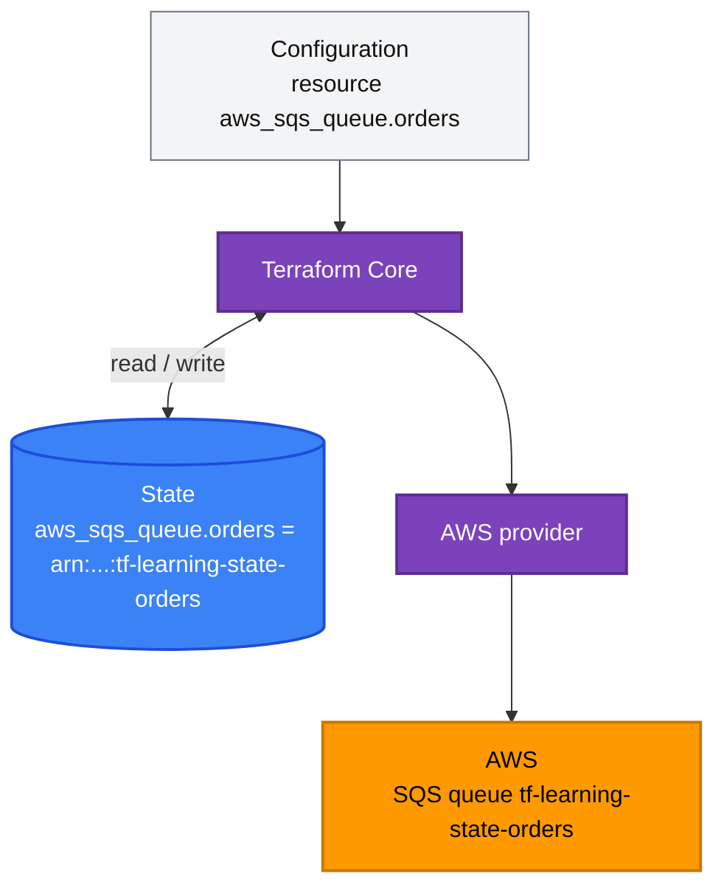
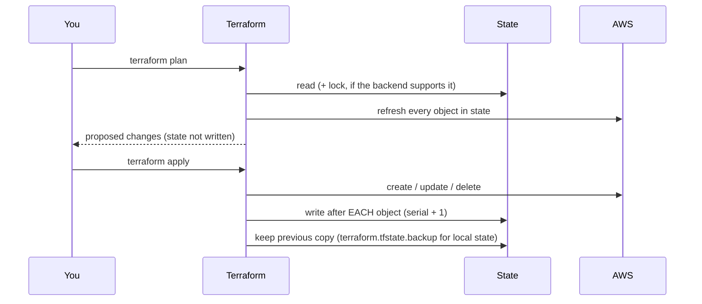

[← RDS](../../aws-services/rds/README.md) | [🏠 Home](../../README.md) | [📚 Learning Path](../00-learning-roadmap/README.md) | [12 · Remote State →](../12-remote-state/README.md)

# 11 · Terraform State

🟡 Intermediate · ⏱️ 60 minutes · 💰 Lab: one idle SQS queue and one empty bucket (free)

By the end of this chapter you will know what state is, why Terraform cannot work without it, how to inspect and refactor it safely, and why it must be protected like a password file.

**Lab:** [examples/state/state-basics](../../examples/state/state-basics/README.md)

---

## 1. What is state?

Terraform needs a record that tells it **which real AWS object belongs to which block in your code**. That record is the state, stored by default in `terraform.tfstate` (a JSON file).

```json
{
  "resources": [
    {
      "mode": "managed",
      "type": "aws_sqs_queue",
      "name": "orders",
      "instances": [
        {
          "attributes": {
            "id": "https://sqs.us-east-1.amazonaws.com/111122223333/tf-learning-state-orders",
            "arn": "arn:aws:sqs:us-east-1:111122223333:tf-learning-state-orders",
            "visibility_timeout_seconds": 30
          }
        }
      ]
    }
  ]
}
```

*(Heavily shortened: real state also holds every attribute, dependencies, the provider, a serial number and a lineage ID.)*

## 2. Why does Terraform need state?

| Without state, Terraform could not… | Because… |
| --- | --- |
| **Map code to objects** | AWS doesn't know that queue `tf-learning-state-orders` is `aws_sqs_queue.orders` in your code. Many resources have no name at all, only a generated ID. |
| **Know what to delete** | If you remove a block from the code, only the state remembers that the object exists and must be destroyed. |
| **Order deletes** | State stores dependencies, so Terraform can destroy in the right order even after the code is gone. |
| **Plan quickly** | It refreshes only objects it knows about, instead of scanning your entire account. |

### Simple analogy

State is a **cloakroom ticket book**. The code says "I have a blue coat"; the ticket (state) says "blue coat = hook 47". Without the ticket book, the attendant can't find your coat — or knows it is yours.



## 3. Resource addresses

Every object in state has an **address**:

| Address | Meaning |
| --- | --- |
| `aws_sqs_queue.orders` | resource in the root module |
| `aws_instance.worker[0]` | instance 0 of a `count` resource |
| `aws_s3_bucket.this["logs"]` | instance `"logs"` of a `for_each` resource |
| `data.aws_ami.al2023` | a data source (read results are cached in state too) |
| `module.vpc.aws_subnet.public["us-east-1a"]` | a resource inside a module |
| `module.bucket["reports"].aws_s3_bucket.this` | a resource inside a `for_each` module |

## 4. State lifecycle



- **`serial`** increases on every write; **`lineage`** identifies one state "family". Terraform refuses to overwrite a state with a different lineage or an older serial — a built-in safety check.
- For **local** state, the previous version is kept in `terraform.tfstate.backup`. For **S3** state, bucket **versioning** keeps every version ([Chapter 12](../12-remote-state/README.md)).

## 5. Inspecting state

```bash
terraform state list                              # every address
terraform state show aws_sqs_queue.orders         # all attributes of one object
terraform show                                    # the whole state, human-readable
terraform show -json | jq '.values.root_module.resources[].address'
terraform plan -refresh-only                      # compare state with reality (drift)
```

Never open `terraform.tfstate` in an editor to "check something" and save it — use the commands.

## 6. Refactoring: moved and removed blocks

Renaming a resource in code looks like "delete the old one, create a new one" to Terraform. For a database, that is a disaster. Tell Terraform it is the **same object at a new address** instead:

### `moved` (Terraform 1.1+)

```hcl
# Renamed aws_sqs_queue.orders → aws_sqs_queue.order_events
moved {
  from = aws_sqs_queue.orders
  to   = aws_sqs_queue.order_events
}
```

The plan shows `# aws_sqs_queue.orders has moved to aws_sqs_queue.order_events` and **0 to add, 0 to destroy**. `moved` also works for moving resources into modules (`to = module.queue.aws_sqs_queue.this`) and between `count`/`for_each` keys.

### `removed` (Terraform 1.7+)

Stop managing a resource **without destroying it** — for example, handing it over to another team's configuration:

```hcl
removed {
  from = aws_s3_bucket.uploads

  lifecycle {
    destroy = false     # forget it, keep the real bucket
  }
}
```

### Code blocks vs CLI commands

| Task | ✅ Preferred (in code) | Legacy CLI |
| --- | --- | --- |
| Rename / move | `moved { }` | `terraform state mv` |
| Stop managing | `removed { }` | `terraform state rm` |
| Adopt existing | `import { }` ([Chapter 15](../15-import-and-existing-resources/README.md)) | `terraform import` |

The code blocks go through **plan and code review**, work for everyone sharing the state, and can be kept in the code as documentation. CLI commands change shared state immediately and invisibly.

## 7. State security

State contains **every attribute of every resource** — including values you marked `sensitive`: database passwords passed as arguments, generated keys, secret values read by data sources, private IPs, ARNs of everything.

| Do | Don't |
| --- | --- |
| Store state in an **encrypted, versioned, access-controlled** remote backend | Commit `terraform.tfstate` to Git |
| Restrict who can **read** the state bucket (read access ≈ read access to every secret in it) | Paste `terraform show` output into chats or tickets |
| Keep secrets out of Terraform (managed passwords, write-only arguments) | Rely on `sensitive = true` to protect state |
| Separate state per environment so dev users can't read prod state | Share one state for everything |

## 8. Manual state editing and corruption

State can become inconsistent: an apply was killed mid-way, someone deleted a resource in the console, two people applied at once without locking, or someone hand-edited the JSON.

- **Resource deleted outside Terraform:** the next plan notices during refresh and proposes to recreate it. Usually that's correct; if not, remove it from the code (or use `removed`).
- **Resource created but not recorded** (apply crashed): the next apply fails with "already exists". Adopt it with an `import` block.
- **Corrupted / wrong state:** restore a previous version (S3 versioning, or `terraform.tfstate.backup` locally).

**Why hand-editing `terraform.tfstate` is a bad idea:** the format is internal and version-specific, attributes are cross-referenced, a typo can make Terraform destroy and recreate resources, and you bypass locking, serial checks and review. If you truly must, use `terraform state pull > backup.json` first, and push with `terraform state push` — as a last resort, with the team informed.

---

## Lab

**Folder:** [examples/state/state-basics](../../examples/state/state-basics/README.md)

```bash
cd examples/state/state-basics
terraform init && terraform apply

# 1 · Inspect
terraform state list
terraform state show aws_sqs_queue.orders
ls -l terraform.tfstate*

# 2 · Refactor with moved
#   edit main.tf: rename  resource "aws_sqs_queue" "orders"  →  "order_events"
#   also update the reference in outputs.tf, and uncomment the moved block
terraform plan        # "has moved to" — 0 to add, 0 to destroy
terraform apply

# 3 · Drift
aws sqs set-queue-attributes --queue-url "$(terraform output -raw queue_url)" \
  --attributes VisibilityTimeout=120
terraform plan -refresh-only      # shows the drift
terraform plan                    # proposes to set it back to 30
terraform apply

# 4 · Backup file
cat terraform.tfstate.backup | head -5   # previous serial
```

### Cleanup

```bash
terraform destroy
```

---

## Key takeaways

- State maps code addresses to real objects; without it Terraform can't update or delete anything.
- Inspect with `state list/show` and `show`; detect drift with `plan -refresh-only`.
- Refactor with `moved` / `removed` blocks, not by editing state.
- State contains secrets: encrypt it, version it, restrict access — the next chapter shows how.

## Official references

- [State](https://developer.hashicorp.com/terraform/language/state)
- [Purpose of Terraform state](https://developer.hashicorp.com/terraform/language/state/purpose)
- [Sensitive data in state](https://developer.hashicorp.com/terraform/language/state/sensitive-data)
- [Refactoring with moved blocks](https://developer.hashicorp.com/terraform/language/modules/develop/refactoring)
- [removed block](https://developer.hashicorp.com/terraform/language/resources/syntax#removing-resources)
- [terraform state commands](https://developer.hashicorp.com/terraform/cli/commands/state)

---

[← RDS](../../aws-services/rds/README.md) | [🏠 Home](../../README.md) | [📚 Learning Path](../00-learning-roadmap/README.md) | [12 · Remote State →](../12-remote-state/README.md)
