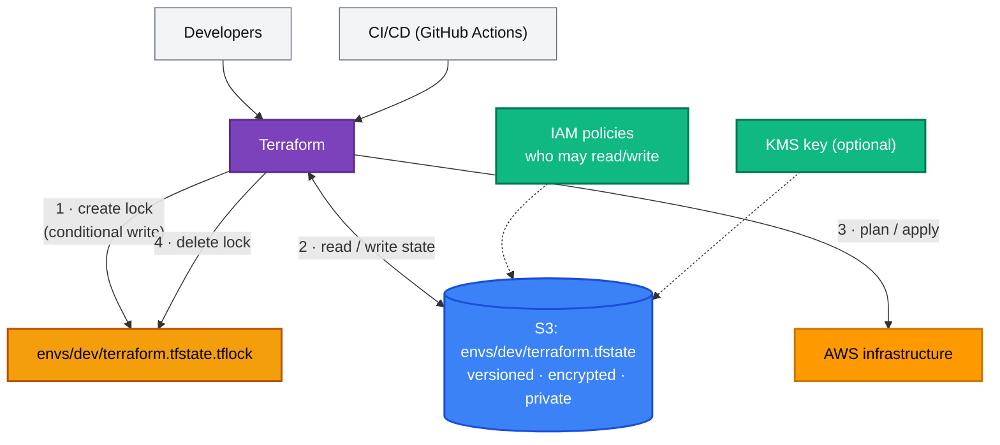

[← 11 · Terraform State](../11-terraform-state/README.md) | [🏠 Home](../../README.md) | [📚 Learning Path](../00-learning-roadmap/README.md) | [13 · Terraform Modules →](../13-terraform-modules/README.md)

# 12 · Remote State

🟡 Intermediate · ⏱️ 60 minutes · 💰 Free: a versioned S3 bucket with a few KB of state

By the end of this chapter your state lives in an encrypted, versioned S3 bucket with locking — the setup every team (and every CI pipeline) needs.

**Labs:** [remote-state-bootstrap](../../examples/state/remote-state-bootstrap/README.md) → [remote-state-backend](../../examples/state/remote-state-backend/README.md)

---

## 1. Why local state is not enough

| Problem with `terraform.tfstate` on a laptop | Consequence |
| --- | --- |
| Only one person has it | Colleagues and CI can't run Terraform, or run with an empty state and try to create everything again |
| No locking | Two simultaneous applies overwrite each other's state → corruption, orphaned resources |
| Laptop lost / disk wiped | Terraform "forgets" everything it manages |
| Secrets in a plain file on disk | Anyone with the laptop or a backup can read them |

A **backend** decides where state is stored. Remote backends solve all four problems.

## 2. The S3 backend



### Configuration

```hcl
terraform {
  backend "s3" {
    bucket       = "tf-learning-state-abc123"
    key          = "examples/remote-state-backend/terraform.tfstate"
    region       = "us-east-1"
    encrypt      = true
    use_lockfile = true
  }
}
```

| Argument | Meaning |
| --- | --- |
| `bucket` | The state bucket (create it first — see §4) |
| `key` | The object path of **this** configuration's state. One key per configuration and environment. |
| `region` | Region of the bucket |
| `encrypt` | Server-side encryption of the state (and lock) objects |
| `kms_key_id` | Optional: encrypt with your own KMS key; readers then also need `kms:Decrypt` |
| `use_lockfile` | **S3-native state locking** (see §3) |
| `workspace_key_prefix` | Where non-default workspaces' states go (default `env:`) — [Chapter 14](../14-workspaces-and-environments/README.md) |

### Backend blocks can't use variables

Terraform configures the backend **before** it evaluates variables, so `bucket = var.state_bucket` is not allowed. Supply values that differ per person or environment at init time — **partial configuration**:

```hcl
# backend.tf (committed)
terraform {
  backend "s3" {
    key = "examples/remote-state-backend/terraform.tfstate"
  }
}
```

```hcl
# backend.hcl (git-ignored, or generated in CI)
bucket       = "tf-learning-state-abc123"
region       = "us-east-1"
encrypt      = true
use_lockfile = true
```

```bash
terraform init -backend-config=backend.hcl
# or individual values, as CI does:
terraform init -backend-config="bucket=$TF_STATE_BUCKET" -backend-config="region=us-east-1"
```

## 3. State locking

### What is it?

A lock guarantees that only **one** operation writes a given state at a time. Without it, two applies can both read serial 5, both write serial 6, and one set of changes is silently lost.

### How S3-native locking works

With `use_lockfile = true`, Terraform creates a lock object next to the state (`<key>.tflock`) using an S3 **conditional write** — the write only succeeds if the object doesn't exist yet. A second Terraform run fails to create it and waits (`-lock-timeout=5m`) or errors:

```text
Error: Error acquiring the state lock
...
Lock Info:
  ID:        <uuid>
  Path:      <bucket>/<key>
  Operation: OperationTypeApply
  Who:       alice@laptop
```

When the operation finishes, Terraform deletes the lock object. If a run crashed and left the lock behind, and you are **sure** nothing is running, release it with `terraform force-unlock <ID>`.

S3-native locking was added in Terraform 1.10 and became generally available in 1.11.

### ⚠️ Legacy / deprecated: DynamoDB locking

Older tutorials create a **DynamoDB table** and set `dynamodb_table = "terraform-locks"` in the backend. HashiCorp's S3 backend documentation marks DynamoDB-based locking as **deprecated** and states it will be removed in a future minor version. Use `use_lockfile = true` for new setups.

If you inherit a configuration using DynamoDB: during migration both can be enabled at the same time; once everyone runs Terraform ≥ 1.11 with `use_lockfile = true`, remove `dynamodb_table` and delete the table.

## 4. The state bucket itself

The bucket that stores state is one of the most sensitive resources you own. The [remote-state-bootstrap](../../examples/state/remote-state-bootstrap/README.md) lab creates it with:

| Setting | Why |
| --- | --- |
| **Versioning** | Every state write keeps the previous version → recovery from corruption or bad changes |
| **Encryption** | SSE-S3 in the lab; SSE-KMS with a customer managed key for an extra access control layer |
| **Block Public Access + ownership enforced** | State must never be public |
| **HTTPS-only bucket policy** | No plain-text transport |
| **Lifecycle on noncurrent versions** | Keep history (e.g. 90 days) without unbounded growth |
| **`prevent_destroy`** | A `terraform destroy` in the bootstrap folder can't delete everyone's state |

### Chicken and egg

The bucket must exist before any configuration can use it as a backend. Common approaches:

1. A small **bootstrap** configuration with **local** state creates the bucket (this course's approach). Keep its state file safe, or migrate it into the bucket afterwards.
2. Create the bucket once with the CLI or CloudFormation, then import it.

### IAM permissions

What a principal needs (from the S3 backend docs):

| Action | Resource |
| --- | --- |
| `s3:ListBucket` | the bucket |
| `s3:GetObject`, `s3:PutObject` | the state object `<key>` |
| `s3:GetObject`, `s3:PutObject`, `s3:DeleteObject` | the lock object `<key>.tflock` (when `use_lockfile = true`) |
| `kms:Encrypt`, `kms:Decrypt`, `kms:GenerateDataKey` | the KMS key (when `kms_key_id` is set) |

Scope permissions **per key prefix** so, for example, a dev pipeline can't read prod state ([Project 09's bootstrap](../../projects/09-production-style-infrastructure/bootstrap/oidc.tf) does this).

## 5. Migrating state

### Local → S3

1. Add the `backend "s3"` block.
2. Run `terraform init -backend-config=backend.hcl`.
3. Terraform detects existing local state and asks: *"Do you want to copy existing state to the new backend?"* → `yes`. (Non-interactive: `terraform init -migrate-state -force-copy`.)
4. Verify with `terraform state list`, then delete the local `terraform.tfstate*` files.

### Changing backend settings

| Flag | Use when |
| --- | --- |
| `-migrate-state` | The backend changed (bucket, key, type) and you want the state **copied** to the new location |
| `-reconfigure` | The backend changed but you do **not** want to migrate (e.g. switching between two existing states) |

### S3 → local

Remove the `backend` block and run `terraform init -migrate-state`.

## 6. Recovering state

Because the bucket is versioned, every previous state is still there:

```bash
aws s3api list-object-versions --bucket "$BUCKET" \
  --prefix examples/remote-state-backend/terraform.tfstate \
  --query "Versions[].[VersionId,LastModified,Size]" --output table

# Download an older version to inspect it
aws s3api get-object --bucket "$BUCKET" \
  --key examples/remote-state-backend/terraform.tfstate \
  --version-id <VERSION_ID> old.tfstate
```

To roll back, you can copy the old version over the current one (`aws s3api copy-object ... --copy-source "$BUCKET/<key>?versionId=<id>"`) **while nobody is running Terraform**, then run `terraform plan` to confirm the result. Treat this as an emergency procedure; most problems are better fixed with `import`, `moved` or `removed` blocks.

## 7. Reading another configuration's outputs

A configuration can read another's **outputs** directly from its state:

```hcl
data "terraform_remote_state" "network" {
  backend = "s3"
  config = {
    bucket = "tf-learning-state-abc123"
    key    = "network/terraform.tfstate"
    region = "us-east-1"
  }
}

# data.terraform_remote_state.network.outputs.vpc_id
```

It works, but it requires read access to the **entire** other state (including its secrets) and couples the two configurations tightly. Alternatives: look the resource up with a normal data source (`data "aws_vpc"` by tag), or publish values to SSM Parameter Store.

---

## Labs

1. **[remote-state-bootstrap](../../examples/state/remote-state-bootstrap/README.md)** — create the state bucket (local state).
2. **[remote-state-backend](../../examples/state/remote-state-backend/README.md)** — use it: partial configuration, locking demo, migration, version history.

## Key takeaways

- Remote state = shared, locked, versioned, encrypted, access-controlled.
- S3 backend + `use_lockfile = true` is the current recommended setup; DynamoDB locking is **deprecated**.
- Backend blocks can't use variables → partial configuration with `-backend-config`.
- Versioning is your undo button; `prevent_destroy` protects the bucket itself.

## Official references

- [Backend configuration](https://developer.hashicorp.com/terraform/language/backend)
- [S3 backend](https://developer.hashicorp.com/terraform/language/backend/s3)
- [State locking](https://developer.hashicorp.com/terraform/language/state/locking)
- [terraform init: backend initialization](https://developer.hashicorp.com/terraform/cli/commands/init#backend-initialization)
- [terraform_remote_state data source](https://developer.hashicorp.com/terraform/language/state/remote-state-data)
- [S3 conditional writes](https://docs.aws.amazon.com/AmazonS3/latest/userguide/conditional-writes.html)

---

[← 11 · Terraform State](../11-terraform-state/README.md) | [🏠 Home](../../README.md) | [📚 Learning Path](../00-learning-roadmap/README.md) | [13 · Terraform Modules →](../13-terraform-modules/README.md)
