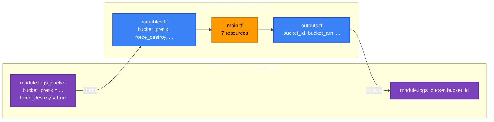
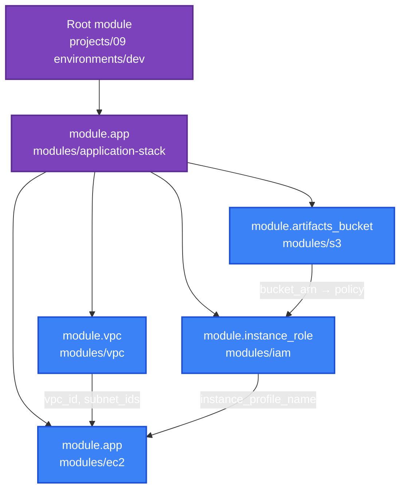

[← 12 · Remote State](../12-remote-state/README.md) | [🏠 Home](../../README.md) | [📚 Learning Path](../00-learning-roadmap/README.md) | [14 · Workspaces and Environments →](../14-workspaces-and-environments/README.md)

# 13 · Terraform Modules

🟡 Intermediate · ⏱️ 90 minutes · 💰 Labs: empty buckets (free); registry VPC without NAT (free)

Modules are how Terraform code is **reused**. By the end of this chapter you can call local and registry modules, write your own module with a clean interface, version it, test it, and compose several modules into a larger system.

**Labs:** [examples/modules](../../examples/modules/README.md) · **Reusable modules of this course:** [modules/](../../modules/README.md)

---

## 1. What is a module?

A module is simply **a directory of `.tf` files**. You have been writing modules all along:

- The directory where you run `terraform` is the **root module**.
- A module called from another module with a `module` block is a **child module**.

## 2. Why do modules exist?

| Without modules | With modules |
| --- | --- |
| Every team copy-pastes "a secure S3 bucket" (7 resources) and they drift apart | One `modules/s3`, used everywhere; fix a bug once |
| Callers must understand every resource | Callers see a small interface: inputs and outputs |
| Standards (encryption, tags, IMDSv2) depend on everyone remembering | Standards are built into the module |

### Simple analogy

A module is a **function**: variables are parameters, outputs are return values, resources are the function body. Calling a module is calling the function.

## 3. Calling a module

```hcl
module "logs_bucket" {
  source = "../../../modules/s3"      # WHERE the module code is

  bucket_prefix = "tf-learning-logs-" # the module's input variables
  force_destroy = true
}

output "logs_bucket" {
  value = module.logs_bucket.bucket_id   # the module's outputs
}
```

After adding or changing a `source`, run `terraform init` so Terraform installs the module.

### Module sources

| Source | Example | Versioning |
| --- | --- | --- |
| Local path | `source = "../../modules/s3"` | Same commit as the caller |
| Terraform Registry | `source = "terraform-aws-modules/vpc/aws"` + `version = "~> 6.7"` | `version` argument |
| Git | `source = "git::https://github.com/org/modules.git//s3?ref=v1.4.0"` | `ref` = tag or commit |
| Private registry (HCP Terraform) | `source = "app.terraform.io/acme/s3/aws"` + `version` | `version` argument |

**Always pin versions** of remote modules. An unpinned module can change under you on the next `init`.

## 4. How modules work



- A child module **only** sees the values you pass in. It cannot read the caller's variables or resources.
- The caller **only** sees the module's outputs, not its internal resources.
- Resources inside get addresses like `module.logs_bucket.aws_s3_bucket.this`.
- **Providers** are inherited from the caller by default (or passed explicitly with `providers = { ... }` — [Chapter 09](../09-meta-arguments/README.md#5-provider-and-providers)). Modules should not contain `provider` blocks.

## 5. Writing a module

Every module in [modules/](../../modules/README.md) follows this layout:

```text
modules/s3/
├── main.tf              resources
├── variables.tf         inputs: typed, described, validated
├── outputs.tf           outputs: described
├── versions.tf          required_version + required_providers (minimum versions)
├── README.md            purpose, usage, and a terraform-docs generated reference
├── examples/basic/      smallest working root module that uses it
└── tests/               terraform test files (mocked, no AWS needed)
```

### Designing a good interface

| Guideline | Example from modules/s3 |
| --- | --- |
| **Secure by default** | `force_destroy = false`, versioning on, public access blocked |
| **Few required inputs** | only `bucket_prefix` is required |
| **Validate inputs** | regex on `bucket_prefix` |
| **Output what callers need** | `bucket_id`, `bucket_arn`, `bucket_regional_domain_name` |
| **Minimum provider version, not a pin** | `version = ">= 6.0"` in `versions.tf` |
| **No provider blocks** | the caller configures providers |
| **Don't wrap a single resource** | a module that only renames `aws_s3_bucket` arguments adds nothing |

### A module is not a place for environment logic

Modules describe **how** to build something. The root module decides **what** to build for dev vs prod by passing different inputs ([Chapter 14](../14-workspaces-and-environments/README.md), [Project 09](../../projects/09-production-style-infrastructure/README.md)).

## 6. Registry modules

The public [Terraform Registry](https://registry.terraform.io/browse/modules) hosts community modules. The most widely used AWS set is [terraform-aws-modules](https://registry.terraform.io/namespaces/terraform-aws-modules).

```hcl
module "vpc" {
  source  = "terraform-aws-modules/vpc/aws"
  version = "~> 6.7"

  name               = "tf-learning-registry-vpc"
  cidr               = "10.30.0.0/16"
  azs                = ["us-east-1a", "us-east-1b"]
  public_subnets     = ["10.30.0.0/24", "10.30.1.0/24"]
  private_subnets    = ["10.30.10.0/24", "10.30.11.0/24"]
  enable_nat_gateway = false
}
```

**Before adopting a registry module:** read its inputs and README, check it is actively maintained, pin the version, and read its changelog before upgrading. A registry module is third-party code that runs with your credentials.

**Your own module or a registry module?** Registry modules save time for well-understood building blocks (VPC, EKS). Your own modules encode your organisation's standards and stay small. Many teams wrap a registry module in a thin in-house module that sets their defaults.

## 7. Versioning your own modules

- **Same repository (this course):** callers use relative paths; module and caller change in one commit and one pull request.
- **Separate repository:** tag releases (`v1.2.0`) using semantic versioning — major = breaking change to inputs/outputs, minor = new optional input, patch = fix — and pin `?ref=v1.2.0`.
- **Private registry** (HCP Terraform / Terraform Enterprise): publish tagged versions and use `version` constraints like the public registry ([Chapter 19](../19-hcp-terraform/README.md)).

When you refactor a module's internals (e.g. rename a resource), add `moved` blocks **inside the module** so callers don't get destroy/create plans.

## 8. Module composition

Small modules combine into bigger ones. [modules/application-stack](../../modules/application-stack/README.md) creates nothing itself; it wires four modules together:



Outputs of one module become inputs of another — Terraform works out the order from those references, exactly as with resources.

Keep composition **shallow** (two or three levels). Deeply nested modules are hard to debug and refactor.

## 9. Documentation with terraform-docs

Each module's README has a section between `<!-- BEGIN_TF_DOCS -->` and `<!-- END_TF_DOCS -->` generated by [terraform-docs](https://terraform-docs.io/) from `variables.tf` and `outputs.tf`, using the repository's [.terraform-docs.yml](../../.terraform-docs.yml):

```bash
terraform-docs modules/s3
```

The [terraform-docs workflow](../../.github/workflows/terraform-docs.yml) fails a pull request if a README is out of date. Details in [Chapter 17](../17-terraform-tooling/README.md).

---

## Labs

| Lab | Shows |
| --- | --- |
| [local-module](../../examples/modules/local-module/README.md) | Calling `modules/s3` once and with `for_each` |
| [registry-module](../../examples/modules/registry-module/README.md) | Using `terraform-aws-modules/vpc/aws` with a pinned version |
| [modules/*/examples/basic](../../modules/README.md) | Minimal usage of each course module |
| [modules/*/tests](../../modules/README.md) | Mocked unit tests ([Chapter 16](../16-testing-and-validation/README.md)) |

## Key takeaways

- A module is a directory; root module calls child modules with `module` blocks.
- Interface = variables in, outputs out. Secure defaults, validated inputs, no provider blocks.
- Pin remote module versions; use `moved` blocks when refactoring module internals.
- Compose small modules; keep nesting shallow.

## Official references

- [Modules overview](https://developer.hashicorp.com/terraform/language/modules)
- [Module blocks](https://developer.hashicorp.com/terraform/language/modules/syntax)
- [Module sources](https://developer.hashicorp.com/terraform/language/modules/sources)
- [Creating modules](https://developer.hashicorp.com/terraform/language/modules/develop)
- [Module composition](https://developer.hashicorp.com/terraform/language/modules/develop/composition)
- [Publishing modules to the registry](https://developer.hashicorp.com/terraform/registry/modules/publish)

---

[← 12 · Remote State](../12-remote-state/README.md) | [🏠 Home](../../README.md) | [📚 Learning Path](../00-learning-roadmap/README.md) | [14 · Workspaces and Environments →](../14-workspaces-and-environments/README.md)
