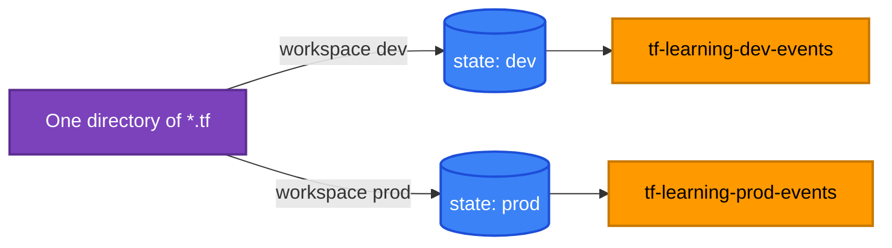
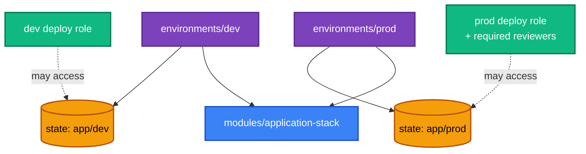

[← 13 · Terraform Modules](../13-terraform-modules/README.md) | [🏠 Home](../../README.md) | [📚 Learning Path](../00-learning-roadmap/README.md) | [15 · Import and Existing Resources →](../15-import-and-existing-resources/README.md)

# 14 · Workspaces and Environments

🟡 Intermediate · ⏱️ 45 minutes · 💰 Lab: idle queues and empty buckets (free)

Almost every team runs the same infrastructure more than once: dev, staging, prod. By the end of this chapter you know two ways to do that with Terraform — **CLI workspaces** and **directory-per-environment** — and when each fits.

**Lab:** [examples/multi-environment/workspaces](../../examples/multi-environment/workspaces/README.md) · **Full example:** [Project 09](../../projects/09-production-style-infrastructure/README.md)

---

## 1. CLI workspaces

### What is it?

A **workspace** is a named, separate **state** for the same configuration directory. Every configuration starts with one workspace called `default`.

### How does it work?

Same code, different state files. The code can read the current workspace name as `terraform.workspace`:

```hcl
locals {
  environment = terraform.workspace
  settings = {
    dev  = { message_retention_seconds = 3600,    versioning = false }
    prod = { message_retention_seconds = 1209600, versioning = true }
  }
  config = lookup(local.settings, local.environment, local.settings["dev"])
}

resource "aws_sqs_queue" "events" {
  name                      = "tf-learning-${local.environment}-events"
  message_retention_seconds = local.config.message_retention_seconds
}
```



### Commands

```bash
terraform workspace list            # * marks the current one
terraform workspace show
terraform workspace new dev         # create + select
terraform workspace select prod
terraform workspace delete dev      # only if its state is empty (destroy first)
```

Where the state goes:

| Backend | default workspace | other workspaces |
| --- | --- | --- |
| local | `terraform.tfstate` | `terraform.tfstate.d/<name>/terraform.tfstate` |
| S3 | `<key>` | `<workspace_key_prefix>/<name>/<key>` (prefix defaults to `env:`) |

### When workspaces work well

- **Short-lived copies** of the same thing: a stack per feature branch or per developer.
- Environments that are **truly identical** apart from a few sizes.

### Their limits

| Limitation | Why it matters |
| --- | --- |
| **Same backend, same credentials** for every workspace | Prod state sits in the same bucket as dev, readable with the same access. You can't easily say "developers may plan dev but not read prod state". |
| **Invisible in the code** | Which workspace is selected isn't visible in the files; a `destroy` in the wrong workspace is one forgotten command away. |
| **Environment differences hide in maps** | `lookup(local.settings, terraform.workspace)` grows until nobody knows what prod actually looks like. |
| **Same provider configuration** | Different AWS accounts per environment need extra logic. |

HashiCorp's own documentation notes that CLI workspaces are not a suitable isolation mechanism when environments need **separate credentials and access controls**.

> **Naming clash:** HCP Terraform also has "workspaces", which are a different, richer concept (their own variables, permissions, runs) — see [Chapter 19](../19-hcp-terraform/README.md).

## 2. Directory per environment

### What is it?

Each environment is its own **root module** in its own directory, calling shared modules with environment-specific inputs:

```text
infrastructure/
├── modules/
│   └── application-stack/      # HOW to build the app (shared)
└── environments/
    ├── dev/
    │   ├── backend.tf           # key = "app/dev/terraform.tfstate"
    │   └── main.tf              # module "app" { instance_count = 1, ... }
    └── prod/
        ├── backend.tf           # key = "app/prod/terraform.tfstate"
        └── main.tf              # module "app" { instance_count = 2, enable_nat_gateway = true }
```



### Trade-offs

| | CLI workspaces | Directory per environment |
| --- | --- | --- |
| Duplication | None | A little (each env has a `main.tf` calling the module) |
| Differences visible in code review | Hidden in maps/conditions | **Explicit**: `environments/prod/main.tf` shows exactly what prod is |
| Separate backends / credentials / accounts | Awkward | **Natural** |
| Risk of acting on the wrong environment | Higher (selected workspace) | Lower (you `cd` into it; CI maps a directory to an environment) |
| Promote a change dev → prod | Same code, run in another workspace | Change the module, apply dev, then prod; or pin module versions per env |
| Best for | Temporary copies, identical stacks | Long-lived environments, teams, CI/CD |

Neither is universally correct. Many teams use directories for long-lived environments **and** workspaces (or HCP Terraform workspaces) for ephemeral copies.

### Keeping environments consistent

- Put everything in modules; environment directories contain only **inputs**.
- Keep `versions.tf`/`providers.tf` identical across environments (or generate them).
- Apply the same change to dev first, then prod, through a pipeline ([Chapter 18](../18-github-actions/README.md)).

## Lab

**Workspaces:** [examples/multi-environment/workspaces](../../examples/multi-environment/workspaces/README.md) — create `dev` and `prod` workspaces from one directory and inspect the separate states.

**Directories:** read [Project 09](../../projects/09-production-style-infrastructure/README.md)'s `environments/dev` and `environments/prod`; compare their `main.tf` files side by side:

```bash
diff projects/09-production-style-infrastructure/environments/dev/main.tf \
     projects/09-production-style-infrastructure/environments/prod/main.tf
```

## Key takeaways

- A CLI workspace = another state for the same code; `terraform.workspace` holds its name.
- Workspaces share backend and credentials — weak isolation for prod.
- Directory-per-environment makes differences explicit and allows separate state access and credentials.
- Choose per use case; long-lived environments usually live in directories.

## Official references

- [Workspaces](https://developer.hashicorp.com/terraform/language/state/workspaces)
- [terraform workspace command](https://developer.hashicorp.com/terraform/cli/commands/workspace)
- [S3 backend: workspace_key_prefix](https://developer.hashicorp.com/terraform/language/backend/s3)
- [HCP Terraform workspaces](https://developer.hashicorp.com/terraform/cloud-docs/workspaces)

---

[← 13 · Terraform Modules](../13-terraform-modules/README.md) | [🏠 Home](../../README.md) | [📚 Learning Path](../00-learning-roadmap/README.md) | [15 · Import and Existing Resources →](../15-import-and-existing-resources/README.md)
