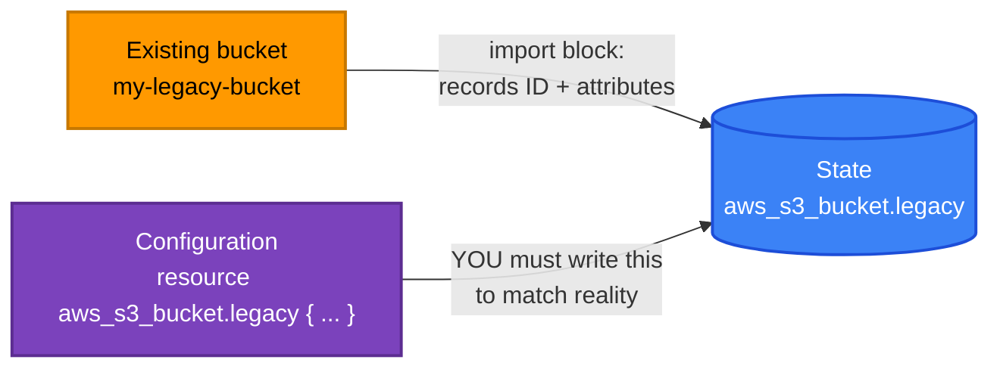

[← 14 · Workspaces and Environments](../14-workspaces-and-environments/README.md) | [🏠 Home](../../README.md) | [📚 Learning Path](../00-learning-roadmap/README.md) | [16 · Testing and Validation →](../16-testing-and-validation/README.md)

# 15 · Import and Existing Resources

🟡 Intermediate · ⏱️ 45 minutes · 💰 Lab: one empty bucket (free)

Real AWS accounts are full of resources created by hand, by scripts, or by other tools. By the end of this chapter you can bring them under Terraform management **without recreating them**.

**Lab:** [examples/state/import-existing-bucket](../../examples/state/import-existing-bucket/README.md)

---

## 1. What is import?

Import tells Terraform: *"the object with this ID already exists in AWS — record it in state at this address."* After that, Terraform manages it exactly as if it had created it.

## 2. Why do we need it?

- Adopting a console-built environment into IaC.
- Recovering after a crashed apply created a resource but didn't record it ("already exists" errors).
- Moving a resource from one configuration to another (`removed` in the old one, `import` in the new one).

## 3. Configuration vs state

Import is easy to misunderstand. It fills in **state**. It does not write **configuration**:



After an import, `terraform plan` compares your **code** with the imported **state**. Anything your code says differently — a missing tag, a different setting — shows up as a change. If the code is badly wrong (e.g. a different bucket name), the plan may even propose to **replace** the resource. Always aim for a plan with **no changes** right after an import.

## 4. The `import` block (recommended)

Available since Terraform 1.5:

```hcl
import {
  to = aws_s3_bucket.legacy
  id = "my-legacy-bucket"          # the ID format is documented per resource
}

resource "aws_s3_bucket" "legacy" {
  bucket = "my-legacy-bucket"
  tags   = { Owner = "console-user" }
}
```

```bash
terraform plan     # Plan: 1 to import, 0 to add, 0 to change, 0 to destroy.
terraform apply
```

Why a block instead of the old command:

| `import` block | `terraform import` CLI |
| --- | --- |
| Shown in `plan`, reviewed in a pull request | Changes state immediately |
| Runs in CI like any change | Must be run by hand against the right state |
| Can import many resources at once, with `for_each` (1.7+) | One resource per command |
| Can draft configuration (`-generate-config-out`) | No |

### What is the ID?

Every resource page in the provider docs ends with an **Import** section showing the ID format:

| Resource | Import ID |
| --- | --- |
| `aws_s3_bucket` | bucket name |
| `aws_instance` | `i-0123456789abcdef0` |
| `aws_vpc` | `vpc-0123...` |
| `aws_iam_role` | role name |
| `aws_security_group` | `sg-0123...` |
| `aws_route_table_association` | `subnet-.../rtb-...` |

### Importing many resources

```hcl
locals {
  legacy_queues = {
    orders   = "https://sqs.us-east-1.amazonaws.com/111122223333/orders"
    payments = "https://sqs.us-east-1.amazonaws.com/111122223333/payments"
  }
}

import {
  for_each = local.legacy_queues
  to       = aws_sqs_queue.legacy[each.key]
  id       = each.value
}

resource "aws_sqs_queue" "legacy" {
  for_each = local.legacy_queues
  name     = each.key
}
```

## 5. Generating configuration

Writing configuration for a complex resource by hand is tedious. Terraform can draft it:

```bash
# import block present, resource block NOT yet written
terraform plan -generate-config-out=generated.tf
```

Terraform writes `generated.tf` with every argument it could read. The feature is **experimental** (per `terraform plan -help`), and the output is a starting point only:

- it includes every default and computed-looking value — delete what you don't need;
- it hard-codes IDs you should replace with references (`vpc_id = aws_vpc.main.id`);
- it may include arguments that conflict with each other and must be fixed by hand.

> **Newer: `terraform query`.** Recent Terraform versions add a `terraform query` command and *list* blocks that search a provider for existing resources and can generate `import` blocks for them in bulk. Support depends on the provider and resource type; see the official [import documentation](https://developer.hashicorp.com/terraform/language/import) for the current state of this feature before relying on it.

## 6. A safe import workflow

1. Write the `import` block and the `resource` block (or generate a draft).
2. `terraform plan` → adjust the code until the plan shows **only** `1 to import` and no changes.
3. Review in a pull request; apply.
4. Delete the `import` block (optional; it is ignored once the resource is in state).
5. For AWS resources configured by **separate** Terraform resources (S3 versioning, encryption, policies), import those too — otherwise Terraform doesn't manage those settings.

## Lab

**[examples/state/import-existing-bucket](../../examples/state/import-existing-bucket/README.md)**: create a bucket with the CLI, import it, make the code match, then try `-generate-config-out`.

## Key takeaways

- Import records **existing** objects in **state**; you still write matching **configuration**.
- Use `import` blocks (planned, reviewed) rather than the `terraform import` command.
- Aim for a no-change plan immediately after importing.
- `-generate-config-out` drafts code; treat it as a draft.

## Official references

- [Import](https://developer.hashicorp.com/terraform/language/import)
- [Generating configuration](https://developer.hashicorp.com/terraform/language/import/generating-configuration)
- [terraform import command](https://developer.hashicorp.com/terraform/cli/commands/import)
- [aws_s3_bucket import section](https://registry.terraform.io/providers/hashicorp/aws/latest/docs/resources/s3_bucket#import)

---

[← 14 · Workspaces and Environments](../14-workspaces-and-environments/README.md) | [🏠 Home](../../README.md) | [📚 Learning Path](../00-learning-roadmap/README.md) | [16 · Testing and Validation →](../16-testing-and-validation/README.md)
