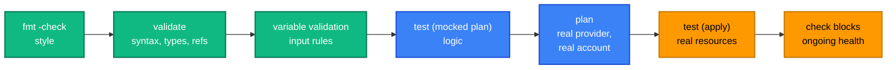

[← 15 · Import and Existing Resources](../15-import-and-existing-resources/README.md) | [🏠 Home](../../README.md) | [📚 Learning Path](../00-learning-roadmap/README.md) | [17 · Terraform Tooling →](../17-terraform-tooling/README.md)

# 16 · Testing and Validation

🟡 Intermediate · ⏱️ 75 minutes · 💰 Free — all course tests use mocked providers

Terraform code is code: it has bugs, and bugs in infrastructure code can delete data or open ports to the internet. By the end of this chapter you know every layer of checking Terraform offers, what each one can and cannot catch, and how to write `terraform test` files.

**Lab:** the tests in [modules/*/tests](../../modules/README.md)

---

## 1. The layers of checking



| Check | Needs AWS? | Catches | Can't catch |
| --- | --- | --- | --- |
| `terraform fmt -check` | No | Formatting | Anything semantic |
| `terraform validate` | No (needs `init`) | Syntax, unknown arguments, wrong types, broken references | Invalid AMI IDs, name clashes, permissions |
| Variable `validation` | No | Bad inputs, with your error message | Problems not visible in inputs |
| `terraform test` with `command = plan` + mocks | **No** | Module logic: counts, names, conditionals, defaults | Real AWS API behaviour |
| `terraform plan` | Yes (read) | Most real-world problems except those the API only reports on create | Some permission/limit errors, eventual consistency |
| `terraform test` with `command = apply` | **Yes (creates resources)** | End-to-end behaviour | — (but costs time and money) |
| Pre/postconditions, `check` blocks | Evaluated during plan/apply | Assumptions about data and results | — |

## 2. `terraform fmt` and `terraform validate`

Covered in [Chapter 05](../05-terraform-workflow/README.md). In CI they run on every directory:

```bash
terraform fmt -check -recursive
./scripts/validate-all.sh     # init -backend=false + validate in every folder
```

## 3. Input validation

Reject bad input **before** anything happens ([Chapter 07](../07-variables-and-outputs/README.md#validation)):

```hcl
variable "bucket_prefix" {
  type = string
  validation {
    condition     = can(regex("^[a-z0-9][a-z0-9-]{1,35}$", var.bucket_prefix))
    error_message = "bucket_prefix must be 2-36 lowercase letters, numbers or hyphens."
  }
}
```

## 4. Preconditions and postconditions

**Custom conditions** on resources, data sources and outputs ([Chapter 09](../09-meta-arguments/README.md#6-lifecycle)):

```hcl
data "aws_ami" "al2023" { ... }

resource "aws_instance" "app" {
  lifecycle {
    precondition {
      condition     = data.aws_ami.al2023.architecture == "x86_64"
      error_message = "The selected AMI must be x86_64 to run on t3 instances."
    }
    postcondition {
      condition     = self.root_block_device[0].encrypted
      error_message = "Root volume must be encrypted."
    }
  }
}

output "api_url" {
  value = aws_apigatewayv2_stage.default.invoke_url
  precondition {
    condition     = startswith(aws_apigatewayv2_stage.default.invoke_url, "https://")
    error_message = "The API must be served over HTTPS."
  }
}
```

- **precondition**: checked before the resource is planned/changed — "are my assumptions true?"
- **postcondition**: checked after — "is the result what I expected?" Use `self` to refer to the resource.
- A failure **stops** the plan or apply.

## 5. `check` blocks

A `check` block (Terraform 1.5+) validates something about your infrastructure **without blocking**: failures are reported as **warnings**.

```hcl
check "private_instances_have_egress" {
  assert {
    condition     = var.instance_subnet_tier == "public" || var.enable_nat_gateway
    error_message = "Instances are in private subnets but enable_nat_gateway is false."
  }
}
```

(From [modules/application-stack](../../modules/application-stack/main.tf).)

A check can contain its own **scoped data source**, e.g. to call a health endpoint after apply:

```hcl
check "website_is_up" {
  data "http" "home" {                 # hashicorp/http provider
    url = "https://${aws_cloudfront_distribution.site.domain_name}"
  }
  assert {
    condition     = data.http.home.status_code == 200
    error_message = "Website returned ${data.http.home.status_code}."
  }
}
```

| Use | When failure should… |
| --- | --- |
| `validation` | reject the **input** |
| `precondition` / `postcondition` | **stop** the run |
| `check` | **warn**, but continue |

## 6. `terraform test`

### What is it?

Terraform's built-in test framework (Terraform 1.6+). Test files end in `.tftest.hcl`, live in a `tests/` directory (by default), and contain `run` blocks that plan or apply the module with given variables and then evaluate `assert` conditions.

### Anatomy

```hcl
# modules/s3/tests/s3.tftest.hcl

mock_provider "aws" {                          # fake AWS: nothing is created
  mock_data "aws_iam_policy_document" {
    defaults = {
      json = "{\"Version\":\"2012-10-17\",\"Statement\":[]}"
    }
  }
}

variables {                                    # defaults for every run
  bucket_prefix = "unit-test-"
}

run "defaults_are_secure" {
  command = plan                               # plan only

  assert {
    condition     = aws_s3_bucket_versioning.this.versioning_configuration[0].status == "Enabled"
    error_message = "Versioning should be enabled by default."
  }
}

run "kms_key_switches_to_sse_kms" {
  command = plan
  variables {
    kms_key_arn = "arn:aws:kms:us-east-1:111122223333:key/11111111-2222-3333-4444-555555555555"
  }
  assert {
    condition     = one(one(aws_s3_bucket_server_side_encryption_configuration.this.rule).apply_server_side_encryption_by_default).sse_algorithm == "aws:kms"
    error_message = "Supplying a KMS key should enable SSE-KMS."
  }
}

run "rejects_invalid_prefix" {
  command = plan
  variables {
    bucket_prefix = "Invalid_Prefix"
  }
  expect_failures = [var.bucket_prefix]        # passes only if validation FAILS
}
```

| Element | Purpose |
| --- | --- |
| `run "name" { }` | One test step. Runs in file order and shares state within the file. |
| `command = plan` / `apply` | Plan only, or really create (default: **apply**) |
| `variables { }` | Inputs, at file level or per run |
| `assert { }` | Condition + message; all asserts in a run are evaluated |
| `expect_failures = [...]` | The run must fail on these checkable objects (variables, resources, outputs, `check` blocks) |
| `mock_provider` | Replace a provider with fake responses (Terraform 1.7+) |
| `override_resource` / `override_data` | Fix specific values of a resource/data source in mocks |
| `module { source = "./tests/setup" }` | Run a helper module (e.g. create prerequisites) |

### Mocks: what they return

With `mock_provider`, computed attributes get **generated fake values** (random strings, zero numbers) unless you set `defaults`. During `command = plan`, many values are still **unknown**, so assertions should test things Terraform *can* know at plan time: counts, keys, inputs passed through, conditional logic. The course's [application-stack test](../../modules/application-stack/tests/application_stack.tftest.hcl) has a comment about exactly this, after a first version of it failed with *"Condition expression could not be evaluated at this time"*.

### ⚠️ Tests that create real resources

A `run` block **without** `command = plan` defaults to `apply`: Terraform creates the resources in the account your credentials point to, runs the assertions, and then **destroys** them at the end of the file. That is valuable (integration tests) but:

- it costs money and takes minutes;
- a crash or Ctrl-C can leave resources behind;
- it needs credentials, so it doesn't belong in pull requests from forks.

Mark such files clearly (e.g. `tests/integration.tftest.hcl`), run them in a dedicated sandbox account, and use `terraform test -filter=tests/unit.tftest.hcl` to choose which files run.

### Running tests

```bash
cd modules/vpc
terraform init
terraform test                  # all files in tests/
terraform test -verbose         # also print the plan for each run
terraform test -filter=tests/vpc.tftest.hcl
```

## 7. Lab

Run every module test in the repository — no AWS account needed:

```bash
for m in modules/*/; do
  terraform -chdir="$m" init -backend=false >/dev/null
  terraform -chdir="$m" test
done
```

Then extend a test:

1. In [modules/vpc/tests/vpc.tftest.hcl](../../modules/vpc/tests/vpc.tftest.hcl), add a run that sets `az_count = 1` and asserts there is exactly one public subnet.
2. Add a run that sets `az_count = 4` and uses `expect_failures` to prove the validation rejects it.
3. Break the module on purpose (change `cidrsubnet(var.cidr_block, 8, index)` to `cidrsubnet(var.cidr_block, 8, index + 1)`) and watch the existing CIDR test fail. Revert.

<details>
<summary>Solution for steps 1–2</summary>

```hcl
run "single_az" {
  command = plan
  variables {
    az_count = 1
  }
  assert {
    condition     = length(aws_subnet.public) == 1
    error_message = "Expected exactly one public subnet."
  }
}

run "rejects_four_azs" {
  command = plan
  variables {
    az_count = 4
  }
  expect_failures = [var.az_count]
}
```

</details>

## Key takeaways

- Layer your checks: fmt → validate → input validation → mocked tests → plan → (optional) apply tests.
- `validation` rejects inputs; pre/postconditions stop runs; `check` blocks warn.
- `terraform test` with `mock_provider` and `command = plan` tests module logic for free.
- Runs default to `apply` — which creates real resources.

## Official references

- [Tests](https://developer.hashicorp.com/terraform/language/tests)
- [Mocks](https://developer.hashicorp.com/terraform/language/tests/mocking)
- [terraform test command](https://developer.hashicorp.com/terraform/cli/commands/test)
- [Custom conditions](https://developer.hashicorp.com/terraform/language/expressions/custom-conditions)
- [Checks](https://developer.hashicorp.com/terraform/language/checks)

---

[← 15 · Import and Existing Resources](../15-import-and-existing-resources/README.md) | [🏠 Home](../../README.md) | [📚 Learning Path](../00-learning-roadmap/README.md) | [17 · Terraform Tooling →](../17-terraform-tooling/README.md)
