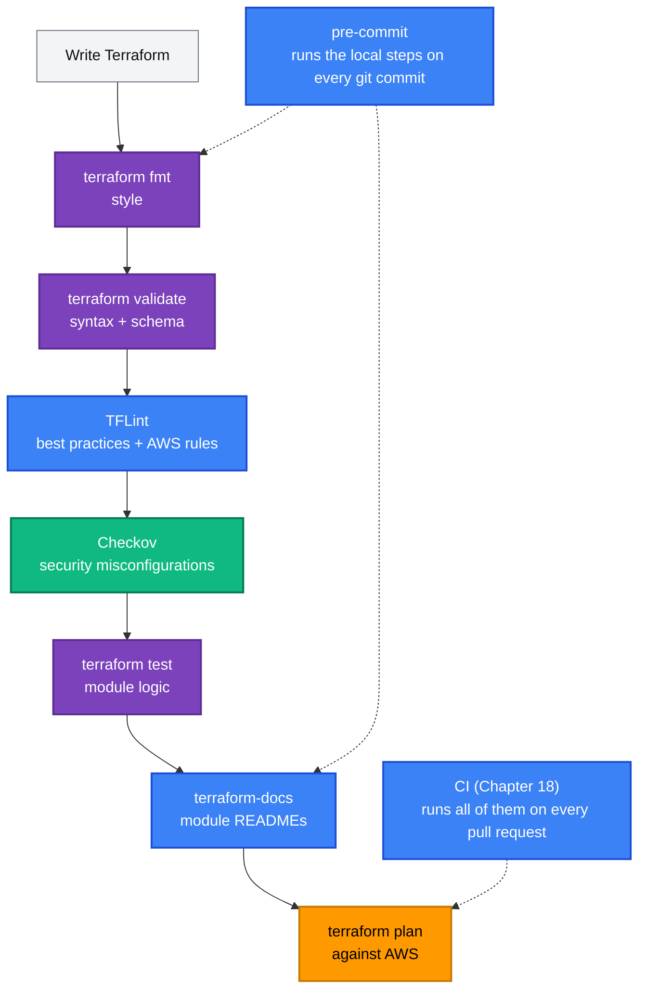

[← 16 · Testing and Validation](../16-testing-and-validation/README.md) | [🏠 Home](../../README.md) | [📚 Learning Path](../00-learning-roadmap/README.md) | [18 · Terraform with GitHub Actions →](../18-github-actions/README.md)

# 17 · Terraform Tooling

🟡 Intermediate · ⏱️ 60 minutes · 💰 Free — everything runs locally

`fmt`, `validate` and `test` are built into Terraform. A few external tools catch what they can't: provider-specific mistakes, missing documentation, and security misconfigurations. By the end of this chapter you can run all of them on this repository and wire them into Git hooks.

---

## Where every tool fits



| Tool | Question it answers | Config in this repo |
| --- | --- | --- |
| `terraform fmt` | Is it formatted canonically? | — |
| `terraform validate` | Is it valid Terraform? | — |
| **TFLint** | Is it *good* Terraform, and valid for AWS? | [.tflint.hcl](../../.tflint.hcl) |
| **Checkov** | Is it *secure*? | [.checkov.yaml](../../.checkov.yaml) |
| `terraform test` | Does the module logic do what I expect? | `modules/*/tests` |
| **terraform-docs** | Is the module documented? | [.terraform-docs.yml](../../.terraform-docs.yml) |
| **pre-commit** | Did I run all of the above before committing? | [.pre-commit-config.yaml](../../.pre-commit-config.yaml) |

---

## 1. TFLint

### What is it?

[TFLint](https://github.com/terraform-linters/tflint) is a pluggable linter. The built-in **terraform** ruleset checks language best practices; the **aws** ruleset knows AWS specifics.

### What it catches that `validate` doesn't

| Example | Rule set |
| --- | --- |
| `instance_type = "t3.micor"` (typo — `validate` only checks it is a string) | aws |
| Previous-generation instance types (`t1.micro`) | aws |
| Variables declared but never used | terraform |
| Variables/outputs without `description` or `type` | terraform |
| Missing `required_providers` version constraint | terraform |
| Deprecated interpolation-only syntax `"${var.x}"` | terraform |
| Non-snake_case names | terraform |

### Configuration

```hcl
# .tflint.hcl
config {
  call_module_type = "local"          # also lint local modules called from root modules
}

plugin "terraform" {
  enabled = true
  preset  = "recommended"
}

plugin "aws" {
  enabled = true
  version = "0.49.0"                  # pinned: same rules for everyone
  source  = "github.com/terraform-linters/tflint-ruleset-aws"
}

rule "terraform_documented_variables" { enabled = true }
rule "terraform_documented_outputs"   { enabled = true }
```

### Run it

```bash
# install: https://github.com/terraform-linters/tflint#installation
tflint --init --config "$(pwd)/.tflint.hcl"          # downloads plugins
tflint --recursive --config "$(pwd)/.tflint.hcl"     # every directory
```

Try it: add `variable "unused" { type = string }` to any lab and run TFLint in that folder.

---

## 2. Security scanning with Checkov

### What is it?

A **static analysis security scanner** reads your Terraform (without deploying it) and reports misconfigurations: unencrypted storage, public buckets, security groups open to the world, IAM wildcards, missing logging.

### Choosing a scanner

The ecosystem changes; check a tool's maintenance status before adopting it.

| Tool | Status (at the time of writing) |
| --- | --- |
| **[Checkov](https://www.checkov.io/)** (Prisma Cloud / Palo Alto Networks) | Actively maintained; large Terraform/AWS policy library. **Used in this course.** |
| **[Trivy](https://trivy.dev/)** (`trivy config`, Aqua Security) | Actively maintained; also scans containers and dependencies. |
| **tfsec** | Its maintainers moved development into Trivy and recommend migrating to Trivy. |

> **Supply-chain lesson.** In March 2026 attackers compromised the `aquasecurity/trivy-action` GitHub Action and re-pointed dozens of its version **tags** to malicious code that stole CI secrets ([GitHub advisory](https://github.com/aquasecurity/trivy/security/advisories/GHSA-69fq-xp46-6x23)). Workflows that referenced the action by a full **commit SHA** were not affected. That is why every action in this repository's workflows is pinned by SHA, and why CI installs Checkov at a pinned version from PyPI rather than via a third-party action. The scanner itself was fine; the delivery path was the weak point.

### Run it

```bash
pip install checkov                           # or: pipx install checkov
checkov -d aws-services/s3/secure-bucket      # one folder
checkov --config-file .checkov.yaml -d modules
```

Output lists each **check ID** (e.g. `CKV_AWS_18`), the resource, and the file/line.

### This repository's policy

- **modules/** and **projects/** must pass — reusable and "complete" code is held to a higher bar.
- **examples/** and **aws-services/** are scanned with `--soft-fail` (reported, not blocking): each lab deliberately shows one idea at a time.
- Findings we accept are **documented**, never silently ignored:
  - repository-wide in [.checkov.yaml](../../.checkov.yaml), each with a reason (mostly: extra cost beyond a learning budget, or false positives);
  - per resource, next to the code:

```hcl
resource "aws_lb_listener" "http" {
  #checkov:skip=CKV_AWS_2:LEARNING SHORTCUT: HTTPS needs a domain and an ACM certificate.
  ...
}
```

A skip is a decision that a reviewer can read and challenge. A finding nobody looks at is not.

---

## 3. terraform-docs

### What is it?

[terraform-docs](https://terraform-docs.io/) generates Markdown (or other formats) from a module's variables, outputs, providers and resources, so the reference documentation can never drift from the code.

### Configuration

```yaml
# .terraform-docs.yml
formatter: markdown table
output:
  file: README.md
  mode: inject          # replace only the text between the markers below
  template: |-
    <!-- BEGIN_TF_DOCS -->
    {{ .Content }}
    <!-- END_TF_DOCS -->
sort:
  enabled: true
  by: required          # required inputs first
```

With `mode: inject`, the hand-written part of each module README (purpose, usage, design notes) is kept and only the reference section is regenerated.

### Run it

```bash
# install: https://terraform-docs.io/user-guide/installation/
terraform-docs modules/s3          # from the repository root
git diff modules/s3/README.md
```

Look at the generated section at the bottom of [modules/s3/README.md](../../modules/s3/README.md). The [terraform-docs workflow](../../.github/workflows/terraform-docs.yml) fails a pull request when a module README is out of date.

---

## 4. pre-commit

### What is it?

[pre-commit](https://pre-commit.com/) runs checks automatically when you `git commit`, so problems are caught on your machine in seconds instead of in CI minutes later.

### Hooks configured in this repository

| Hook | Source | Does |
| --- | --- | --- |
| `check-merge-conflict`, `end-of-file-fixer`, `trailing-whitespace`, `check-yaml` | pre-commit-hooks | Hygiene |
| `detect-private-key`, `detect-aws-credentials` | pre-commit-hooks | Blocks committed keys |
| `gitleaks` | gitleaks | Scans for secrets (tokens, passwords, keys) |
| `terraform_fmt`, `terraform_validate` | pre-commit-terraform | Built-in checks on changed directories |
| `terraform_tflint` | pre-commit-terraform | TFLint with the repo config |
| `terraform_docs` | pre-commit-terraform | Regenerates module READMEs |
| `terraform_checkov` | pre-commit-terraform | Security scan |

The pre-commit-terraform hooks call the tools you have installed (terraform, tflint, terraform-docs, checkov), so install those first.

### Use it

```bash
pip install pre-commit        # or: brew install pre-commit / pipx install pre-commit
pre-commit install            # once per clone: installs the git hook
pre-commit run --all-files    # run everything now
git commit ...                # from now on hooks run automatically on changed files
```

Hook versions are pinned by `rev:`; update them deliberately with `pre-commit autoupdate` and review the diff.

---

## Lab: run the whole toolchain on this repository

```bash
terraform fmt -check -recursive
./scripts/validate-all.sh
tflint --init --config "$(pwd)/.tflint.hcl" && tflint --recursive --config "$(pwd)/.tflint.hcl"
checkov --config-file .checkov.yaml -d modules
for m in modules/*/; do terraform -chdir="$m" init -backend=false >/dev/null && terraform -chdir="$m" test; done
for m in modules/*/; do terraform-docs "$m"; done && git status --short modules
python3 scripts/check-links.py
```

Then introduce one problem per tool — a formatting error, an unused variable, `cidr_ipv4 = "0.0.0.0/0"` on port 22, an undocumented output — and watch which tool catches it.

## Key takeaways

- TFLint = best practices + AWS-specific validity; Checkov = security posture; terraform-docs = documentation that can't drift; pre-commit = run it all before each commit.
- Pin tool and plugin versions; pin CI actions by commit SHA.
- Document accepted findings next to the code.

## Official references

- [TFLint](https://github.com/terraform-linters/tflint) · [TFLint AWS ruleset](https://github.com/terraform-linters/tflint-ruleset-aws) · [TFLint config](https://github.com/terraform-linters/tflint/blob/master/docs/user-guide/config.md)
- [terraform-docs user guide](https://terraform-docs.io/user-guide/introduction/)
- [pre-commit](https://pre-commit.com/) · [pre-commit-terraform hooks](https://github.com/antonbabenko/pre-commit-terraform)
- [Checkov documentation](https://www.checkov.io/1.Welcome/What%20is%20Checkov.html) · [Suppressing checks](https://www.checkov.io/2.Basics/Suppressing%20and%20Skipping%20Policies.html)
- [Trivy: misconfiguration scanning](https://trivy.dev/latest/docs/scanner/misconfiguration/)
- [gitleaks](https://github.com/gitleaks/gitleaks)

---

[← 16 · Testing and Validation](../16-testing-and-validation/README.md) | [🏠 Home](../../README.md) | [📚 Learning Path](../00-learning-roadmap/README.md) | [18 · Terraform with GitHub Actions →](../18-github-actions/README.md)
