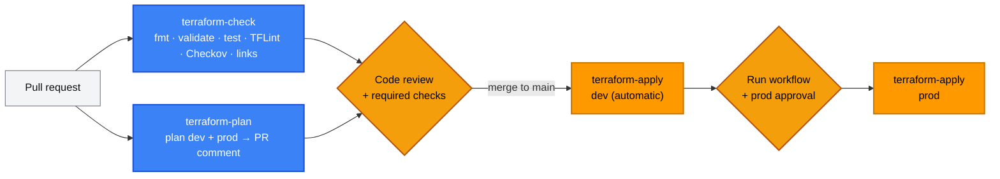
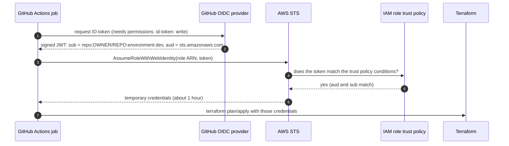
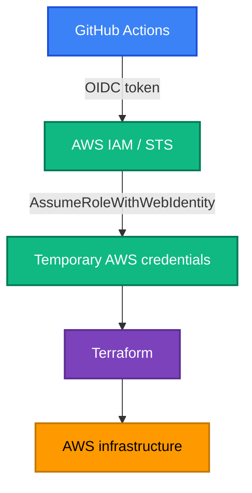

[← 17 · Terraform Tooling](../17-terraform-tooling/README.md) | [🏠 Home](../../README.md) | [📚 Learning Path](../00-learning-roadmap/README.md) | [19 · HCP Terraform →](../19-hcp-terraform/README.md)

# 18 · Terraform with GitHub Actions

🟡 Intermediate · ⏱️ 90 minutes · 💰 Free for checks; plan/apply deploy [Project 09](../../projects/09-production-style-infrastructure/README.md) (dev: one `t3.micro` + public IPv4)

Running Terraform from laptops doesn't scale: nobody knows who applied what, credentials are spread around, and reviews happen after the fact. By the end of this chapter you understand this repository's CI/CD workflows, how GitHub authenticates to AWS **without stored keys** (OIDC), and how to switch the pipeline on for your own fork.

**Workflows:** [.github/workflows](../../.github/workflows)

---

## 1. The pipeline



| Workflow | Trigger | AWS access | Purpose |
| --- | --- | --- | --- |
| [terraform-check.yml](../../.github/workflows/terraform-check.yml) | every PR and push to `main` | **none** | Static checks of the **whole** repository |
| [terraform-plan.yml](../../.github/workflows/terraform-plan.yml) | PRs touching Project 09 or `modules/` | read-only plan role | Show reviewers exactly what would change |
| [terraform-apply.yml](../../.github/workflows/terraform-apply.yml) | push to `main` (dev); manual (dev/prod) | per-environment apply role | Controlled apply of a saved plan |
| [terraform-docs.yml](../../.github/workflows/terraform-docs.yml) | PRs touching `modules/` | none | Module READMEs up to date |
| [terraform-destroy-example.yml](../../.github/workflows/terraform-destroy-example.yml) | **manual only**, typed confirmation | dev apply role | *Educational* destroy of dev |

### Pull request checks (no AWS)

```text
Checkout → Setup Terraform → terraform fmt -check → init -backend=false → validate
        → terraform test (mocked) → TFLint → Checkov → link check
```

These need no credentials, so they are safe on pull requests from forks.

### Pull request plan

```text
Checkout → OIDC → assume READ-ONLY plan role → init (S3 backend) → validate
        → plan -out=tfplan → show → job summary + PR comment
```

### Merge / deployment

```text
Checkout → OIDC → assume the ENVIRONMENT's apply role → init → plan -out=tfplan → apply tfplan
```

The apply job plans and applies in the **same job**, so the applied plan is exactly the one in the log. Environments protect the job (see §4).

---

## 2. Authenticating to AWS: why not access keys?

The old way: create an IAM user, store `AWS_ACCESS_KEY_ID` / `AWS_SECRET_ACCESS_KEY` as GitHub secrets.

| Problem | Consequence |
| --- | --- |
| Keys never expire | A leak (log, fork, compromised action) is valid until someone notices and rotates |
| Keys must be rotated by hand | They usually aren't |
| One key for every branch and workflow | Can't say "only main may deploy to prod" |

## 3. GitHub Actions → AWS with OIDC

### What is it?

**OpenID Connect (OIDC)** lets GitHub vouch for a workflow run: GitHub issues a short-lived, signed **token** describing the run (repository, branch, environment, event). AWS verifies the signature and, if the token's claims match a role's **trust policy**, hands out **temporary credentials** for that role.





No secret is stored anywhere. The credentials expire on their own.

### The AWS side (Terraform)

[projects/09-production-style-infrastructure/bootstrap/oidc.tf](../../projects/09-production-style-infrastructure/bootstrap/oidc.tf) creates:

**1 · The identity provider** (one per AWS account):

```hcl
resource "aws_iam_openid_connect_provider" "github" {
  url            = "https://token.actions.githubusercontent.com"
  client_id_list = ["sts.amazonaws.com"]
}
```

`thumbprint_list` is optional in current AWS provider versions; AWS validates GitHub's certificate itself.

**2 · Roles whose trust policy pins the repository AND the context:**

```hcl
data "aws_iam_policy_document" "apply_trust" {
  statement {
    actions = ["sts:AssumeRoleWithWebIdentity"]
    principals {
      type        = "Federated"
      identifiers = [aws_iam_openid_connect_provider.github.arn]
    }
    condition {
      test     = "StringEquals"
      variable = "token.actions.githubusercontent.com:aud"
      values   = ["sts.amazonaws.com"]
    }
    condition {
      test     = "StringEquals"
      variable = "token.actions.githubusercontent.com:sub"
      values   = ["repo:cloud-prakhar/terraform-aws-learning:environment:prod"]
    }
  }
}
```

### Restricting trust: the `sub` claim

The `sub` (subject) claim depends on how the job runs:

| Job context | `sub` value |
| --- | --- |
| Job with `environment: prod` | `repo:OWNER/REPO:environment:prod` |
| Push to a branch, no environment | `repo:OWNER/REPO:ref:refs/heads/main` |
| Pull request, no environment | `repo:OWNER/REPO:pull_request` |
| Tag push | `repo:OWNER/REPO:ref:refs/tags/v1.0.0` |

This repository uses:

| Role | Trusted `sub` | Permissions |
| --- | --- | --- |
| `github-shop-terraform-plan` | `repo:…:pull_request` | `ReadOnlyAccess` + create/delete the state **lock** object only |
| `github-shop-terraform-apply-dev` | `repo:…:environment:dev` | EC2 in one Region; S3/IAM limited to `shop-dev-*` names; dev state prefix |
| `github-shop-terraform-apply-prod` | `repo:…:environment:prod` | same, `shop-prod-*` and prod state prefix |

**Never** use a wildcard such as `repo:*` or `repo:OWNER/*` for a role that can change infrastructure: any repository (or any repository in the organisation) could then assume it.

### Why the plan role is read-only

A pull request can change Terraform code, and Terraform code can run arbitrary logic during **plan** (providers, `external` data sources). If the plan job had write credentials, anyone able to open a PR against the repository could modify infrastructure. Read-only plan roles, and only applying **after review** on `main`, close that hole. For the same reason, never run Terraform on the `pull_request_target` event with PR code.

### The GitHub side

```yaml
permissions:
  contents: read
  id-token: write        # lets the job request an OIDC token

steps:
  - uses: aws-actions/configure-aws-credentials@e1253824e5c10ff9df46874f81ed3ec929e19cfd # v6.3.0
    with:
      role-to-assume: ${{ vars.AWS_APPLY_ROLE_ARN }}
      aws-region: ${{ vars.AWS_REGION }}
```

Role ARNs, bucket names and Regions are not secret, so they are stored as **variables**, not secrets.

## 4. Environments and protection rules

A GitHub **environment** (Settings → Environments) is a named deployment target with its own rules and variables:

| Setting | Recommended for `dev` | Recommended for `prod` |
| --- | --- | --- |
| Deployment branches | `main` only | `main` only |
| Required reviewers | none | at least one (not the person who triggered it) |
| Wait timer | — | optional |
| Environment variables | `AWS_APPLY_ROLE_ARN` = dev role | `AWS_APPLY_ROLE_ARN` = prod role |

When a job declares `environment: prod`, GitHub pauses it until a reviewer approves, **and** the OIDC token's `sub` becomes `repo:…:environment:prod` — the only subject the prod role trusts. The approval gate and the AWS permission are tied together.

## 5. Other safety measures in the workflows

| Measure | Where | Why |
| --- | --- | --- |
| Actions pinned to **commit SHAs** | every `uses:` | Tags can be moved to malicious code ([Chapter 17](../17-terraform-tooling/README.md#2-security-scanning-with-checkov)) |
| `permissions:` set per workflow | top of each file | Least privilege for the GitHub token |
| `concurrency` with `cancel-in-progress: false` for applies | apply, destroy | Never two applies on one state; never cancel an apply half-way |
| `-lock-timeout=5m` | plan, apply | Wait for a lock instead of failing immediately |
| Saved plan → apply | apply, destroy | Apply exactly what was shown |
| Skip when variables are missing | plan, apply, destroy | Forks and fresh clones stay green |
| Pinned `TF_VERSION` | all | Same Terraform everywhere |

## 6. The destroy example

[terraform-destroy-example.yml](../../.github/workflows/terraform-destroy-example.yml) shows how a destroy *could* be automated safely: manual trigger only, a typed confirmation (`destroy-dev`), `main` only, **dev only** (there is no prod option), running inside the `dev` environment so its protection rules apply. Production resources should never be destroyed by a pipeline.

## 7. Turning it on for your fork

1. Fork the repository; clone your fork.
2. Deploy the bootstrap with **your** repository name:
   ```bash
   cd projects/09-production-style-infrastructure/bootstrap
   terraform init
   terraform apply -var github_repository="<you>/terraform-aws-learning"
   terraform output
   ```
3. In your fork: **Settings → Secrets and variables → Actions → Variables** (repository):
   `AWS_REGION` (e.g. `us-east-1`), `TF_STATE_BUCKET` (`state_bucket` output), `AWS_PLAN_ROLE_ARN` (`plan_role_arn` output).
4. **Settings → Environments**: create `dev` and `prod`; restrict both to `main`; add required reviewers to `prod`; add an environment variable `AWS_APPLY_ROLE_ARN` to each (from `apply_role_arns`).
5. Open a PR that changes `environments/dev/main.tf` (e.g. `instance_count`): the plan appears as a comment.
6. Merge: dev is applied. Run **Actions → Terraform apply → Run workflow → prod** to deploy prod after approval.
7. Clean up: run the destroy example for dev, destroy prod locally (or with a manual workflow of your own), then destroy the bootstrap.

## Key takeaways

- CI checks everything on every PR without AWS access; plans use a **read-only** role; applies happen after review, per environment.
- OIDC replaces stored keys with short-lived credentials; the trust policy's `aud` and `sub` conditions decide which workflows get which role.
- GitHub environments tie human approval to AWS permissions.
- Pin actions by SHA, set `permissions`, use `concurrency`, apply saved plans.

## Official references

- [Configuring OpenID Connect in AWS (GitHub)](https://docs.github.com/en/actions/security-for-github-actions/security-hardening-your-deployments/configuring-openid-connect-in-amazon-web-services)
- [OIDC token claims and subject formats (GitHub)](https://docs.github.com/en/actions/security-for-github-actions/security-hardening-your-deployments/about-security-hardening-with-openid-connect)
- [Create an OIDC identity provider in IAM (AWS)](https://docs.aws.amazon.com/IAM/latest/UserGuide/id_roles_providers_create_oidc.html)
- [configure-aws-credentials action](https://github.com/aws-actions/configure-aws-credentials)
- [Managing environments for deployment (GitHub)](https://docs.github.com/en/actions/managing-workflow-runs-and-deployments/managing-deployments/managing-environments-for-deployment)
- [Security hardening for GitHub Actions](https://docs.github.com/en/actions/security-for-github-actions/security-guides/security-hardening-for-github-actions)
- [hashicorp/setup-terraform](https://github.com/hashicorp/setup-terraform)

---

[← 17 · Terraform Tooling](../17-terraform-tooling/README.md) | [🏠 Home](../../README.md) | [📚 Learning Path](../00-learning-roadmap/README.md) | [19 · HCP Terraform →](../19-hcp-terraform/README.md)
