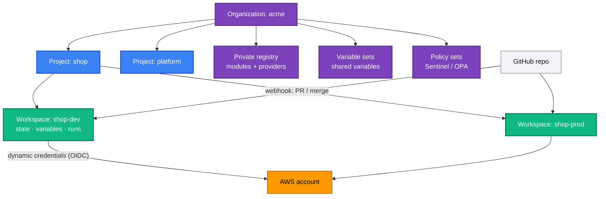
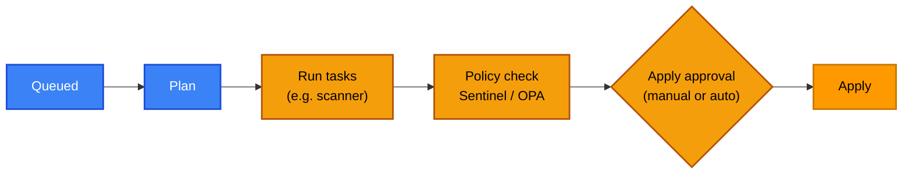

[← 18 · Terraform with GitHub Actions](../18-github-actions/README.md) | [🏠 Home](../../README.md) | [📚 Learning Path](../00-learning-roadmap/README.md) | [20 · Terraform Enterprise →](../20-terraform-enterprise/README.md)

# 19 · HCP Terraform

🟡 Intermediate · ⏱️ 45 minutes · 💰 Conceptual chapter — HCP Terraform has free and paid tiers; check [current pricing](https://www.hashicorp.com/products/terraform/pricing) before signing up

**HCP Terraform** is HashiCorp's managed platform for running Terraform as a team. It was previously called **Terraform Cloud**; you will still see that name in older articles, in `terraform login` output, and in the `cloud` block.

By the end of this chapter you know what HCP Terraform does, how its concepts map to what you built yourself with S3 and GitHub Actions, and when switching makes sense.

---

## 1. What is it?

A SaaS service that provides, in one place, what Chapters 12–18 assembled by hand:

| You built… | HCP Terraform provides… |
| --- | --- |
| S3 backend + lockfile ([Ch. 12](../12-remote-state/README.md)) | **Remote state** storage, locking, versioning, access control |
| GitHub Actions running `terraform plan/apply` ([Ch. 18](../18-github-actions/README.md)) | **Remote runs** on HashiCorp-managed (or your own) workers |
| OIDC roles for GitHub ([Ch. 18](../18-github-actions/README.md)) | **Dynamic provider credentials** (OIDC from HCP Terraform to AWS) |
| GitHub environments + reviewers | **Run approvals**, team permissions |
| Checkov in CI ([Ch. 17](../17-terraform-tooling/README.md)) | **Policies** (Sentinel / OPA) and **run tasks** (third-party scanners) |
| Modules in a Git repo ([Ch. 13](../13-terraform-modules/README.md)) | **Private registry** for modules and providers |

## 2. Core concepts



| Concept | Meaning |
| --- | --- |
| **Organization** | Top-level container: users, teams, billing, settings |
| **Project** | Groups workspaces (e.g. per application or team); permissions can be granted per project |
| **Workspace** | One state + its variables + its run history + its settings. Roughly **one root module × one environment**. *Different from CLI workspaces* ([Ch. 14](../14-workspaces-and-environments/README.md)). |
| **Run** | One plan (and optionally apply), executed remotely, with logs and history |
| **Variables** | Per workspace: Terraform variables and environment variables; can be marked sensitive (write-only in the UI/API) |
| **Variable sets** | Variables shared by many workspaces or projects (e.g. common tags, a Region) |
| **Teams** | Groups of users with permissions on projects/workspaces (read, plan, write, admin) |

## 3. Workflows

| Workflow | How runs start | Typical use |
| --- | --- | --- |
| **VCS-driven** | HCP Terraform watches a repository: a PR triggers a *speculative plan* (posted as a PR check); a merge triggers a plan + apply | Most teams |
| **CLI-driven** | Developers run `terraform plan/apply` locally; execution and state are remote | Migrating from local workflows |
| **API-driven** | Your own pipeline calls the API | Custom orchestration |

Connecting a CLI configuration uses the `cloud` block instead of a `backend` block:

```hcl
terraform {
  cloud {
    organization = "acme"
    workspaces {
      name = "shop-dev"
    }
  }
}
```

```bash
terraform login     # stores an API token for app.terraform.io
terraform init
terraform plan      # runs remotely; output streams to your terminal
```

## 4. The run workflow



- **Run tasks** send the plan to external services (security scanners, cost estimation, ticketing) and can block the run.
- **Policies** (as code, written in **Sentinel** or **OPA/Rego**) enforce rules such as "no public S3 buckets" or "only approved instance types", with advisory or mandatory enforcement levels.

## 5. Dynamic provider credentials for AWS

The same idea as GitHub OIDC ([Ch. 18](../18-github-actions/README.md#3-github-actions--aws-with-oidc)): HCP Terraform issues a signed token per run; an IAM role trusts it.

- IAM identity provider URL: `https://app.terraform.io`, audience `aws.workload.identity`.
- Trust policy `sub` pins the scope and phase, in the format `organization:ORG:project:PROJECT:workspace:WORKSPACE:run_phase:plan|apply`, so plan and apply can even use different roles.
- Workspace environment variables `TFC_AWS_PROVIDER_AUTH = true` and `TFC_AWS_RUN_ROLE_ARN = <role ARN>` switch it on.

No AWS keys are stored in HCP Terraform.

## 6. Private registry

Publish your modules (from tagged Git repositories) to an organization-private registry. Consumers use registry-style sources with version constraints:

```hcl
module "vpc" {
  source  = "app.terraform.io/acme/vpc/aws"
  version = "~> 2.1"
}
```

## 7. Agents and private networks

Remote runs execute on HashiCorp-managed infrastructure by default. **HCP Terraform agents** run inside your own network when Terraform must reach private endpoints (a private Kubernetes API, an on-premises system).

## 8. When to move from "S3 + GitHub Actions" to HCP Terraform

| Stay with S3 + GitHub Actions when… | Consider HCP Terraform when… |
| --- | --- |
| A few configurations, one team | Many workspaces and teams need consistent permissions |
| You are comfortable owning the pipeline code | You'd rather not maintain plan/apply pipelines, state buckets and locking |
| Policies = a scanner in CI is enough | You need policy-as-code with enforcement levels and audit trails |
| Cost sensitivity | Self-service for teams via no-code modules and a private registry is valuable |

Both are legitimate. What you learned in Chapters 12–18 transfers directly: the state, locking, OIDC and review concepts are the same.

## Key takeaways

- HCP Terraform (formerly Terraform Cloud) = managed state + remote runs + governance.
- Organization → projects → workspaces; a workspace ≈ one root module in one environment.
- VCS-driven runs, policies (Sentinel/OPA), run tasks, private registry, dynamic credentials.

## Official references

- [HCP Terraform documentation](https://developer.hashicorp.com/terraform/cloud-docs)
- [Workspaces](https://developer.hashicorp.com/terraform/cloud-docs/workspaces)
- [Run workflows](https://developer.hashicorp.com/terraform/cloud-docs/run/remote-operations)
- [Variable sets](https://developer.hashicorp.com/terraform/cloud-docs/variables/managing-variables)
- [Dynamic credentials with AWS](https://developer.hashicorp.com/terraform/cloud-docs/dynamic-provider-credentials/aws-configuration)
- [Policy enforcement](https://developer.hashicorp.com/terraform/cloud-docs/policy-enforcement)
- [Run tasks](https://developer.hashicorp.com/terraform/cloud-docs/workspaces/settings/run-tasks)
- [Private registry](https://developer.hashicorp.com/terraform/cloud-docs/registry)
- [The cloud block](https://developer.hashicorp.com/terraform/cli/cloud/settings)

---

[← 18 · Terraform with GitHub Actions](../18-github-actions/README.md) | [🏠 Home](../../README.md) | [📚 Learning Path](../00-learning-roadmap/README.md) | [20 · Terraform Enterprise →](../20-terraform-enterprise/README.md)
