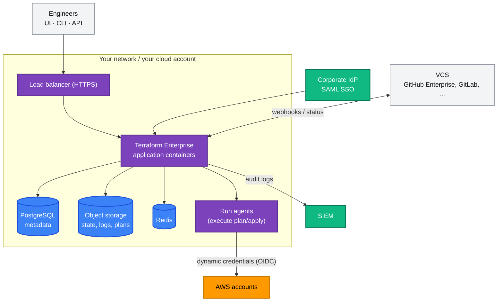
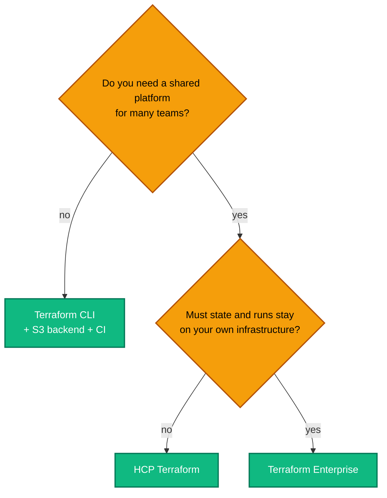

[← 19 · HCP Terraform](../19-hcp-terraform/README.md) | [🏠 Home](../../README.md) | [📚 Learning Path](../00-learning-roadmap/README.md) | [21 · Best Practices →](../21-best-practices/README.md)

# 20 · Terraform Enterprise

🟡 Intermediate · ⏱️ 30 minutes · 💰 Conceptual chapter — Terraform Enterprise is a commercial product

**Terraform Enterprise (TFE)** is HashiCorp's **self-hosted distribution of HCP Terraform**. It offers the same workspaces, runs, registry, policies and team model as [HCP Terraform](../19-hcp-terraform/README.md), but runs on infrastructure **you** operate.

This chapter is about understanding what TFE is and why organisations choose it — not about installing it.

---

## 1. Terraform CLI vs HCP Terraform vs Terraform Enterprise

| | Terraform CLI (this course so far) | HCP Terraform | Terraform Enterprise |
| --- | --- | --- | --- |
| What it is | The `terraform` binary | HashiCorp-hosted SaaS platform | Self-hosted distribution of HCP Terraform |
| Who runs it | You, on laptops/CI | HashiCorp | **Your platform team** |
| State storage | Your backend (e.g. S3) | HashiCorp | Your infrastructure (database + object storage) |
| Runs execute on | Your machine / CI runner | HashiCorp workers or your agents | Your infrastructure |
| Workspaces, teams, registry, policies, run tasks | Build it yourself | Included (by tier) | Included |
| Network location | Wherever you run it | Internet (SaaS) | Your network — can be fully private |
| Upgrades | You install new versions | Automatic | Your team schedules them |
| Pricing | Free (BUSL licence) | Free and paid tiers | Commercial licence |

The **workflow and language are identical** across all three: the same `.tf` files, modules and providers.

## 2. Why enterprises choose Terraform Enterprise

| Driver | Why TFE helps |
| --- | --- |
| **Data residency / sovereignty** | State (which contains secrets) never leaves infrastructure the company controls |
| **Private networking** | Runs execute inside the corporate network; can reach private APIs without exposing them |
| **Air-gapped environments** | Can operate without internet access (with mirrored providers/modules) |
| **Compliance** | Controls, audits and evidence stay within existing compliance boundaries |
| **Enterprise authentication** | SAML single sign-on with the corporate identity provider; team membership from SSO groups |
| **Audit logging** | Detailed logs of who did what, forwarded to the company's SIEM |
| **Centralised governance** | One platform for all teams: policies, private registry, standard modules |

The trade-off: someone must operate it — capacity, backups, upgrades, monitoring, high availability.

## 3. Architecture (conceptual)

TFE runs as containers on infrastructure you manage, with external PostgreSQL, object storage (e.g. S3) and Redis for production-grade deployments. The supported platforms and exact components are listed in HashiCorp's deployment documentation and change between releases — check the official docs rather than relying on older guides.

## 4. Concepts (same as HCP Terraform)

| Concept | In TFE |
| --- | --- |
| **Workspaces** | State + variables + runs per root module/environment |
| **VCS integration** | Connects to GitHub (incl. Enterprise Server), GitLab, Bitbucket, Azure DevOps |
| **Remote runs** | Plan/apply executed by TFE, with approvals |
| **Private registry** | Internal modules and providers |
| **Teams** | RBAC on organizations, projects and workspaces; can be mapped from SSO groups |
| **SSO** | SAML 2.0 with your identity provider |
| **Audit logging** | Application and audit logs exported to your logging stack |
| **Policies** | Sentinel and OPA policy sets |
| **Run tasks** | Integrations with scanners and other tools |
| **Dynamic credentials** | OIDC from TFE to AWS — no stored keys; the IAM identity provider URL is your TFE hostname |

## 5. AWS integration

- **Where it runs:** commonly on AWS itself (EC2 or EKS in private subnets, RDS PostgreSQL, S3, ElastiCache), deployed — typically with Terraform — by the platform team.
- **How it deploys to AWS:** dynamic provider credentials: each workspace's runs assume an IAM role whose trust policy names the TFE OIDC provider and the workspace, exactly like [Chapter 18](../18-github-actions/README.md) and [Chapter 19](../19-hcp-terraform/README.md#5-dynamic-provider-credentials-for-aws).
- **Multi-account:** one role per target account/environment; workspaces are mapped to roles.

## 6. Choosing between them

## Key takeaways

- Terraform Enterprise = the self-hosted distribution of HCP Terraform; same concepts, your infrastructure.
- Chosen for data residency, private networking, SSO, audit and centralised governance.
- It must be operated like any other critical platform.
- Your Terraform code, modules and skills are the same whichever option runs them.

## Official references

- [Terraform Enterprise documentation](https://developer.hashicorp.com/terraform/enterprise)
- [Terraform Enterprise deployment overview](https://developer.hashicorp.com/terraform/enterprise/deploy)
- [SAML single sign-on](https://developer.hashicorp.com/terraform/enterprise/saml/configuration)
- [HCP Terraform documentation](https://developer.hashicorp.com/terraform/cloud-docs)

---

[← 19 · HCP Terraform](../19-hcp-terraform/README.md) | [🏠 Home](../../README.md) | [📚 Learning Path](../00-learning-roadmap/README.md) | [21 · Best Practices →](../21-best-practices/README.md)
