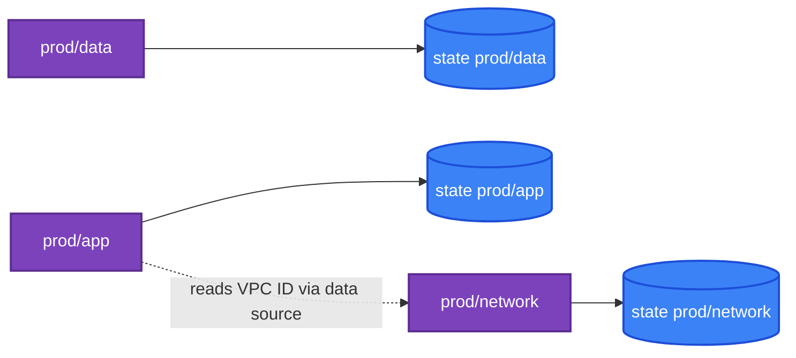

[← 20 · Terraform Enterprise](../20-terraform-enterprise/README.md) | [🏠 Home](../../README.md) | [📚 Learning Path](../00-learning-roadmap/README.md) | [22 · Troubleshooting →](../22-troubleshooting/README.md)

# 21 · Best Practices

🟡 Intermediate · ⏱️ 45 minutes · 💰 No cost — a reference chapter

This chapter collects the practices used throughout the course into one checklist, and shows the repository layout most teams converge on. Each item links to where it was taught.

---

## 1. A realistic repository layout

```text
infrastructure/
├── modules/                       # HOW things are built — reusable, versioned, tested
│   ├── vpc/
│   ├── ec2/
│   └── application/
│
└── environments/                  # WHAT is deployed where — thin root modules
    ├── dev/
    │   ├── backend.tf             # key = "app/dev/terraform.tfstate"
    │   ├── providers.tf           # dev account / Region
    │   └── main.tf                # module "app" { small sizes }
    ├── staging/
    └── prod/
        ├── backend.tf             # key = "app/prod/terraform.tfstate"
        ├── providers.tf           # prod account, allowed_account_ids
        └── main.tf                # module "app" { HA sizes }
```

[Project 09](../../projects/09-production-style-infrastructure/README.md) implements this layout (with the course's `modules/` as the module library).

### Why separate modules from environments?

| Reason | Effect |
| --- | --- |
| **One implementation** | A fix in `modules/vpc` reaches every environment through the normal promotion path |
| **Explicit differences** | `diff environments/dev/main.tf environments/prod/main.tf` shows exactly how prod differs |
| **Small blast radius** | Each environment (and often each component) has its own state; a mistake in dev can't touch prod |
| **Separate access** | Different state keys, roles and approvals per environment ([Chapter 18](../18-github-actions/README.md)) |

### Splitting state by component

Large systems split further — for example `network/`, `data/`, `app/` per environment — so that a routine app change doesn't lock (or risk) the network state. Components share values through data sources or outputs published to SSM Parameter Store ([Chapter 12 §7](../12-remote-state/README.md#7-reading-another-configurations-outputs)).



## 2. Checklist

### Code

- [ ] `required_version` and `required_providers` with constraints in every root module; `>=` minimums in modules ([Ch. 06](../06-aws-provider/README.md))
- [ ] `.terraform.lock.hcl` committed for root modules; upgraded deliberately with `init -upgrade` ([Ch. 03](../03-terraform-basics/README.md))
- [ ] Every variable has `type` and `description`; validations for anything with rules ([Ch. 07](../07-variables-and-outputs/README.md))
- [ ] `for_each` with meaningful keys instead of `count` over lists ([Ch. 09](../09-meta-arguments/README.md))
- [ ] Data sources instead of hard-coded AMIs, account IDs, AZs ([Ch. 08](../08-data-sources-and-locals/README.md))
- [ ] Comments explain **why**, not **what**
- [ ] No provisioners (`local-exec`, `remote-exec`) for configuring servers — use user data, images, or configuration management; provisioners are a documented last resort
- [ ] `moved`/`removed`/`import` blocks instead of state surgery ([Ch. 11](../11-terraform-state/README.md))

### Naming and tagging

- [ ] Consistent resource names: `<app>-<env>-<component>`
- [ ] `default_tags` for `Project`, `Environment`, `ManagedBy`, `Owner`/`CostCenter`
- [ ] Terraform local names in `snake_case`, describing the role (`aws_s3_bucket.artifacts`, not `aws_s3_bucket.bucket1`)

### State

- [ ] Remote S3 backend with `use_lockfile = true`, versioning, encryption, public access blocked, `prevent_destroy` ([Ch. 12](../12-remote-state/README.md))
- [ ] One state per environment (and per large component)
- [ ] State read access treated like secret access

### Security

- [ ] No credentials in code, tfvars, or Git; pre-commit secret scanning ([Ch. 17](../17-terraform-tooling/README.md))
- [ ] CI uses OIDC roles; plan roles read-only; apply roles per environment ([Ch. 18](../18-github-actions/README.md))
- [ ] Least-privilege IAM: specific actions and ARNs; conditions on privilege-escalation paths (`iam:PassRole`, `iam:AttachRolePolicy`)
- [ ] Encryption at rest everywhere; customer managed KMS keys where you need control ([KMS](../../aws-services/kms/README.md))
- [ ] Secrets never pass through Terraform, or only via ephemeral/write-only paths ([Secrets Manager](../../aws-services/secrets-manager/README.md))
- [ ] IMDSv2 required, no SSH from `0.0.0.0/0`, private subnets for servers and databases
- [ ] `allowed_account_ids` in production provider blocks
- [ ] Security scanner in CI with documented exceptions

### Change management

- [ ] Every change through a pull request with a visible plan
- [ ] Apply the reviewed, saved plan; never `-auto-approve` interactively
- [ ] Protected environments with approvals for production
- [ ] `prevent_destroy` on data stores; read `-/+` lines twice
- [ ] Avoid `-target` except for recovery

### Cost

- [ ] Cost-generating resources (NAT, load balancers, RDS, public IPv4) are opt-in in non-prod
- [ ] Log retention set on every log group
- [ ] Lifecycle rules on buckets
- [ ] Budgets and alerts in every account
- [ ] Ephemeral environments destroyed automatically or on a schedule

## 3. Things that look convenient but hurt later

| Anti-pattern | Better |
| --- | --- |
| One giant root module for everything | Split by environment and component |
| A module per resource ("wrapper" modules) | Modules that encapsulate a meaningful unit |
| `ignore_changes = all` | Ignore specific attributes, with a comment |
| `depends_on` everywhere "to be safe" | References; `depends_on` only for hidden dependencies |
| Copy-pasted environments that drift | Shared modules + thin environment roots |
| `terraform apply` from laptops against prod | Pipeline with approvals |
| Generated secrets (`random_password`, `tls_private_key`) in state without protection | Managed secrets, ephemeral resources, or a tightly controlled state |

## Key takeaways

- Separate **modules** (how) from **environments** (what/where); separate state per environment and component.
- Most best practices are about **reducing blast radius** and **making changes reviewable**.
- Security and cost controls belong in the code and the pipeline, not in people's memory.

## Official references

- [Terraform style guide](https://developer.hashicorp.com/terraform/language/style)
- [Recommended practices (HCP Terraform)](https://developer.hashicorp.com/terraform/cloud-docs/recommended-practices)
- [AWS provider best practices](https://registry.terraform.io/providers/hashicorp/aws/latest/docs/guides/best-practices)
- [AWS Prescriptive Guidance: Terraform on AWS best practices](https://docs.aws.amazon.com/prescriptive-guidance/latest/terraform-aws-provider-best-practices/introduction.html)
- [Provisioners are a last resort](https://developer.hashicorp.com/terraform/language/resources/provisioners/syntax#provisioners-are-a-last-resort)

---

[← 20 · Terraform Enterprise](../20-terraform-enterprise/README.md) | [🏠 Home](../../README.md) | [📚 Learning Path](../00-learning-roadmap/README.md) | [22 · Troubleshooting →](../22-troubleshooting/README.md)
