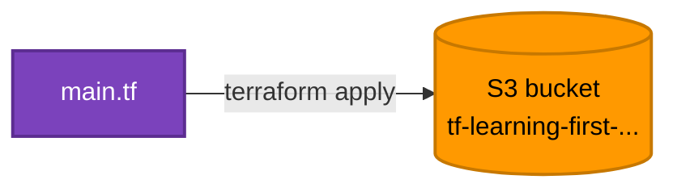

[⬆ Examples](../../README.md) | [🏠 Home](../../../README.md) | [📚 Learning Path](../../../docs/00-learning-roadmap/README.md)

# Lab · First S3 bucket

🟢 Beginner · Used in [Chapter 03](../../../docs/03-terraform-basics/README.md) and [Chapter 05](../../../docs/05-terraform-workflow/README.md) · 💰 Free (an empty bucket costs nothing)

## What will be created

| Resource | Purpose |
| --- | --- |
| `aws_s3_bucket.first` | One empty S3 bucket named `tf-learning-first-<random suffix>` |



## Prerequisites

- Terraform ≥ 1.11 and working AWS credentials ([Chapter 02](../../../docs/02-installation-and-setup/README.md)).

## Terraform concepts shown

- `terraform` block with `required_providers`
- `provider "aws"` with a hard-coded region (replaced by a variable in later labs)
- One `resource` and one `output`
- `bucket_prefix`: AWS appends a unique suffix because bucket names are global

## Commands

```bash
terraform init
terraform fmt
terraform validate
terraform plan
terraform apply
terraform output
```

## Expected result

- `plan`: `Plan: 1 to add, 0 to change, 0 to destroy.`
- `apply`: an output `bucket_name = "tf-learning-first-..."`.

## Verification

```bash
aws s3api head-bucket --bucket "$(terraform output -raw bucket_name)"
terraform state list
terraform plan        # "No changes" = the real bucket matches the code
```

## Cleanup

```bash
terraform destroy
```

---

[⬆ Examples](../../README.md) | [🏠 Home](../../../README.md) | [📚 Learning Path](../../../docs/00-learning-roadmap/README.md)
