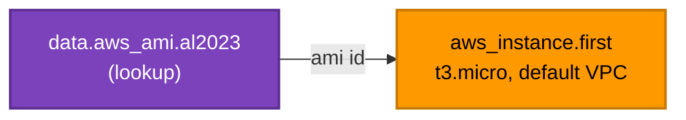

[⬆ Examples](../../README.md) | [🏠 Home](../../../README.md) | [📚 Learning Path](../../../docs/00-learning-roadmap/README.md)

# Lab · First EC2 instance

🟢 Beginner · Used in [Chapter 06](../../../docs/06-aws-provider/README.md) · 💰 **Costs money while running** (one `t3.micro` + its 8 GiB volume). Destroy it when finished.

## What will be created

| Resource | Purpose |
| --- | --- |
| `aws_instance.first` | A `t3.micro` Amazon Linux 2023 instance in your **default VPC**, without a public IP |

The AMI (machine image) is found with a `data "aws_ami"` lookup, because AMI IDs differ per Region and change with every patch release. Data sources are explained in [Chapter 08](../../../docs/08-data-sources-and-locals/README.md).



## Prerequisites

- A **default VPC** in `us-east-1`. New accounts have one. Check with `aws ec2 describe-vpcs --filters Name=is-default,Values=true`.

## Terraform concepts shown

- A data source feeding a resource (`data.aws_ami.al2023.id`)
- Nested blocks (`metadata_options`, `root_block_device`)
- Security defaults from day one: IMDSv2 required, encrypted root volume, no public IP

## Commands

```bash
terraform init
terraform plan
terraform apply
terraform output
```

## Verification

```bash
aws ec2 describe-instances \
  --instance-ids "$(terraform output -raw instance_id)" \
  --query "Reservations[0].Instances[0].[State.Name,InstanceType,MetadataOptions.HttpTokens]" \
  --region us-east-1
```

Expect `running`, `t3.micro`, `required`.

## Cost considerations

EC2 instances and EBS volumes are billed while they exist. Some accounts are eligible for the AWS Free Tier; check your own eligibility on the [AWS Free Tier page](https://aws.amazon.com/free/) rather than assuming.

## Cleanup

```bash
terraform destroy
```

---

[⬆ Examples](../../README.md) | [🏠 Home](../../../README.md) | [📚 Learning Path](../../../docs/00-learning-roadmap/README.md)
