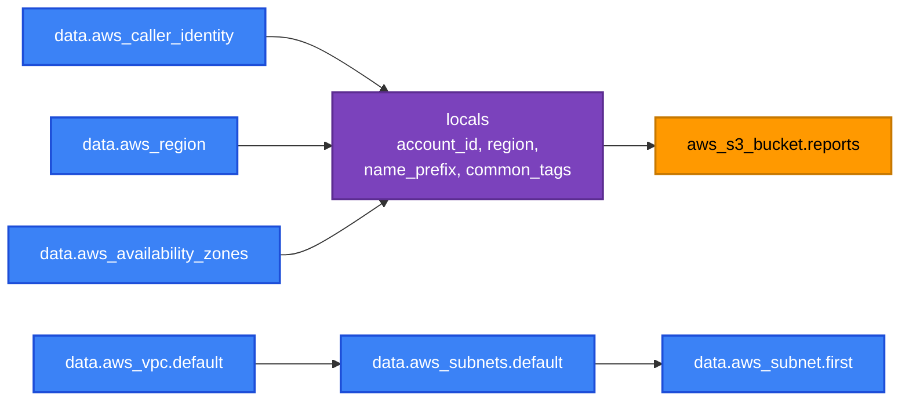

[⬆ Examples](../README.md) | [🏠 Home](../../README.md) | [📚 Learning Path](../../docs/00-learning-roadmap/README.md)

# Lab · Data sources and locals

🟢 Beginner · Used in [Chapter 02](../../docs/02-installation-and-setup/README.md) (to test credentials) and [Chapter 08](../../docs/08-data-sources-and-locals/README.md) · 💰 Free (one empty bucket)

## What will be created

| Kind | Address | Purpose |
| --- | --- | --- |
| data | `data.aws_caller_identity.current` | Account ID and caller ARN |
| data | `data.aws_region.current` | Configured Region |
| data | `data.aws_availability_zones.available` | Usable AZs |
| data | `data.aws_ami.ubuntu` | Newest Ubuntu 24.04 AMI from Canonical |
| data | `data.aws_vpc.default`, `data.aws_subnets.default`, `data.aws_subnet.first` | Default VPC and its subnets |
| data | `data.aws_secretsmanager_secret.existing` | *Optional* lookup of an existing secret (skipped unless you pass a name) |
| resource | `aws_s3_bucket.reports` | The only thing created: a bucket named `<project>-<env>-reports-<account>-<region>` |



## Prerequisites

A default VPC in the Region (new accounts have one). If you deleted it, the `aws_vpc.default` lookup fails — that is a good way to see a data-source error.

## Files

[data.tf](data.tf) (all lookups) · [locals.tf](locals.tf) · [main.tf](main.tf) (the bucket) · [outputs.tf](outputs.tf) · [variables.tf](variables.tf)

## Commands

```bash
terraform init
terraform plan
terraform apply
terraform output
terraform console      # try: data.aws_ami.ubuntu.creation_date
```

## Verification

```bash
aws sts get-caller-identity --query Account --output text    # = terraform output account_id
aws s3api head-bucket --bucket "$(terraform output -raw bucket_name)"
```

## Cleanup

```bash
terraform destroy
```

---

[⬆ Examples](../README.md) | [🏠 Home](../../README.md) | [📚 Learning Path](../../docs/00-learning-roadmap/README.md)
