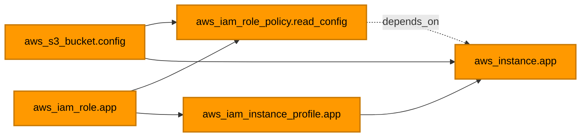

[⬆ Meta-argument labs](../README.md) | [🏠 Home](../../../README.md) | [📚 Learning Path](../../../docs/00-learning-roadmap/README.md)

# Lab · depends_on

🟡 Intermediate · [Chapter 09](../../../docs/09-meta-arguments/README.md#4-depends_on) · 💰 **Costs money while running** (1 × `t3.micro`)

## What will be created

An S3 bucket, an IAM role with an inline policy that can read it, an instance profile, and an instance whose **boot script reads the bucket**.



The instance references the bucket (in `user_data`) and the instance profile, but **not** the role policy. Without `depends_on`, Terraform could launch the instance before the policy exists, and the boot script's `aws s3 ls` would fail with AccessDenied.

## Commands

```bash
terraform init
terraform graph | grep -E 'read_config|aws_instance'   # the explicit edge is in the graph
terraform apply
```

## Experiment

Comment out the `depends_on` line and run `terraform graph` again: the edge between the policy and the instance disappears. (The timing issue is a race, so the apply may still succeed by luck — that is exactly why hidden dependencies are dangerous.) Restore the line.

## Verification

The boot script prints its result to the serial console. The instance has no SSM access in this lab (to keep the role minimal), so read the **console output** a few minutes after apply:

```bash
aws ec2 get-console-output --instance-id "$(terraform output -raw instance_id)" --latest --output text | grep config-check
```

`config-check exit code: 0` means the role's policy was in place when the instance booted.

## Cleanup

```bash
terraform destroy
```

---

[⬆ Meta-argument labs](../README.md) | [🏠 Home](../../../README.md) | [📚 Learning Path](../../../docs/00-learning-roadmap/README.md)
