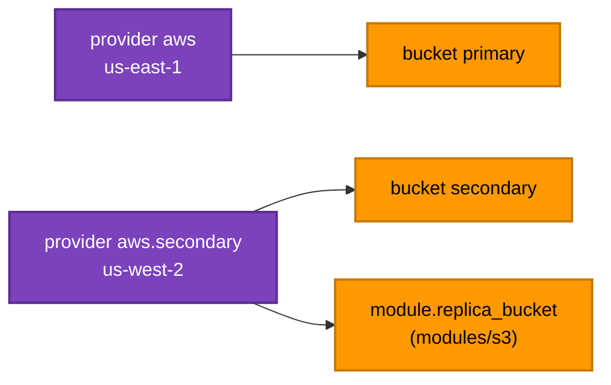

[⬆ Meta-argument labs](../README.md) | [🏠 Home](../../../README.md) | [📚 Learning Path](../../../docs/00-learning-roadmap/README.md)

# Lab · Multiple Regions with provider aliases

🟡 Intermediate · [Chapter 09](../../../docs/09-meta-arguments/README.md#5-provider-and-providers) · 💰 Free (empty buckets)

## What will be created

| Address | Region | Provider used |
| --- | --- | --- |
| `aws_s3_bucket.primary` | `var.aws_region` (us-east-1) | default `aws` |
| `aws_s3_bucket.secondary` | `var.secondary_region` (us-west-2) | `provider = aws.secondary` |
| `module.replica_bucket` (uses [modules/s3](../../../modules/s3/README.md)) | us-west-2 | `providers = { aws = aws.secondary }` |



The module call is a preview of [Chapter 13](../../../docs/13-terraform-modules/README.md); here, focus on the `providers` argument.

## Commands

```bash
terraform init
terraform apply
terraform output
```

## Verification

```bash
aws s3api get-bucket-location --bucket "$(terraform output -raw module_bucket)"   # "us-west-2"
```

## Experiment

Change `secondary_region` to `eu-west-1` and plan: all resources using `aws.secondary` must be **replaced**, because a bucket cannot move Regions.

## Cleanup

```bash
terraform destroy
```

---

[⬆ Meta-argument labs](../README.md) | [🏠 Home](../../../README.md) | [📚 Learning Path](../../../docs/00-learning-roadmap/README.md)
