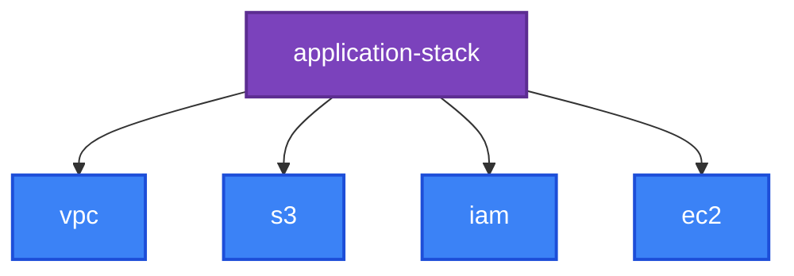

[⬆ 13 · Terraform Modules](../docs/13-terraform-modules/README.md) | [🏠 Home](../README.md) | [📚 Learning Path](../docs/00-learning-roadmap/README.md)

# Reusable modules

🟡 Intermediate · Explained in [Chapter 13 · Modules](../docs/13-terraform-modules/README.md) · Tested as in [Chapter 16](../docs/16-testing-and-validation/README.md)

| Module | Creates | Used by |
| --- | --- | --- |
| [s3](s3/README.md) | Private, encrypted, versioned bucket with lifecycle and HTTPS-only policy | [local-module lab](../examples/modules/local-module/README.md), [multi-region lab](../examples/meta-arguments/multi-region-providers/README.md), [application-stack](application-stack/README.md), [Project 09 bootstrap](../projects/09-production-style-infrastructure/README.md) |
| [vpc](vpc/README.md) | VPC, public/private subnets across AZs, IGW, optional single NAT gateway | [application-stack](application-stack/README.md), [Project 08](../projects/08-highly-available-web/README.md) |
| [iam](iam/README.md) | IAM role for AWS services, managed + inline policies, optional instance profile | [application-stack](application-stack/README.md) |
| [ec2](ec2/README.md) | N instances spread over subnets, with a security group and IMDSv2 | [application-stack](application-stack/README.md) |
| [application-stack](application-stack/README.md) | **Composition** of the four modules above | [Project 09](../projects/09-production-style-infrastructure/README.md) |



## Layout of every module

```text
<module>/
├── main.tf  variables.tf  outputs.tf  versions.tf
├── README.md          hand-written intro + terraform-docs reference
├── examples/basic/    runnable minimal usage
└── tests/*.tftest.hcl mocked tests: no AWS account needed
```

## Run the tests

```bash
cd modules/s3
terraform init
terraform test
```

All module tests use `mock_provider "aws"`, so they create nothing and need no credentials. CI runs them for every module on each pull request.

## Regenerate the reference docs

```bash
terraform-docs modules/s3        # run from the repository root: picks up .terraform-docs.yml
```

See [Chapter 17](../docs/17-terraform-tooling/README.md) for the tool itself.

---

[⬆ 13 · Terraform Modules](../docs/13-terraform-modules/README.md) | [🏠 Home](../README.md) | [📚 Learning Path](../docs/00-learning-roadmap/README.md)
