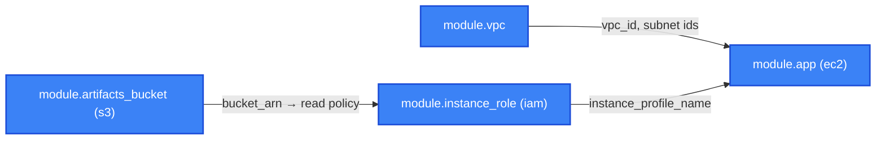

[⬆ Reusable modules](../README.md) | [🏠 Home](../../README.md) | [📚 Learning Path](../../docs/00-learning-roadmap/README.md)

# Module · application-stack

A **composition module**: it creates no resources of its own (apart from one IAM policy document) and wires [vpc](../vpc/README.md), [s3](../s3/README.md), [iam](../iam/README.md) and [ec2](../ec2/README.md) together into a small application environment. Explained in [Chapter 13 §8](../../docs/13-terraform-modules/README.md#8-module-composition); used by [Project 09](../../projects/09-production-style-infrastructure/README.md).



## What you get

- A VPC with public and private subnets (NAT optional).
- An artifacts bucket (`force_destroy` only outside prod).
- An instance role with SSM access and **read-only access to that one bucket**.
- `instance_count` instances running nginx, in public or private subnets.
- A `check` block that **warns** when instances are placed in private subnets without a NAT gateway.

## Usage

```hcl
module "app" {
  source = "../../modules/application-stack"

  name                 = "shop"
  environment          = "dev"
  enable_nat_gateway   = false
  instance_subnet_tier = "public"
  instance_count       = 1
}
```

- Example: [examples/basic](examples/basic/main.tf)
- Tests: [tests/application_stack.tftest.hcl](tests/application_stack.tftest.hcl) — including a test that expects the `check` warning

<!-- BEGIN_TF_DOCS -->
### Requirements

| Name | Version |
| ---- | ------- |
| terraform | >= 1.11.0 |
| aws | >= 6.0 |

### Providers

| Name | Version |
| ---- | ------- |
| aws | >= 6.0 |

### Modules

| Name | Source | Version |
| ---- | ------ | ------- |
| app | ../ec2 | n/a |
| artifacts\_bucket | ../s3 | n/a |
| instance\_role | ../iam | n/a |
| vpc | ../vpc | n/a |

### Resources

| Name | Type |
| ---- | ---- |
| [aws_iam_policy_document.read_artifacts](https://registry.terraform.io/providers/hashicorp/aws/latest/docs/data-sources/iam_policy_document) | data source |

### Inputs

| Name | Description | Type | Default | Required |
| ---- | ----------- | ---- | ------- | :------: |
| environment | Environment name, e.g. dev or prod. | `string` | n/a | yes |
| name | Application name, used as a prefix for every resource. | `string` | n/a | yes |
| allowed\_http\_cidrs | IPv4 CIDRs allowed to reach the instances on port 80. Empty = no inbound HTTP. | `list(string)` | `[]` | no |
| az\_count | Number of Availability Zones. | `number` | `2` | no |
| enable\_nat\_gateway | Create a NAT gateway (hourly cost). Required for instances in private subnets to reach the internet. | `bool` | `false` | no |
| instance\_count | Number of application instances. | `number` | `1` | no |
| instance\_subnet\_tier | Where to run instances: "public" (public IP, no NAT needed) or "private" (needs NAT). | `string` | `"public"` | no |
| instance\_type | EC2 instance type for the application. | `string` | `"t3.micro"` | no |
| tags | Extra tags added to every resource. | `map(string)` | `{}` | no |
| vpc\_cidr | CIDR block for the application VPC. | `string` | `"10.0.0.0/16"` | no |

### Outputs

| Name | Description |
| ---- | ----------- |
| artifacts\_bucket | Name of the artifacts bucket the instances can read. |
| instance\_ids | Map of instance name => ID. |
| instance\_public\_ips | Map of instance name => public IP (empty in private subnets). |
| instance\_role\_arn | ARN of the instances' IAM role. |
| private\_subnet\_ids | Private subnet IDs. |
| public\_subnet\_ids | Public subnet IDs. |
| vpc\_id | ID of the application VPC. |
<!-- END_TF_DOCS -->

---

[⬆ Reusable modules](../README.md) | [🏠 Home](../../README.md) | [📚 Learning Path](../../docs/00-learning-roadmap/README.md)
