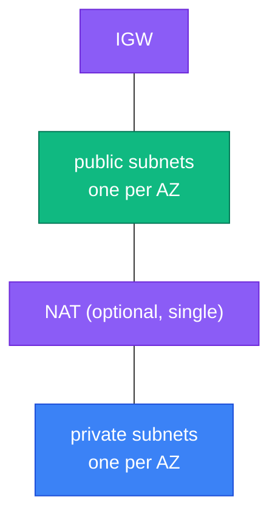

[⬆ Reusable modules](../README.md) | [🏠 Home](../../README.md) | [📚 Learning Path](../../docs/00-learning-roadmap/README.md)

# Module · vpc

A VPC with public subnets and optional private subnets across 1–3 Availability Zones. The concepts are taught step by step in the [VPC track](../../aws-services/vpc/README.md).

## What it creates

| Resource | Notes |
| --- | --- |
| `aws_vpc` | DNS support and hostnames on |
| `aws_default_security_group` | Adopted and emptied (no rules) |
| `aws_internet_gateway`, public route table + `0.0.0.0/0` route | |
| `aws_subnet.public[az]` | `/24` per AZ at `cidrsubnet(cidr, 8, index)` |
| `aws_subnet.private[az]`, private route table | when `create_private_subnets = true`; `/24` at index + 10 |
| `aws_eip`, `aws_nat_gateway`, private `0.0.0.0/0` route | when `enable_nat_gateway = true` (**hourly cost**) |



## Usage

```hcl
module "vpc" {
  source = "../../modules/vpc"

  name               = "myapp-dev"
  cidr_block         = "10.20.0.0/16"
  az_count           = 2
  enable_nat_gateway = false
}

# module.vpc.public_subnet_ids, module.vpc.private_subnet_ids
```

- Example: [examples/basic](examples/basic/main.tf)
- Tests: [tests/vpc.tftest.hcl](tests/vpc.tftest.hcl)

## Design notes

- One shared NAT gateway keeps cost down; for per-AZ NAT see [Project 02](../../projects/02-custom-vpc/README.md).
- Subnet outputs are **lists ordered by AZ**, so callers can use them directly in `subnet_ids` arguments.

<!-- BEGIN_TF_DOCS -->
### Requirements

| Name | Version |
| ---- | ------- |
| terraform | >= 1.11.0 |
| aws | >= 6.0 |

### Providers

| Name | Version |
| ---- | ------- |
| aws | >= 6.0 |

### Resources

| Name | Type |
| ---- | ---- |
| [aws_default_security_group.this](https://registry.terraform.io/providers/hashicorp/aws/latest/docs/resources/default_security_group) | resource |
| [aws_eip.nat](https://registry.terraform.io/providers/hashicorp/aws/latest/docs/resources/eip) | resource |
| [aws_internet_gateway.this](https://registry.terraform.io/providers/hashicorp/aws/latest/docs/resources/internet_gateway) | resource |
| [aws_nat_gateway.this](https://registry.terraform.io/providers/hashicorp/aws/latest/docs/resources/nat_gateway) | resource |
| [aws_route.private_nat](https://registry.terraform.io/providers/hashicorp/aws/latest/docs/resources/route) | resource |
| [aws_route.public_internet](https://registry.terraform.io/providers/hashicorp/aws/latest/docs/resources/route) | resource |
| [aws_route_table.private](https://registry.terraform.io/providers/hashicorp/aws/latest/docs/resources/route_table) | resource |
| [aws_route_table.public](https://registry.terraform.io/providers/hashicorp/aws/latest/docs/resources/route_table) | resource |
| [aws_route_table_association.private](https://registry.terraform.io/providers/hashicorp/aws/latest/docs/resources/route_table_association) | resource |
| [aws_route_table_association.public](https://registry.terraform.io/providers/hashicorp/aws/latest/docs/resources/route_table_association) | resource |
| [aws_subnet.private](https://registry.terraform.io/providers/hashicorp/aws/latest/docs/resources/subnet) | resource |
| [aws_subnet.public](https://registry.terraform.io/providers/hashicorp/aws/latest/docs/resources/subnet) | resource |
| [aws_vpc.this](https://registry.terraform.io/providers/hashicorp/aws/latest/docs/resources/vpc) | resource |
| [aws_availability_zones.available](https://registry.terraform.io/providers/hashicorp/aws/latest/docs/data-sources/availability_zones) | data source |

### Inputs

| Name | Description | Type | Default | Required |
| ---- | ----------- | ---- | ------- | :------: |
| name | Name prefix for every networking resource. | `string` | n/a | yes |
| az\_count | Number of Availability Zones to spread subnets across. | `number` | `2` | no |
| cidr\_block | IPv4 CIDR block for the VPC. /16 gives 65,536 addresses to split into subnets. | `string` | `"10.0.0.0/16"` | no |
| create\_private\_subnets | Create one private subnet per AZ (no direct route to the internet). | `bool` | `true` | no |
| enable\_nat\_gateway | Create ONE NAT gateway so private subnets can reach the internet. Costs money every hour it exists. | `bool` | `false` | no |
| tags | Tags to add to every resource. | `map(string)` | `{}` | no |

### Outputs

| Name | Description |
| ---- | ----------- |
| azs | Availability Zones used, in order. |
| nat\_gateway\_public\_ip | Public IP used by private subnets for outbound traffic, or null. |
| private\_subnet\_ids | Private subnet IDs, ordered like azs (empty if disabled). |
| public\_subnet\_ids | Public subnet IDs, ordered like azs. |
| vpc\_cidr\_block | CIDR block of the VPC. |
| vpc\_id | ID of the VPC. |
<!-- END_TF_DOCS -->

---

[⬆ Reusable modules](../README.md) | [🏠 Home](../../README.md) | [📚 Learning Path](../../docs/00-learning-roadmap/README.md)
