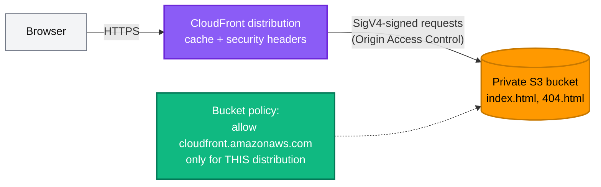

[← Projects](../README.md) | [🏠 Home](../../README.md) | [📚 Learning Path](../../docs/00-learning-roadmap/README.md) | [⬆ Projects](../README.md) | [Project 02 · Custom Three-Tier VPC →](../02-custom-vpc/README.md)

# Project 01 · Static Website on S3 + CloudFront

🟢 Beginner · Do it after [Chapter 10](../../docs/10-expressions-and-functions/README.md) · 💰 CloudFront and S3 are billed per request/GB — a test site costs very little, but check pricing · ⏱️ CloudFront takes several minutes to deploy and to delete

## Requirements

Build a static website that:

1. stores its files in a **private** S3 bucket (no public access at all);
2. is served over **HTTPS** by CloudFront, redirecting HTTP to HTTPS;
3. uploads every file in `./site` with the right `Content-Type`, re-uploading files when they change;
4. returns a friendly `404.html` page for missing paths;
5. adds standard security headers;
6. outputs the website URL.

## Architecture



## Concepts used

| Concept | Where |
| --- | --- |
| `fileset()` + `for_each` over files | `aws_s3_object.site` |
| `filemd5()` as `etag` → re-upload on change | `aws_s3_object.site` |
| Map lookup for content types | `local.content_types` |
| Data sources for AWS managed policies | `data.aws_cloudfront_cache_policy`, `data.aws_cloudfront_response_headers_policy` |
| Service principal + `AWS:SourceArn` condition | `data.aws_iam_policy_document.site` |
| Documented Checkov exceptions | `#checkov:skip` comments in `main.tf` |

## Reference solution

[main.tf](main.tf) · [variables.tf](variables.tf) · [outputs.tf](outputs.tf) · [site/](site/)

## Run it

```bash
terraform init
terraform apply          # ~5 minutes for CloudFront
terraform output website_url
```

## Verify

```bash
URL=$(terraform output -raw website_url)
curl -sI "$URL" | grep -iE "HTTP/|content-type|strict-transport"
curl -s  "$URL/does-not-exist" | grep 404
curl -sI "http://${URL#https://}" | grep -i location      # redirect to HTTPS
aws s3api get-public-access-block --bucket "$(terraform output -raw bucket_name)"
curl -sI "https://$(terraform output -raw bucket_name).s3.amazonaws.com/index.html" | head -1   # 403: bucket is private
```

Edit `site/index.html`, `terraform apply` (only that object changes), then invalidate the cache so CloudFront serves the new version immediately:

```bash
aws cloudfront create-invalidation --distribution-id "$(terraform output -raw distribution_id)" --paths "/*"
```

## Cleanup

```bash
terraform destroy        # disabling and deleting a distribution takes several minutes
```

## Extensions

- Custom domain: `aws_acm_certificate` in **us-east-1** (with the aliased provider pattern from [Chapter 09](../../docs/09-meta-arguments/README.md#5-provider-and-providers)), DNS validation in Route 53, `aliases` + `viewer_certificate { acm_certificate_arn = ... }`, and an alias A record.
- CloudFront access logs to a separate bucket.
- A `check` block that fetches the URL after apply ([Chapter 16](../../docs/16-testing-and-validation/README.md#5-check-blocks)).

---

[← Projects](../README.md) | [🏠 Home](../../README.md) | [📚 Learning Path](../../docs/00-learning-roadmap/README.md) | [⬆ Projects](../README.md) | [Project 02 · Custom Three-Tier VPC →](../02-custom-vpc/README.md)
