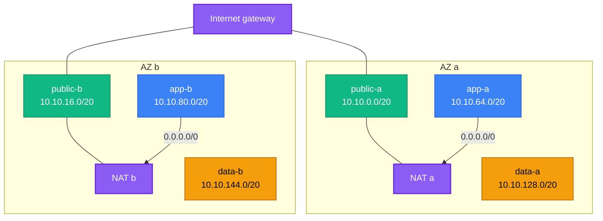

[← Project 01 · Static Website on S3 + CloudFront](../01-static-website/README.md) | [🏠 Home](../../README.md) | [📚 Learning Path](../../docs/00-learning-roadmap/README.md) | [⬆ Projects](../README.md) | [Project 03 · EC2 Web Server →](../03-web-server/README.md)

# Project 02 · Custom Three-Tier VPC

🟢 Beginner · Do it after the [VPC track](../../aws-services/vpc/README.md) · 💰 Free with `nat_gateway_mode = "none"` (default); **hourly per NAT gateway** otherwise

## Requirements

Design a network for a three-tier application:

1. A VPC with a configurable CIDR, across **2 or 3 AZs** (input).
2. Three subnet tiers per AZ: **public** (load balancers, NAT), **app** (servers), **data** (databases).
3. Public subnets route to an internet gateway; **data** subnets have **no** internet route at all.
4. App subnets get outbound internet through NAT, with three modes: `none`, `single` (one shared NAT) or `per_az` (one NAT per AZ, each AZ routes through its own).
5. The VPC's default security group must allow nothing.
6. Outputs: VPC ID, subnet IDs grouped by tier, the planned CIDR of every subnet.

## Architecture (per_az mode, 2 AZs)



Data subnets have only the VPC's local route.

## Concepts used

| Concept | Where |
| --- | --- |
| Nested `for` + `merge(...)` expansion to build one subnet map | `local.subnets` |
| `cidrsubnet()` with per-tier offsets | `local.tier_offsets` |
| Map indexing to choose a list (`{...}[var.mode]`) | `local.nat_azs` |
| `for_each` with filtered maps | route table associations |
| `dynamic "route"` block (0 or 1 routes) | `aws_route_table.app` |
| `aws_default_security_group` | lock down the default SG |

## Reference solution

[main.tf](main.tf) · [variables.tf](variables.tf) · [outputs.tf](outputs.tf)

## Run it

```bash
terraform init
terraform plan                                   # 2 AZs, no NAT
terraform plan -var az_count=3 -var nat_gateway_mode=per_az   # compare the plan
terraform apply
terraform output subnet_ids_by_tier
```

## Verify

```bash
VPC=$(terraform output -raw vpc_id)
aws ec2 describe-route-tables --filters "Name=vpc-id,Values=$VPC" \
  --query "RouteTables[].[Tags[?Key=='Name']|[0].Value, Routes[?DestinationCidrBlock=='0.0.0.0/0']|[0].[GatewayId,NatGatewayId]]" \
  --output json
```

Public → `igw-...`; app → `null` (no NAT) or `nat-...`; data → no default route.

## Cleanup

```bash
terraform destroy
```

## Extensions

- VPC Flow Logs to CloudWatch Logs with a short retention.
- A **gateway VPC endpoint** for S3 on the app and data route tables (no hourly charge).
- Turn this into a module with the same interface as [modules/vpc](../../modules/vpc/README.md) plus a data tier.

---

[← Project 01 · Static Website on S3 + CloudFront](../01-static-website/README.md) | [🏠 Home](../../README.md) | [📚 Learning Path](../../docs/00-learning-roadmap/README.md) | [⬆ Projects](../README.md) | [Project 03 · EC2 Web Server →](../03-web-server/README.md)
